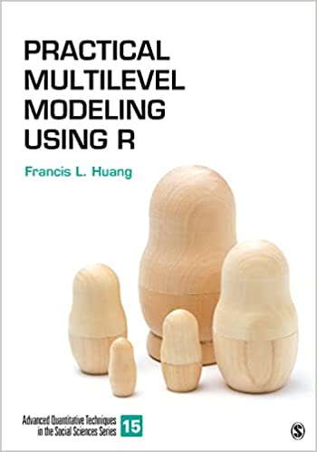

 

## Multilevel Modeling Using R

**Practical Multilevel Modeling Using R** provides students with a step-by-step guide for running their own multilevel analyses. Detailed examples illustrate the conceptual and statistical issues that multilevel modeling addresses in a way that is clear and relevant to students in applied disciplines. Clearly annotated R syntax illustrates how multilevel modeling (MLM) can be used, and real-world examples show why and how modeling decisions can affect results. The book covers all the basics but also important advanced topics such as diagnostics, detecting and handling heteroscedasticity, power analysis, and missing data handling methods. Unlike other detailed texts on MLM which are written at a very high level, this text with its applied focus and use of R software to run the analyses is much more suitable for students who have substantive research areas but are not training to be methodologists or statisticians. At the end of the chapters, a Test Yourself section is also provided (with answers available on the password-protected instructor website at https://edge.sagepub.com/huang1e so that questions can be assigned for homework). A companion R package (“MLMusingR”) is also available at https://cran.r-project.org/ which contains the datasets and helper functions used in the book.

Available from [Sage](https://us.sagepub.com/en-us/nam/practical-multilevel-modeling-using-r/book276872?priorityCode=2B1659&utm_campaign=2B1659&utm_medium=email&utm_source=selligent&m_i=rEIPdGW5o6UrWOMrGcXiAJbEbA86tsw4%20Wq8ivW55VDMCZYoFvfJQqvaJWA_3Atpu6eeHMEvO4qepexTDiSBM_RW0IyNN9&M_BT=37409334049792) or [Amazon](https://www.amazon.com/Practical-Multilevel-Modeling-Quantitative-Techniques/dp/1071846124/ref=sr_1_1?keywords=practical+multilevel+modeling+using+r&qid=1671640128&sprefix=practical+multilevel+modeling%2Caps%2C1907&sr=8-1).

## Sample chapters/appendix

- [Introduction](https://us.sagepub.com/sites/default/files/upm-assets/126450_book_item_126450.pdf)
- [The Unconditional Means Model](https://us.sagepub.com/sites/default/files/upm-assets/126451_book_item_126451.pdf)
- Online [appendix A](MLM_Appendix_A.pdf): Reporting results of multilevel models

### Errata

- Download [here](errata_MLM.docx) (as of 2024.06.03)

### Reviews

> A major strength of this book is its accessibility. Huang effortlessly bridges the divide between the sometimes-abstruse literature on advanced statistics and the needs of applied researchers who lack extensive quantitative training. The result is an approachable text that covers all the basics, but also does not shy away from important advanced topics such as diagnostics, detecting and handling heteroscedasticity, and missing data handling methods. This book would make not only a useful guide to the application of multilevel modeling, but could also serve as an excellent companion text for a course on multilevel modeling. - Kristopher J. Preacher, Vanderbilt University

> This book is an excellent book for a graduate level multilevel modeling course that utilizes R; it perfectly combines the depth and breadth on this topic. - Wei Wang, The Graduate Center, City University of New York

