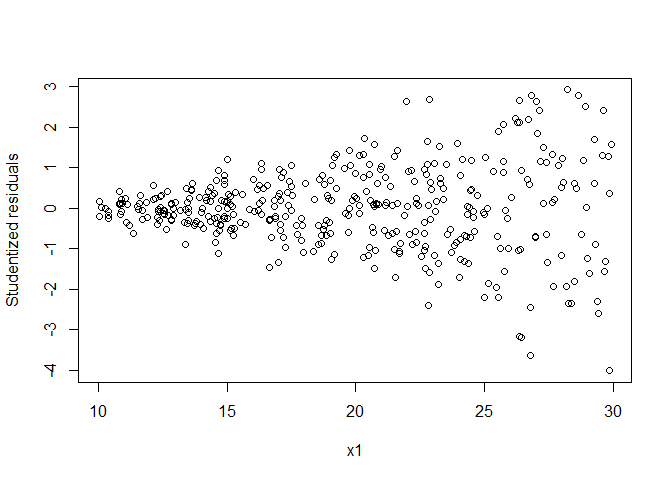
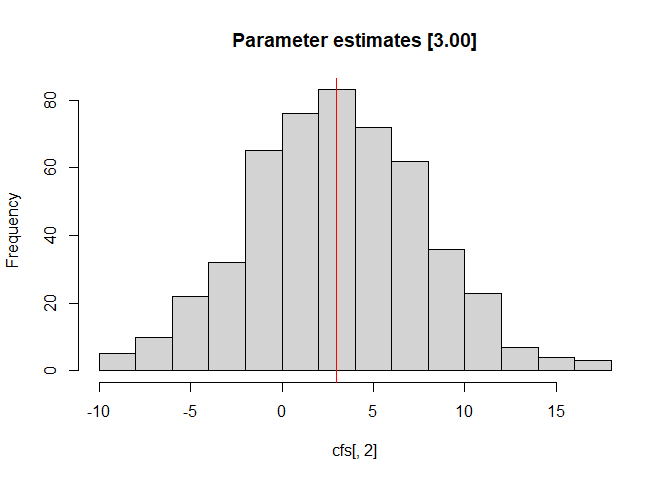
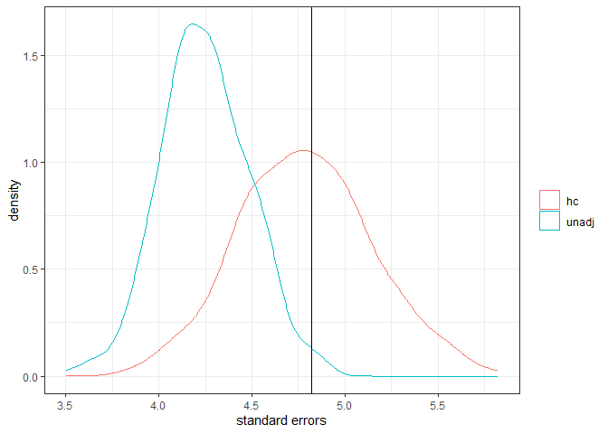

The other day in class, while talking about instances (e.g., analyzing
clustered data or heteroskedastic residuals) where adjustments are
required to the standard errors of a regression model, a student asked:
how do we know what the ‘true’ standard error should be in the first
place– which is necessary to know if it is too high or too low.

This short simulation illustrates that, over repeated sampling from a
specified population, the **standard deviaton** of the regression
coefficients can be used as the true standard errors. Take for example
the case where the residuals of a regression are heteroskedastic instead
of the assumed homoskedastic residuals. Parameter estimates will be
unbiased but the standard errors will be biased.

To illustrate this, I create one dataset which shows heteroskedastic
residuals:

    set.seed(2468)
    ns <- 400 #sample size
    B1 <- 3 #regression coefficient
    x1 <- runif(ns, 10, 30)
    err <- rnorm(ns, 0, x1^2) #variance [or sd] increases as x1 increases
    y <- 50 + B1 * x1 + err

    m1 <- lm(y ~ x1) #run a basic regression
    summary(m1) #we see that the the coefficient for x1

    ## 
    ## Call:
    ## lm(formula = y ~ x1)
    ## 
    ## Residuals:
    ##      Min       1Q   Median       3Q      Max 
    ## -1980.99  -274.52     7.57   270.21  1458.05 
    ## 
    ## Coefficients:
    ##             Estimate Std. Error t value Pr(>|t|)
    ## (Intercept)   40.230     95.180   0.423    0.673
    ## x1             2.907      4.667   0.623    0.534
    ## 
    ## Residual standard error: 506.3 on 398 degrees of freedom
    ## Multiple R-squared:  0.000974,   Adjusted R-squared:  -0.001536 
    ## F-statistic: 0.388 on 1 and 398 DF,  p-value: 0.5337

    plot(x1, rstudent(m1), ylab = 'Studentized residuals') #classic fan spread of residuals

    library(lmtest)
    bptest(m1) #Breusch Pagan test: results show statistical significance indicating a violation

    ## 
    ##  studentized Breusch-Pagan test
    ## 
    ## data:  m1
    ## BP = 98.226, df = 1, p-value < 2.2e-16

However, the question then becomes: what should the standard error be?
So, we can run a simulation where we run a regression 1,000 times (1,000
replications) and collect the output. Typically, using
heteroskedasticity corrected standard errors should alleviate the
problem which we will see.

    set.seed(123)
    ns <- 400 #sample size
    B1 <- 3 #regression coefficient
    reps <- 500 #replications

    #container to save the coefficient and the standard errors
    cfs <- ses <- ses2 <- matrix(NA, ncol = 2, nrow = reps)

    library(sandwich) #to get the adjusted standard errors

    set.seed(3210) #for reproducability
    #the actual simulation
    for (i in 1:reps){
      x1 <- runif(ns, 10, 30)
      err <- rnorm(ns, 0, x1^2) #variance [or sd] increases as x1 increases
      y <- 50 + B1 * x1 + err
      m2 <- lm(y ~ x1) #run a basic regression
      cfs[i, ] <- coef(m2)
      ses[i, ] <- sqrt(diag(vcov(m2)))
      ses2[i, ] <- sqrt(diag(vcovHC(m2) ))
      #cat(i, "::")
    }

After running the simulation, we can compare the actual standard errors
to the empirically determined standard errors. The point estimate is ~
3.00 (i.e., *B* = 3.04).

    ### these are for the point estimates: should be unbiased
    colMeans(cfs) #should be around 50 and 3.00

    ## [1] 47.974758  3.044893

    hist(cfs[,2], main = 'Parameter estimates [3.00]')
    abline(v = 3, col = 'red')

For the standard errors, we can compare the 1) empirical standard
errors; 2) the unadjusted standard errors; and 3) the corrected standard
errors.

    ### these are for the standard errors
    apply(cfs, 2, sd) #these show the empirical standard errors for the intercept and x1

    ## [1] 78.909899  4.819149

    colMeans(ses) #these are the model based standard errors

    ## [1] 88.474339  4.247855

    colMeans(ses2) #these are adjusted standard errors

    ## [1] 78.28279  4.78608

We can see that the *unadjusted* standard errors for *x*1 are
**too low** (`(4.24 - 4.82)/4.82 = -12`%) while the *adjusted* standard
errors are close to the empirical standard errors (i.e., 4.79 vs. 4.82).

    dat <- data.frame(se = c(ses[,2], ses2[,2]), gr = rep(c('unadj', 'hc'), each = reps))

    library(ggplot2)

    ## Learn more about the underlying theory at
    ## https://ggplot2-book.org/

    ggplot(dat, aes(x = se, group = gr, col = factor(gr))) +
     geom_density() +
     geom_vline(xintercept = sd(cfs[,2])) + 
      theme_bw() +
      labs(col = "", x = 'standard errors')

### 
