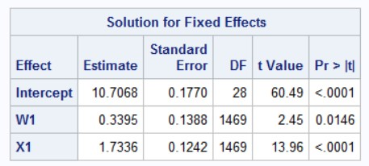

In a recent article in *Multivariate Behavioral Research*, we (Huang, Wiedermann, and Zhang; HWZ; doi: 10.1080/00273171.2022.2077290) discuss a robust standard error that can be used with mixed models that accounts for violations of homogeneity. Note that these robust standard errors have been around for years though are not always provided in statistical software. These can also be computed using the `CR2` package or the `clubSandwich` package. This page shows how to compute the traditional Liang and Zeger (1986) robust standard errors (CR0) and the CR2 estimator- see Bell and McCaffrey (2002) as well as McCaffrey, Bell, and Botts (2001) (BM and MBB). 

**NOTE:** Cluster robust standard errors can also be computed using our **SPSS** add-on available here: <https://github.com/flh3/CR2>. This doesn't work though with mixed models.


``` r
d1 <- rio::import(file = 'https://github.com/flh3/evalclass/raw/main/ccrem/ccrem.sav')
set.seed(123)
d1 <- d1[sample(nrow(d1)),] #jumble up the data to test functions...
## c1 is the clustering variable
```

Inspecting the intraclass correlation coefficient.


``` r
library(lmerTest)
library(CR2)
m0 <- lmer(y ~ 1 + (1|c1),
           data = d1)
performance::icc(m0)
```

```
# Intraclass Correlation Coefficient

    Adjusted ICC: 0.095
  Unadjusted ICC: 0.095
```

``` r
dplyr::n_distinct(d1$c1)
```

```
[1] 30
```

Use a basic random intercepts model.


``` r
m2 <- lmer(y ~ W1 + X1 + (1|c1), # + (1|c2), for CCREM, ignore for now
     data = d1)
```

Using elements for from the `m2` object, reconstruct the results "manually". The fixed effects are: $$(X'V^{-1}X)^{-1}X'V^{-1}y.$$


``` r
Vm <- CR2::getV(m2) #V matrix, install the package.
X <- model.matrix(m2) #X matrix
y <- m2@resp$y #the outcome
dat <- m2@frame #the dataframe
Vinv <- solve(Vm) #can be slow, don't really do this but the data are small anyway

solve(t(X) %*% Vinv %*% X) %*% t(X) %*% Vinv %*% y #manual, slow
```

```
              [,1]
(Intercept) 10.707
W1           0.339
X1           1.734
```

``` r
fixef(m2) #fixed effects / regression coefficients
```

```
(Intercept)          W1          X1 
     10.707       0.339       1.734 
```

The model-based variance covariance matrix is $$(X'V^{-1}X)^{-1}.$$ Standard errors are the square root of the diagonal of the matrix.


``` r
solve(t(X) %*% Vinv %*% X)
```

```
            (Intercept)        W1        X1
(Intercept)    3.22e-02 -4.71e-03  1.41e-05
W1            -4.71e-03  3.40e-02 -2.44e-05
X1             1.41e-05 -2.44e-05  4.08e-03
```

``` r
vcov(m2) #same
```

```
3 x 3 Matrix of class "dpoMatrix"
            (Intercept)        W1        X1
(Intercept)    3.22e-02 -4.71e-03  1.41e-05
W1            -4.71e-03  3.40e-02 -2.44e-05
X1             1.41e-05 -2.44e-05  4.08e-03
```

The regression coefficients and standard errors are the same.

##  Now to compute robust standard errors

The cluster robust standard errors (CRSEs) were originally proposed by Liang and Zeger (1986). These can be shown based on:

$$\hat{Var}(\hat{\beta})=(X'V^{-1}X)^{-1} \sum_{c=1}^{C}X_{c}^{'}\hat{\Omega_c}X_{c}(X'V^{-1}X)^{-1}$$
The formulation of $\hat{\Omega}$ differs for the CR0 and the CR2 estimators. The *sandwich* standard errors-- using the bread $(X'V^{-1}X)^{-1}$ components and the meat, $\sum_{c=1}^{C}X_{c}^{'}\hat{\Omega_c}X_{c}$, differ based on the meat portion. 

### Computing the CR0 standard errors

For the CR0, the meat is:

$$\sum_{c=1}^{C}X_{c}^{'}V^{-1}_c\hat{e}_c\hat{e}'_cV^{-1}_c
X_{c}$$

For both CR0 and CR2, we need the residuals...


``` r
rr <- y - X %*% fixef(m2) #marginal residuals
```

Compute the matrices needed for the CR0 standard errors.


``` r
Xl <- Vl <- Rl <- list()
cnames <- names(table(dat$c1))

## to get Xc
Xlist <- function(x){
    sel <- which(dat$c1 == x)
    Xl[[x]] <- X[sel,]
}

Xl <- lapply(cnames, Xlist)
## lists become numeric? just add the names back later...
 
Vlist <- function(x){
  sel <- which(dat$c1 == x)
  Vl[[x]] <- solve(Vm[sel, sel]) #can use chol2inv but using solve for transparency
}

Vl <- lapply(cnames, Vlist)
names(Xl) <- names(Vl) <- cnames ## adding names back?

## This is to compute the bread portion
addx <- function(x){
  t(Xl[[x]]) %*% Vl[[x]] %*% Xl[[x]] #(Xc' x Vinvc x Xc)
}

mm <- lapply(cnames, addx) #getting this per cluster
br <- solve(Reduce("+", mm)) #adding the matrices together: bread matrix

## residuals in a list -- for the meat
Rl <- split(rr, dat$c1) #has names; this is easier for vectors

mt <- function(x){
  t(Rl[[x]]) %*% Vl[[x]] %*% Xl[[x]]  #compute part of the the meat matrix
}

u <- t(sapply(cnames, mt))

mt <- t(u) %*% u #the full meat
clvc.cr0 <- br %*% mt %*% br #variance covariance matrix
clvc.cr0 #manual computation of robust vcov matrix
```

```
            (Intercept)       W1      X1
(Intercept)     0.03133 -0.00807 0.00573
W1             -0.00807  0.01927 0.00117
X1              0.00573  0.00117 0.01542
```

Compare these results to the one estimated using the `clubSandwich` package (see Pustejovsky and Tipton-- which is much faster and more flexible).


``` r
library(clubSandwich)
vcovCR(m2, d1$c1, type = "CR0") #the same
```

```
            (Intercept)       W1      X1
(Intercept)     0.03133 -0.00807 0.00573
W1             -0.00807  0.01927 0.00117
X1              0.00573  0.00117 0.01542
```

The traditional Liang and Zeger (1986) robust standard errors are the same. The standard errors are the square roots of the diagonals of the matrix: 


``` r
sqrt(diag(clvc.cr0))
```

```
(Intercept)          W1          X1 
      0.177       0.139       0.124 
```

You can also compare this to the empirical standard errors computed by SAS (using the `empirical` option in `proc mixed`):


Another quick way to do this is to use the `robust_mixed` function in the `CR2` package. This shows a comparison with the model-based and the robust standard errors.


``` r
CR2::robust_mixed(m2, type = 'CR0')
```

```

Standard error type = CR0 
Degrees of freedom = Satterthwaite 

            Estimate  mb.se robust.se t.stat   df Pr(>t)    
(Intercept)   10.707  0.179     0.177 60.494 26.3 <2e-16 ***
W1             0.339  0.184     0.139  2.446  9.8  0.035 *  
X1             1.734  0.064     0.124 13.960 27.8 <2e-16 ***
---
Signif. codes:  0 '***' 0.001 '**' 0.01 '*' 0.05 '.' 0.1 ' ' 1
```
By default, the `robust_mixed` function uses the CR2 estimator (shown next), though for comparative purposes, I indicate `CR0` (as this is what SAS and what other software compute).

Note that the LZ (i.e., CR0) SE are well known to underestimate the level-2 SEs when there are a few clusters (e.g., < 40). Instead, the CR2 adjustment of BM and MBB have been recommended (Huang & Li, 2022). 

### Computing the CR2 standard errors

Now, for the CR2 adjustment matrices which will be needed (see HWZ paper for more explanations), the meat matrix is:

$$\sum_{c=1}^{C}X_{c}^{'}V^{-1}_c[I_c-H_c]^{-1/2}\hat{e}_c\hat{e}'_c[I_c-H_c]^{-1/2}V^{-1}_c
X_{c}$$

The $H_c$ matrix can be computed using (note the bread matrix is used, so good we computed that already earlier):

$$H_c = X_c(X'V^{-1}X)^{-1}X'_cV^{-1}_c.$$
Note: instead of the $[I_c-H_c]^{-1/2}$ adjustment matrix (which is the inverse of the symmetric square root; need the `CR2` package to compute this), MBB indicated that we can use:

$$U_c'[U_c(I_c-H_c)V_cU_c']^{-1/2}U_c$$
where $U_c$ is an upper triangular matrix such that $V_c = U_c'U_c$ so that $U_c$ is referred to as the Cholesky root of the matrix $V_c$. For example:


``` r
tt = matrix(c(1, .3, .2, #test matrix
              .3, 1, .4,
              .2, .4, 1), nrow = 3)
tt # full matrix
```

```
     [,1] [,2] [,3]
[1,]  1.0  0.3  0.2
[2,]  0.3  1.0  0.4
[3,]  0.2  0.4  1.0
```

``` r
chol(tt) #chol matrix; upper triangle
```

```
     [,1]  [,2]  [,3]
[1,]    1 0.300 0.200
[2,]    0 0.954 0.356
[3,]    0 0.000 0.913
```

``` r
t(chol(tt)) %*% chol(tt) #obtain original matrix
```

```
     [,1] [,2] [,3]
[1,]  1.0  0.3  0.2
[2,]  0.3  1.0  0.4
[3,]  0.2  0.4  1.0
```

Now the adjustment matrix is more complicated. However, this can all be done using syntax:


``` r
tXs <- function(s) {
  sel <- which(dat$c1 == s)
  Vmc <- Vm[sel, sel] #V matrix per cluster
  Ijj <- diag(nrow(Xl[[s]])) #Identity matrix
  Hjj <- Xl[[s]] %*% br %*% t(Xl[[s]]) %*% Vl[[s]] 
  IHjj <- Ijj - Hjj #identity less Hat matrix
  #MatSqrtInverse(Ijj - Hjj) #early adjustment / valid
  V3 <- chol(Vmc) #based on MBB; #see footnote 5 in HWZ; upper triangle
  Bi <- V3 %*% IHjj %*% Vmc %*% t(V3)
  t(V3) %*% MatSqrtInverse(Bi) %*% V3 #need the CR2 package installed
} 

tX <- lapply(cnames, tXs) #these are the adjustment matrices
names(tX) <- cnames

cc2 <- function(x){
  Rl[[x]] %*% tX[[x]] %*% Vl[[x]] %*% Xl[[x]] # r x Adj x Vinv x Xc
}

u <- t(sapply(cnames, cc2)) 

mt2 <- t(u) %*% u #the full meat matrix
clvc.cr2 <- br %*% mt2 %*% br #variance covariance matrix

clvc.cr2 #manual computation of robust vcov matrix for CR2
```

```
            (Intercept)       W1      X1
(Intercept)     0.03300 -0.00808 0.00601
W1             -0.00808  0.02178 0.00155
X1              0.00601  0.00155 0.01597
```

``` r
vcovCR(m2, d1$c1, type = "CR2") #the same
```

```
            (Intercept)       W1      X1
(Intercept)     0.03300 -0.00808 0.00601
W1             -0.00808  0.02178 0.00155
X1              0.00601  0.00155 0.01597
```

The manual computation and the output provided by `clubSandwich` are the same. 


### Comparing different standard errors

Also, we can ask "Are random slopes warranted?" (They should be since I simulated the dataset to have random slopes...)


``` r
m3 <- lmer(y ~ W1 + X1 + (X1|c1), #add random slope
           data = d1)
anova(m2, m3) #RS warranted, large X2
```

```
refitting model(s) with ML (instead of REML)
```

```
Data: d1
Models:
m2: y ~ W1 + X1 + (1 | c1)
m3: y ~ W1 + X1 + (X1 | c1)
   npar  AIC  BIC logLik deviance Chisq Df Pr(>Chisq)    
m2    5 6971 6997  -3480     6961                        
m3    7 6924 6961  -3455     6910  51.3  2    7.3e-12 ***
---
Signif. codes:  0 '***' 0.001 '**' 0.01 '*' 0.05 '.' 0.1 ' ' 1
```

Results indicate that RS should be included ($\chi^2$ is huge).

To compare the various model-based random intercept, CR0, CR2, and random slope standard errors:


``` r
data.frame(
mb_ri = sqrt(diag(vcov(m2))), #model-based, X1 too low, should have a random slope
cr0 = sqrt(diag(clvc.cr0)),
cr2 = sqrt(diag(clvc.cr2)),
mb_rs = sqrt(diag(vcov(m3))) 
)
```

```
             mb_ri   cr0   cr2 mb_rs
(Intercept) 0.1794 0.177 0.182 0.177
W1          0.1844 0.139 0.148 0.167
X1          0.0639 0.124 0.126 0.130
```

We see that the model-based RI SEs are too low for the level-1 (X1) variable. All the other models correct for that (due to heterogeneity). In that way, robust standard errors can be used as well as a diagnostic if random slopes are needed too. 

The CR2 standard errors can also be computed using:


``` r
CR2::robust_mixed(m2)
```

```

Standard error type = CR2 
Degrees of freedom = Satterthwaite 

            Estimate  mb.se robust.se t.stat   df Pr(>t)    
(Intercept)   10.707  0.179     0.182 58.938 26.3 <2e-16 ***
W1             0.339  0.184     0.148  2.300  8.9  0.047 *  
X1             1.734  0.064     0.126 13.718 27.7 <2e-16 ***
---
Signif. codes:  0 '***' 0.001 '**' 0.01 '*' 0.05 '.' 0.1 ' ' 1
```

#### References

Bell, R., & McCaffrey, D. (2002). Bias reduction in standard errors for linear regression with multi-stage samples. *Survey Methodology, 28*, 169-182.

Huang, F., & Li, X. (2021). Using cluster-robust standard errors when analyzing group-randomized trials with few clusters. *Behavior Research Methods*. https://doi.org/10.3758/s13428-021-01627-0

Huang, F., Zhang, B., & Li, X. (in press). Using robust standard errors for the analysis of binary outcomes with a small number of clusters. *Journal of Research on Educational Effectiveness.*

Huang, F., Wiedermann, W., & Zhang, B. (2022). Accounting for heteroskedasticity resulting from 	between-group differences in multilevel models. *Multivariate Behavioral Research.* doi: 10.1080/00273171.2022.2077290.

Liang, K.-Y., & Zeger, S. L. (1986). Longitudinal data analysis using generalized linear models. *Biometrika, 73*(1), 13-22.

McCaffrey, D., Bell, R., & Botts, C. (2001, August). *Generalizations of biased reduced linearization*. Paper presented at the Annual Meeting of the American Statistical Association, Atlanta, GA.

Pustejovsky, J. E., & Tipton, E. (2018). Small-sample methods for cluster-robust variance estimation and hypothesis testing in fixed effects models. *Journal of Business & Economic Statistics, 36*(4), 672-683.

