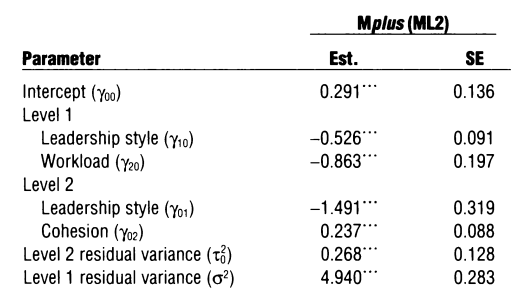
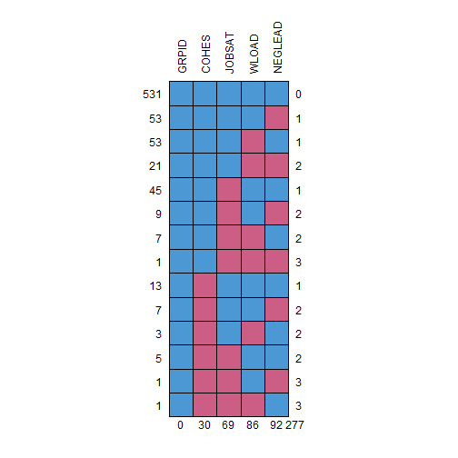

## Using FIML in R with Multilevel Data (Part 3)

A recurring question that I get asked is how to use full information maximum likelihood (FIML) when performing a multiple regression analysis BUT this time, accounting for nesting or clustered data structure. For this example, I use the the `leadership` dataset in the `mitml` package (Grund et al., 2021). We'll also use `lavaan` (Roseel, 2012) to estimate the two-level model. The chapter of Grund et al. (2019) is available [here](https://simongrund1.github.io/publications/2019-chap-apa/). We'll replicate the `Mplus` FIML results in Table 16.3 in the chapter and is shown below:



### Read in the data

As `lavaan` and `Mplus` need data in a numeric format (not factors), we have to recode a `factor` into a `numeric` variable. We inspect the dataset also for missing data:


``` r
library(mitml)
library(lavaan)
library(sjmisc) #for frq
library(MLMusingR) #for nmiss
library(dplyr) #for some data management and the pipe

data(leadership) #from the mitml package
MLMusingR::nmiss(leadership)
```

```
Percent missing per variable:
  GRPID  JOBSAT   COHES NEGLEAD   WLOAD 
  0.000   0.092   0.040   0.123   0.115 

Percent complete cases: 0.708 
(Minimum) number to impute: 29 
```

``` r
mice::md.pattern(leadership, rotate.names = TRUE)
```



```
    GRPID COHES JOBSAT WLOAD NEGLEAD    
531     1     1      1     1       1   0
53      1     1      1     1       0   1
53      1     1      1     0       1   1
21      1     1      1     0       0   2
45      1     1      0     1       1   1
9       1     1      0     1       0   2
7       1     1      0     0       1   2
1       1     1      0     0       0   3
13      1     0      1     1       1   1
7       1     0      1     1       0   2
3       1     0      1     0       1   2
5       1     0      0     1       1   2
1       1     0      0     1       0   3
1       1     0      0     0       1   3
        0    30     69    86      92 277
```

Also, as done in the chapter, we:

- compute the group mean for `NEGLEAD` and use it as a predictor (level 2);
- group mean center `NEGLEAD` and also use that as a predictor (level 1);
- convert `WLOAD` into a binary, numeric predictor (wloadh = 1 and wloadh = 0).


``` r
str(leadership)
```

```
'data.frame':	750 obs. of  5 variables:
 $ GRPID  : num  1 1 1 1 1 1 1 1 1 1 ...
 $ JOBSAT : num  -1.717 0.237 -2.098 2.933 0.145 ...
 $ COHES  : num  1.33 1.33 1.33 1.33 1.33 ...
 $ NEGLEAD: num  0.3128 -1.9047 -0.1243 -1.2984 0.0646 ...
 $ WLOAD  : Factor w/ 2 levels "low","high": 1 1 1 1 2 1 1 1 1 1 ...
```

``` r
# creating group means and group centered variables
leadership$negleadm <- group_mean(leadership$NEGLEAD, leadership$GRPID)
leadership$negleadc <- group_center(leadership$NEGLEAD, leadership$GRPID)

frq(leadership, WLOAD) #this is a factor, convert
```

```
WLOAD <categorical> 
# total N=750 valid N=664 mean=1.37 sd=0.48

Value |   N | Raw % | Valid % | Cum. %
--------------------------------------
low   | 416 | 55.47 |   62.65 |  62.65
high  | 248 | 33.07 |   37.35 | 100.00
<NA>  |  86 | 11.47 |    <NA> |   <NA>
```

``` r
leadership$wloadh <- ifelse(leadership$WLOAD == 'high', 1, 0)
frq(leadership, wloadh)
```

```
wloadh <numeric> 
# total N=750 valid N=664 mean=0.37 sd=0.48

Value |   N | Raw % | Valid % | Cum. %
--------------------------------------
    0 | 416 | 55.47 |   62.65 |  62.65
    1 | 248 | 33.07 |   37.35 | 100.00
 <NA> |  86 | 11.47 |    <NA> |   <NA>
```

### Use `lavaan` to estimate the model of interest

This first model does not account for missing data (just uses listwise deletion). Note as done in the chapter (read the chapter), we constrain the effect of `wload` to be the same across levels.


``` r
mod <- '
level:1
  JOBSAT ~ negleadc + a * wloadh #a is used to constrain to be equal
level:2
  JOBSAT ~ negleadm + COHES + a * wloadh
'

## Estimate models
m0 <- sem(data = leadership, model = mod,
          cluster = 'GRPID')
summary(m0) #ignoring missing
```

```
lavaan 0.6-19 ended normally after 33 iterations

  Estimator                                         ML
  Optimization method                           NLMINB
  Number of model parameters                         8
  Number of equality constraints                     1

                                                  Used       Total
  Number of observations                           531         750
  Number of clusters [GRPID]                        48            

Model Test User Model:
                                                      
  Test statistic                                 0.033
  Degrees of freedom                                 1
  P-value (Chi-square)                           0.856

Parameter Estimates:

  Standard errors                             Standard
  Information                                 Observed
  Observed information based on                Hessian


Level 1 [within]:

Regressions:
                   Estimate  Std.Err  z-value  P(>|z|)
  JOBSAT ~                                            
    negleadc         -0.476    0.089   -5.372    0.000
    wloadh     (a)   -0.758    0.193   -3.936    0.000

Variances:
                   Estimate  Std.Err  z-value  P(>|z|)
   .JOBSAT            4.512    0.290   15.556    0.000


Level 2 [GRPID]:

Regressions:
                   Estimate  Std.Err  z-value  P(>|z|)
  JOBSAT ~                                            
    negleadm         -1.379    0.312   -4.421    0.000
    COHES             0.236    0.079    2.999    0.003
    wloadh     (a)   -0.758    0.193   -3.936    0.000

Intercepts:
                   Estimate  Std.Err  z-value  P(>|z|)
   .JOBSAT           -0.189    0.129   -1.463    0.144

Variances:
                   Estimate  Std.Err  z-value  P(>|z|)
   .JOBSAT            0.095    0.105    0.900    0.368
```

The output says it uses only 531 out of 750 observations. We can use FIML to account for the missing data:


``` r
m1 <- sem(data = leadership, model = mod,
          missing = 'fiml', cluster = 'GRPID',
          fixed.x = FALSE)
```

```
Warning: lavaan->lav_data_full():  
   some cases are empty and will be ignored: 692.
```

```
Warning: lavaan->lav_model_hessian():  
   Hessian is not fully symmetric. Max diff = 
   0.0145968188158649 (Max diag Hessian = 78.5822165206694)
```

```
Warning: lavaan->lav_model_hessian():  
   Hessian is not fully symmetric. Max diff = 
   0.0143185015100071 (Max diag Hessian = 80.5929458759393)
```

Note when we do it this way, we get a couple of warnings:

1. Observation `692` will not be used. We can inspect that observation:


``` r
leadership[692,]
```

```
    GRPID JOBSAT COHES NEGLEAD WLOAD negleadm negleadc wloadh
692    47     NA 0.569      NA  <NA>   -0.106       NA     NA
```

This observation has missing values on all level-1 predictors as well as the outcome (so in this case, it drops it). Think about it: if all that you had were level-2 predictors and no level-1 predictors (and the outcome as well) for an observation, does it make sense to still include the observation in the model? Mplus does not provide that warning though.

2. Provides a warning about the Hessian matrix. This appears when we constrain results to be equal across levels (does not happen if the constraint is not there).


``` r
summary(m1)
```

```
lavaan 0.6-19 ended normally after 87 iterations

  Estimator                                         ML
  Optimization method                           NLMINB
  Number of model parameters                        21
  Number of equality constraints                     1

                                                  Used       Total
  Number of observations                           749         750
  Number of clusters [GRPID]                        50            
  Number of missing patterns -- level 1              7            
  Number of missing patterns -- level 2              2            

Model Test User Model:
                                                      
  Test statistic                                 0.523
  Degrees of freedom                                 1
  P-value (Chi-square)                           0.470

Parameter Estimates:

  Standard errors                             Standard
  Information                                 Observed
  Observed information based on                Hessian


Level 1 [within]:

Regressions:
                   Estimate  Std.Err  z-value  P(>|z|)
  JOBSAT ~                                            
    negleadc         -0.526    0.091   -5.784    0.000
    wloadh     (a)   -0.863    0.197   -4.381    0.000

Covariances:
                   Estimate  Std.Err  z-value  P(>|z|)
  negleadc ~~                                         
    wloadh            0.047    0.020    2.330    0.020

Intercepts:
                   Estimate  Std.Err  z-value  P(>|z|)
    negleadc         -0.026    0.040   -0.648    0.517

Variances:
                   Estimate  Std.Err  z-value  P(>|z|)
   .JOBSAT            4.940    0.283   17.481    0.000
    negleadc          1.057    0.059   18.070    0.000
    wloadh            0.230    0.013   17.517    0.000


Level 2 [GRPID]:

Regressions:
                   Estimate  Std.Err  z-value  P(>|z|)
  JOBSAT ~                                            
    negleadm         -1.491    0.319   -4.675    0.000
    COHES             0.237    0.088    2.686    0.007
    wloadh     (a)   -0.863    0.197   -4.381    0.000

Covariances:
                   Estimate  Std.Err  z-value  P(>|z|)
  negleadm ~~                                         
    COHES            -0.005    0.073   -0.068    0.946
    wloadh            0.006    0.008    0.742    0.458
  COHES ~~                                            
    wloadh           -0.043    0.028   -1.525    0.127

Intercepts:
                   Estimate  Std.Err  z-value  P(>|z|)
   .JOBSAT            0.291    0.136    2.142    0.032
    negleadm          0.028    0.051    0.549    0.583
    COHES             0.156    0.185    0.844    0.399
    wloadh            0.363    0.021   17.278    0.000

Variances:
                   Estimate  Std.Err  z-value  P(>|z|)
   .JOBSAT            0.268    0.128    2.086    0.037
    negleadm          0.131    0.026    5.000    0.000
    COHES             1.629    0.332    4.905    0.000
    wloadh            0.005    0.004    1.037    0.300
```

``` r
parameterestimates(m1) %>% 
  dplyr::filter(lhs == 'JOBSAT')
```

```
     lhs op      rhs block level label    est    se     z
1 JOBSAT  ~ negleadc     1     1       -0.526 0.091 -5.78
2 JOBSAT  ~   wloadh     1     1     a -0.863 0.197 -4.38
3 JOBSAT ~~   JOBSAT     1     1        4.940 0.283 17.48
4 JOBSAT ~1              1     1        0.000 0.000    NA
5 JOBSAT  ~ negleadm     2     2       -1.491 0.319 -4.67
6 JOBSAT  ~    COHES     2     2        0.237 0.088  2.69
7 JOBSAT  ~   wloadh     2     2     a -0.863 0.197 -4.38
8 JOBSAT ~~   JOBSAT     2     2        0.268 0.128  2.09
9 JOBSAT ~1              2     2        0.291 0.136  2.14
  pvalue ci.lower ci.upper
1  0.000   -0.704   -0.348
2  0.000   -1.249   -0.477
3  0.000    4.386    5.494
4     NA    0.000    0.000
5  0.000   -2.116   -0.866
6  0.007    0.064    0.409
7  0.000   -1.249   -0.477
8  0.037    0.016    0.519
9  0.032    0.025    0.557
```

You can compare the results with those estimated using `Mplus`. The syntax is from the Grund et al. (2019) chapter. Results are comparable:

```
MODEL RESULTS

Two-Tailed
                Estimate       S.E.  Est./S.E.    P-Value

Within Level

JOBSAT     ON
NEGLEADC          -0.526      0.091     -5.785      0.000
WLOADH            -0.863      0.197     -4.382      0.000

NEGLEADC WITH
WLOADH             0.047      0.020      2.330      0.020

Means
NEGLEADC          -0.026      0.040     -0.648      0.517

Variances
NEGLEADC           1.057      0.059     18.070      0.000
WLOADH             0.230      0.013     17.516      0.000

Residual Variances
JOBSAT             4.940      0.283     17.481      0.000

Between Level

JOBSAT     ON
NEGLEADM          -1.491      0.319     -4.675      0.000
COHES              0.237      0.088      2.686      0.007
WLOADH            -0.863      0.197     -4.382      0.000

NEGLEADM WITH
COHES             -0.005      0.073     -0.068      0.945
WLOADH             0.006      0.008      0.742      0.458

COHES    WITH
WLOADH            -0.043      0.028     -1.524      0.127

Means
COHES              0.156      0.185      0.844      0.399
NEGLEADM           0.028      0.051      0.549      0.583
WLOADH             0.363      0.021     17.278      0.000

Intercepts
JOBSAT             0.291      0.136      2.141      0.032

Variances
COHES              1.629      0.332      4.905      0.000
NEGLEADM           0.131      0.026      5.000      0.000
WLOADH             0.005      0.004      1.037      0.300

Residual Variances
JOBSAT             0.268      0.128      2.086      0.037
```

Table 16.3 is shown again (so you don't have to scroll all the way up):


Note though that Grund et al. prefer to use multiple imputation. In their [Organizational Research Methods](https://simongrund1.github.io/publications/pdf/Grund_etal_2018_ORM.pdf) article (2018), they warn against using FIML with multilevel data in some cases (see p. 127).

#### References

Grund, S., Ludtke, O., & Robitzsch, A. (2019). Missing data in multilevel research. In: Humphrey, S. E. & LeBreton, J. M. (Eds.), *Handbook for multilevel theory, measurement, and analysis*. Washington, DC: American Psychological Association doi: 10.1037/0000115-017

-- END

