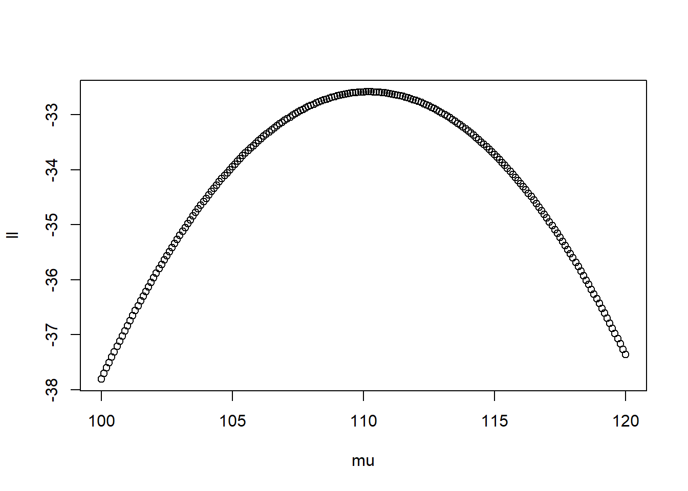

<em>Notes to self.</em> Often, discussions related to maximum likelihood refer to (A) estimating parameters likely to have come from some (B) probability distribution (PD) by (C) maximizing a likelihood function (from Wikipedia).

In many cases, (A) is the unknown which we want to figure out (e.g., means, variances, regression coefficients). We make an assumption about the PD where the data come from and determine the likelihood or the log likelihood of observing the datum. Get the product of all the likelihoods (multiplicative) or the sum of the log likelihoods (additive) and you will get the total likelihood.

An example will help:

<h1>Simulate some data</h1>
<pre class="r"><code>set.seed(123)
x &lt;- rnorm(10, mean = 110, sd = 3) #make up some data
x</code></pre>
<pre><code>##  [1] 108.3186 109.3095 114.6761 110.2115 110.3879 115.1452 111.3827 106.2048
##  [9] 107.9394 108.6630</code></pre>
<pre class="r"><code>mean(x)</code></pre>
<pre><code>## [1] 110.2239</code></pre>
<pre class="r"><code>sd(x)</code></pre>
<pre><code>## [1] 2.861352</code></pre>

We have a vector with 10 elements. We can easily get the mean of this by just typing <code>mean(x)</code> but this is for illustrative purposes.

We create a likelihood function <code>llike</code> based on a normal distribution using:

\(f(x; \mu, \sigma^2) = \frac{1}{\sigma \sqrt{2\pi}}e^{-\frac{1}{2}(\frac{x - \mu}{\sigma})^2}\)

This take the sums of the log likelihood of whatever data is in x with a specified mean (<code>mu</code>) and standard deviation <code>sigma</code>– the later two we “don’t” know. There is also the built-in function of <code>dnorm</code> which we can use to check if we are getting the same results.

<pre class="r"><code>llike &lt;- function(x, mu, sigma){
  sum(log((1 / (sigma * sqrt(2 * pi))) * exp(-.5 * ((x - mu) / sigma)^2)))
}

llike(x, 100, 10) #testing function to see if this works</code></pre>
<pre><code>## [1] -37.81005</code></pre>
<pre class="r"><code>#just checking if we specify m = 100, sd = 10
sum(dnorm(x, mean = 100, sd = 10, log = T)) #using built-in function</code></pre>
<pre><code>## [1] -37.81005</code></pre>

We get the same result using a specified mean of 100 and an SD of 10.

We can take a series of means (<code>mu</code> below) and see where the sum of the ll is at the highest.

<pre class="r"><code>mu &lt;- seq(100, 120, .1) #set of values to test
ll &lt;- sapply(mu, function(z)
  llike(x, z, 10) #find the log likelihood
)

plot(ll ~ mu) #plot </code></pre>

<pre class="r"><code>mu[which(ll == max(ll))] #which mu had the highest point</code></pre>
<pre><code>## [1] 110.2</code></pre>

Based on the results, it peaks around 110.

We can use another function to find the maximum point (optimizing involves either finding the maximum or minimum). A lot of these ideas come from the very useful and accessible book of Hilbe and Robinson (2013) <em>Methods of Statistical Model Estimation</em>.

<pre class="r"><code>## another function to optimize
bb &lt;- function(p, x){
  sum(dnorm(x, mean = p[1], sd = p[2], log = T))
}

## finding the maximum likelihood using &#39;optim&#39;
fit &lt;- optim(c(mean = 100, sd = 10), #starting values or guesses
      fn = bb, x = x,
      control = list(fnscale = -1)) #-1 to maximize
fit$par #contain the mean and the SD</code></pre>
<pre><code>##       mean         sd 
## 110.224295   2.715141</code></pre>
<pre class="r"><code>mean(x)</code></pre>
<pre><code>## [1] 110.2239</code></pre>
<pre class="r"><code>sd(x) #this is the actual variance</code></pre>
<pre><code>## [1] 2.861352</code></pre>
<pre class="r"><code>sqrt(sum((x - mean(x))^2) / length(x)) #this is the ML variance</code></pre>
<pre><code>## [1] 2.714517</code></pre>
<pre class="r"><code># (SS / n), not n - 1
# based on ML
# the variance is under estimated</code></pre>

<h1>What about using ML in a regression?</h1>

I have not seen examples showing this. I’ve only seen examples of the first kind shown (e.g., getting the mean).

First, create some data with two variables (<code>x1</code> and <code>x2</code>):

<pre class="r"><code>## simulate some data
set.seed(2468)
ns &lt;- 1000
x1 &lt;- rnorm(ns)
x2 &lt;- rnorm(ns)
e1 &lt;- rnorm(ns)
y &lt;- 10 + 1 * x1 + .5 * x2 + e1
dat &lt;- data.frame(y = y, x1 = x1, x2 = x2)</code></pre>

Prepare the formula and some matrices:

<pre class="r"><code>fml &lt;- formula(&#39;y ~ x1 + x2&#39;)
df &lt;- model.frame(fml, dat)
y &lt;- model.response(df)
X &lt;- model.matrix(fml, df)</code></pre>

Create another function to optimize:

<pre class="r"><code>## log likelihood for continuous variables
ll.cont &lt;- function(p, X, y){
  len &lt;- length(p)
  betas &lt;- p
  mu &lt;- X %*% betas
  sum((y - mu)^2) #minimize this, sum of squared residuals
}</code></pre>

In this case, we want to minimize the sums of squared residuals (error)– that’s what the best fitting line does.

<pre class="r"><code>start &lt;- ncol(X) #how many start values
fit &lt;- optim(p = rep(1, start), #repeat 1 
      fn = ll.cont, 
      X = X, y = y) #this minimizes the SSR
fit$par #compare with results below </code></pre>
<pre><code>## [1] 9.9952812 1.0151535 0.5098497</code></pre>
<pre class="r"><code>## values are for the intercept / Bx1 / Bx2</code></pre>

Compare to using our standard <code>lm</code> function:

<pre class="r"><code>t1 &lt;- lm(y ~ x1 + x2, data = df)
summary(t1)$coef</code></pre>
<pre><code>##              Estimate Std. Error   t value      Pr(&gt;|t|)
## (Intercept) 9.9950936 0.03144700 317.83937  0.000000e+00
## x1          1.0153582 0.03116854  32.57638 4.166280e-159
## x2          0.5096043 0.03093340  16.47424  4.091831e-54</code></pre>

Instead of minimizing the error, what if we want to maximize the likelihoods again?

<pre class="r"><code>ll.cont.mx &lt;- function(p, X, y){
  len &lt;- length(p)
  betas &lt;- p[-len]
  mu &lt;- X %*% betas
  sds &lt;- p[len]
  sum(dnorm(y, mean = mu, sd = sds, log = T)) #maximize this
  #sum((y - mu)^2) #minimize this
}

start &lt;- ncol(X) + 1 #add one w/c is the variance
fit &lt;- optim(p = rep(1, start), #starting values
             fn = ll.cont.mx, #function to use
             X = X, y = y, #pass this to our
             hessian = T, #to get standard errors
             control = list(fnscale = -1, #to maximize
             reltol = 1e-10) #change in deviance to converge
)
b &lt;- fit$par[1:3] #the betas
ll &lt;- fit$value #the log likelihood
conv &lt;- fit$convergence #value of zero means convergence
ses &lt;- sqrt(diag(solve(-fit$hessian)))[1:3] #get the SE from the inverse of the Hessian matrix
df &lt;- data.frame(b, ses, t = b/ses)       
rownames(df) &lt;- colnames(X)
df #putting it all together   </code></pre>
<pre><code>##                     b        ses         t
## (Intercept) 9.9951172 0.03139866 318.32944
## x1          1.0153670 0.03112063  32.62681
## x2          0.5095777 0.03088585  16.49874</code></pre>
<pre class="r"><code>ll #the log likelihood</code></pre>
<pre><code>## [1] -1411.179</code></pre>
<pre class="r"><code>t1 &lt;- lm(y ~ x1 + x2, data = df)
summary(t1)$coef</code></pre>
<pre><code>##              Estimate Std. Error   t value      Pr(&gt;|t|)
## (Intercept) 9.9950936 0.03144700 317.83937  0.000000e+00
## x1          1.0153582 0.03116854  32.57638 4.166280e-159
## x2          0.5096043 0.03093340  16.47424  4.091831e-54</code></pre>
<pre class="r"><code>logLik(t1)</code></pre>
<pre><code>## &#39;log Lik.&#39; -1411.179 (df=4)</code></pre>

Similar coefficients, standard errors, and the same log likelihood.

— END

