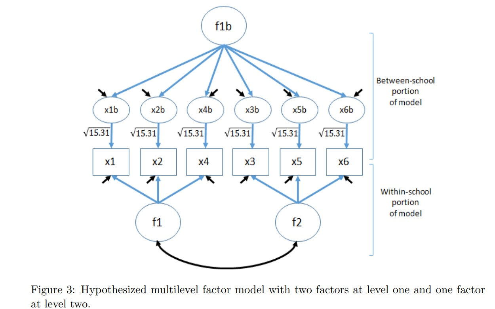

A while back, I wrote a note about how to conduct a [multilevel
confirmatory factor analysis (MLCFA) in
R](https://github.com/flh3/mcfa/blob/main/MCFAinRHUANG.pdf). Part of the
note shows how to setup `lavaan` to be able to run the MLCFA model.
*NOTE:* one of the important aspects of an MLCFA is that the factor
structure at the two levels *may not be the same*– that is the factor
structures are *invariant* across levels. The setup process is/was
cumbersome– but putting the note together was informative. Testing a 2-1
factor model (i.e., 2 factors at the first level and 1 factor at the
second level) required the following code (see the original note for the
detailed explanation of the setup and what the variables represent).
This is a measure of school engagement; *n* = 3,894 students in 254
schools.

## 1. Running an MLCFA manually

1.  Read in the data

<!-- -->

    library(lavaan)
    source("https://raw.githubusercontent.com/flh3/mcfa/main/02_syntax/mcfa2.R")
    raw <- read.csv("https://raw.githubusercontent.com/flh3/mcfa/main/01_data/raw.csv")
    head(raw)

      x1 x2 x3 x4 x5 x6 sid
    1  4  4  3  4  4  3  55
    2  6  6  4  6  4  4  55
    3  5  5  2  6  4  4  55
    4  4  4  5  5  3  3  55
    5  4  4  4  4  3  2  55
    6  4  4  2  4  2  2  55

Just as a reminder, here are some item statistics: 

1.  Prepare the data for use with the `mcfa.input` function to create
    the necessary matrices and store them in `x`.

<!-- -->

    x <- mcfa.input("sid", raw) #sid is the school id or clustering variable
    combined.cov <- list(within = x$pw.cov, between = x$b.cov)
    combined.n <- list(within = x$n - x$G, between = x$G)
    x$icc #view intraclass correlation (ICCs) of the six variables

       x1    x2    x3    x4    x5    x6 
    0.199 0.247 0.145 0.108 0.248 0.125 

1.  Specify the model:

<!-- -->

    level2.1factor <- '
      f1 =~ x1 + c(a,a)*x2 + c(b,b)*x4
      f2 =~ x3 + c(c,c)*x5 + c(d,d)*x6
     
      x1 ~~ c(e,e)*x1
      x2 ~~ c(f,f)*x2
      x3 ~~ c(g,g)*x3
      x4 ~~ c(h,h)*x4
      x5 ~~ c(i,i)*x5
      x6 ~~ c(j,j)*x6
      f1 ~~ c(k,k)*f1
      f2 ~~ c(l,l)*f2
      f1 ~~ c(m,m)*f2
      x1b =~ c(0,3.91)*x1
      x1b ~~ c(0,NA)*x1b
      x2b =~ c(0,3.91)*x2
      x2b ~~ c(0,NA)*x2b
      x3b =~ c(0,3.91)*x3
      x3b ~~ c(0,NA)*x3b
      x4b =~ c(0,3.91)*x4
      x4b ~~ c(0,NA)*x4b
      x5b =~ c(0,3.91)*x5
      x5b ~~ c(0,NA)*x5b
      x6b =~ c(0,3.91)*x6
      x6b ~~ c(0,NA)*x6b
     
      bf1 =~ c(0,1)*x1b  + c(0,NA)*x2b + c(0,NA)*x3b + c(0,NA)*x4b  +
         c(0,NA)*x5b + c(0,NA)*x6b
      bf1 ~~ c(0,NA)*bf1 + c(0,0)*f1 + c(0,0)*f2
    '

The specified model looks like:

1.  Run the model:

<!-- -->

    results6 <- cfa(level2.1factor, sample.cov = combined.cov,
     sample.nobs = combined.n, orthogonal = T)
    summary(results6, fit.measures = T, standardized = T)

     lavaan 0.6-19 ended normally after 54 iterations
     
       Estimator                                         ML
       Optimization method                           NLMINB
       Number of model parameters                        38
       Number of equality constraints                    13
     
       Number of observations per group:                   
         within                                        3640
         between                                        254
     
     Model Test User Model:
                                                           
       Test statistic                               142.465
       Degrees of freedom                                17
       P-value (Chi-square)                           0.000
       Test statistic for each group:
         within                                      56.924
         between                                     85.541
     
     Model Test Baseline Model:
     
       Test statistic                             11054.075
       Degrees of freedom                                30
       P-value                                        0.000
     
     User Model versus Baseline Model:
     
       Comparative Fit Index (CFI)                    0.989
       Tucker-Lewis Index (TLI)                       0.980
     
     Loglikelihood and Information Criteria:
     
       Loglikelihood user model (H0)             -27509.959
       Loglikelihood unrestricted model (H1)     -27438.727
                                                           
       Akaike (AIC)                               55069.919
       Bayesian (BIC)                             55226.599
       Sample-size adjusted Bayesian (SABIC)      55147.160
     
     Root Mean Square Error of Approximation:
     
       RMSEA                                          0.062
       90 Percent confidence interval - lower         0.052
       90 Percent confidence interval - upper         0.071
       P-value H_0: RMSEA <= 0.050                    0.019
       P-value H_0: RMSEA >= 0.080                    0.001
     
     Standardized Root Mean Square Residual:
     
       SRMR                                           0.024
     
     Parameter Estimates:
     
       Standard errors                             Standard
       Information                                 Expected
       Information saturated (h1) model          Structured
     
     
     Group 1 [within]:
     
     Latent Variables:
                        Estimate  Std.Err  z-value  P(>|z|)   Std.lv
       f1 =~                                                        
         x1                1.000                               0.694
         x2         (a)    1.081    0.021   51.609    0.000    0.750
         x4         (b)    0.649    0.024   27.156    0.000    0.450
       f2 =~                                                        
         x3                1.000                               0.688
         x5         (c)    1.146    0.030   38.404    0.000    0.789
         x6         (d)    1.317    0.034   38.786    0.000    0.906
       x1b =~                                                       
         x1                0.000                               0.000
       x2b =~                                                       
         x2                0.000                               0.000
       x3b =~                                                       
         x3                0.000                               0.000
       x4b =~                                                       
         x4                0.000                               0.000
       x5b =~                                                       
         x5                0.000                               0.000
       x6b =~                                                       
         x6                0.000                               0.000
       bf1 =~                                                       
         x1b               0.000                                 NaN
         x2b               0.000                                 NaN
         x3b               0.000                                 NaN
         x4b               0.000                                 NaN
         x5b               0.000                                 NaN
         x6b               0.000                                 NaN
       Std.all
              
         0.882
         0.873
         0.454
              
         0.634
         0.819
         0.868
              
         0.000
              
         0.000
              
         0.000
              
         0.000
              
         0.000
              
         0.000
              
           NaN
           NaN
           NaN
           NaN
           NaN
           NaN
     
     Covariances:
                        Estimate  Std.Err  z-value  P(>|z|)   Std.lv
       f1 ~~                                                        
         f2         (m)    0.301    0.013   24.014    0.000    0.630
         bf1               0.000                                 NaN
       f2 ~~                                                        
         bf1               0.000                                 NaN
       Std.all
              
         0.630
           NaN
              
           NaN
     
     Variances:
                        Estimate  Std.Err  z-value  P(>|z|)   Std.lv
        .x1         (e)    0.137    0.008   17.000    0.000    0.137
        .x2         (f)    0.176    0.010   18.328    0.000    0.176
        .x3         (g)    0.704    0.019   37.860    0.000    0.704
        .x4         (h)    0.781    0.019   41.160    0.000    0.781
        .x5         (i)    0.306    0.012   25.779    0.000    0.306
        .x6         (j)    0.270    0.014   19.493    0.000    0.270
         f1         (k)    0.481    0.016   30.196    0.000    1.000
         f2         (l)    0.473    0.024   20.059    0.000    1.000
        .x1b               0.000                                 NaN
        .x2b               0.000                                 NaN
        .x3b               0.000                                 NaN
        .x4b               0.000                                 NaN
        .x5b               0.000                                 NaN
        .x6b               0.000                                 NaN
         bf1               0.000                                 NaN
       Std.all
         0.222
         0.238
         0.598
         0.794
         0.330
         0.247
         1.000
         1.000
           NaN
           NaN
           NaN
           NaN
           NaN
           NaN
           NaN
     
     
     Group 2 [between]:
     
     Latent Variables:
                        Estimate  Std.Err  z-value  P(>|z|)   Std.lv
       f1 =~                                                        
         x1                1.000                               0.694
         x2         (a)    1.081    0.021   51.609    0.000    0.750
         x4         (b)    0.649    0.024   27.156    0.000    0.450
       f2 =~                                                        
         x3                1.000                               0.688
         x5         (c)    1.146    0.030   38.404    0.000    0.789
         x6         (d)    1.317    0.034   38.786    0.000    0.906
       x1b =~                                                       
         x1                3.910                               1.511
       x2b =~                                                       
         x2                3.910                               1.900
       x3b =~                                                       
         x3                3.910                               1.685
       x4b =~                                                       
         x4                3.910                               1.341
       x5b =~                                                       
         x5                3.910                               2.073
       x6b =~                                                       
         x6                3.910                               1.497
       bf1 =~                                                       
         x1b               1.000                               0.987
         x2b               1.258    0.037   33.807    0.000    0.987
         x3b               1.025    0.062   16.612    0.000    0.906
         x4b               0.784    0.054   14.640    0.000    0.871
         x5b               1.256    0.064   19.471    0.000    0.903
         x6b               0.991    0.047   21.132    0.000    0.986
       Std.all
              
         0.407
         0.360
         0.270
              
         0.343
         0.345
         0.496
              
         0.887
              
         0.911
              
         0.841
              
         0.804
              
         0.907
              
         0.820
              
         0.987
         0.987
         0.906
         0.871
         0.903
         0.986
     
     Covariances:
                        Estimate  Std.Err  z-value  P(>|z|)   Std.lv
       f1 ~~                                                        
         f2         (m)    0.301    0.013   24.014    0.000    0.630
         bf1               0.000                               0.000
       f2 ~~                                                        
         bf1               0.000                               0.000
       Std.all
              
         0.630
         0.000
              
         0.000
     
     Variances:
                        Estimate  Std.Err  z-value  P(>|z|)   Std.lv
        .x1         (e)    0.137    0.008   17.000    0.000    0.137
        .x2         (f)    0.176    0.010   18.328    0.000    0.176
        .x3         (g)    0.704    0.019   37.860    0.000    0.704
        .x4         (h)    0.781    0.019   41.160    0.000    0.781
        .x5         (i)    0.306    0.012   25.779    0.000    0.306
        .x6         (j)    0.270    0.014   19.493    0.000    0.270
         f1         (k)    0.481    0.016   30.196    0.000    1.000
         f2         (l)    0.473    0.024   20.059    0.000    1.000
        .x1b               0.004    0.002    1.742    0.082    0.027
        .x2b               0.006    0.003    1.812    0.070    0.025
        .x3b               0.033    0.008    4.161    0.000    0.179
        .x4b               0.028    0.007    3.814    0.000    0.241
        .x5b               0.052    0.008    6.639    0.000    0.185
        .x6b               0.004    0.004    0.985    0.325    0.027
         bf1               0.145    0.017    8.637    0.000    1.000
       Std.all
         0.047
         0.040
         0.175
         0.281
         0.058
         0.081
         1.000
         1.000
         0.027
         0.025
         0.179
         0.241
         0.185
         0.027
         1.000

## 2. Automatic Setup of an MLCFA

To run this **automatically** using `lavaan`, the setup is now much
simpler:

    twolevel <- '
    level: 1
      f1 =~ x1 + x2 + x4
      f2 =~ x3 + x5 + x6
    level: 2
      fb =~ x1 + x2 + x3 + x4 + x5 + x6
    '

    results <- cfa(twolevel, data = raw, cluster = 'sid')

    Warning: lavaan->lav_data_full():  
       Level-1 variable "x1" has no variance within some clusters . 
       The cluster ids with zero within variance are: 62, 52, 54.

    Warning: lavaan->lav_data_full():  
       Level-1 variable "x2" has no variance within some clusters . 
       The cluster ids with zero within variance are: 61.

    Warning: lavaan->lav_data_full():  
       Level-1 variable "x5" has no variance within some clusters . 
       The cluster ids with zero within variance are: 60.

    summary(results, fit.measures = T, standardized = T)

    lavaan 0.6-19 ended normally after 73 iterations

      Estimator                                         ML
      Optimization method                           NLMINB
      Number of model parameters                        31

      Number of observations                          3894
      Number of clusters [sid]                         254

    Model Test User Model:
                                                          
      Test statistic                               140.120
      Degrees of freedom                                17
      P-value (Chi-square)                           0.000

    Model Test Baseline Model:

      Test statistic                             10988.837
      Degrees of freedom                                30
      P-value                                        0.000

    User Model versus Baseline Model:

      Comparative Fit Index (CFI)                    0.989
      Tucker-Lewis Index (TLI)                       0.980

    Loglikelihood and Information Criteria:

      Loglikelihood user model (H0)             -27492.948
      Loglikelihood unrestricted model (H1)     -27422.888
                                                          
      Akaike (AIC)                               55047.896
      Bayesian (BIC)                             55242.179
      Sample-size adjusted Bayesian (SABIC)      55143.675

    Root Mean Square Error of Approximation:

      RMSEA                                          0.043
      90 Percent confidence interval - lower         0.037
      90 Percent confidence interval - upper         0.050
      P-value H_0: RMSEA <= 0.050                    0.953
      P-value H_0: RMSEA >= 0.080                    0.000

    Standardized Root Mean Square Residual (corr metric):

      SRMR (within covariance matrix)                0.022
      SRMR (between covariance matrix)               0.055

    Parameter Estimates:

      Standard errors                             Standard
      Information                                 Observed
      Observed information based on                Hessian

    Level 1 [within]:

    Latent Variables:
                       Estimate  Std.Err  z-value  P(>|z|)   Std.lv
      f1 =~                                                        
        x1                1.000                               0.693
        x2                1.084    0.021   52.810    0.000    0.751
        x4                0.644    0.024   27.003    0.000    0.446
      f2 =~                                                        
        x3                1.000                               0.688
        x5                1.146    0.030   38.464    0.000    0.789
        x6                1.321    0.034   38.847    0.000    0.908
      Std.all
             
        0.881
        0.874
        0.449
             
        0.634
        0.819
        0.869

    Covariances:
                       Estimate  Std.Err  z-value  P(>|z|)   Std.lv
      f1 ~~                                                        
        f2                0.301    0.012   24.171    0.000    0.631
      Std.all
             
        0.631

    Variances:
                       Estimate  Std.Err  z-value  P(>|z|)   Std.lv
       .x1                0.138    0.008   17.530    0.000    0.138
       .x2                0.175    0.009   18.669    0.000    0.175
       .x4                0.790    0.019   41.008    0.000    0.790
       .x3                0.705    0.019   38.015    0.000    0.705
       .x5                0.306    0.012   25.811    0.000    0.306
       .x6                0.269    0.014   19.432    0.000    0.269
        f1                0.481    0.016   30.197    0.000    1.000
        f2                0.473    0.024   19.969    0.000    1.000
      Std.all
        0.223
        0.237
        0.799
        0.598
        0.329
        0.246
        1.000
        1.000

    Level 2 [sid]:

    Latent Variables:
                       Estimate  Std.Err  z-value  P(>|z|)   Std.lv
      fb =~                                                        
        x1                1.000                               0.385
        x2                1.262    0.037   34.134    0.000    0.486
        x3                0.997    0.067   14.861    0.000    0.384
        x4                0.790    0.054   14.611    0.000    0.304
        x5                1.209    0.071   17.078    0.000    0.466
        x6                0.987    0.050   19.704    0.000    0.380
      Std.all
             
        0.988
        0.986
        0.899
        0.911
        0.898
        0.988

    Intercepts:
                       Estimate  Std.Err  z-value  P(>|z|)   Std.lv
       .x1                4.744    0.028  168.611    0.000    4.744
       .x2                4.564    0.035  131.910    0.000    4.564
       .x3                3.513    0.033  107.212    0.000    3.513
       .x4                4.348    0.027  160.857    0.000    4.348
       .x5                4.198    0.037  114.219    0.000    4.198
       .x6                3.913    0.030  130.439    0.000    3.913
      Std.all
       12.167
        9.253
        8.225
       13.024
        8.095
       10.168

    Variances:
                       Estimate  Std.Err  z-value  P(>|z|)   Std.lv
       .x1                0.004    0.002    1.824    0.068    0.004
       .x2                0.007    0.003    2.271    0.023    0.007
       .x3                0.035    0.008    4.100    0.000    0.035
       .x4                0.019    0.008    2.495    0.013    0.019
       .x5                0.052    0.008    6.554    0.000    0.052
       .x6                0.003    0.004    0.946    0.344    0.003
        fb                0.148    0.018    8.274    0.000    1.000
      Std.all
        0.024
        0.028
        0.191
        0.170
        0.193
        0.023
        1.000

The factor loadings and fit indices are similar– and are exactly the
same when done using `Mplus` (see article p. 15 for a comparison).

To get the alpha at either level (part of the function), can use the
`alpha` function (I prefer Omega nowadays though for several reasons).

    alpha(x$ab.cov) #multilevel alpha or level 2 alpha

    [1] 0.9658581

NOTE: At the moment, you cannot use ordinal data in a two level model
using `lavaan` and WLSMV.

-   END 
