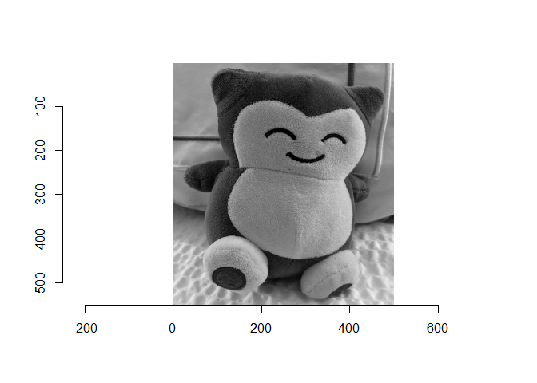
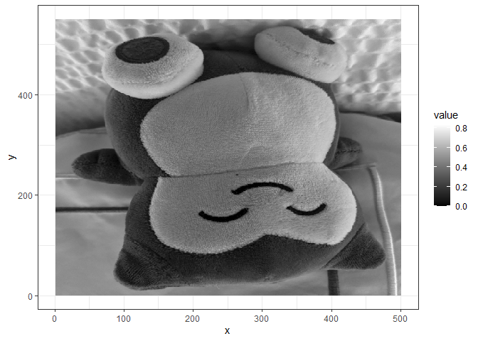
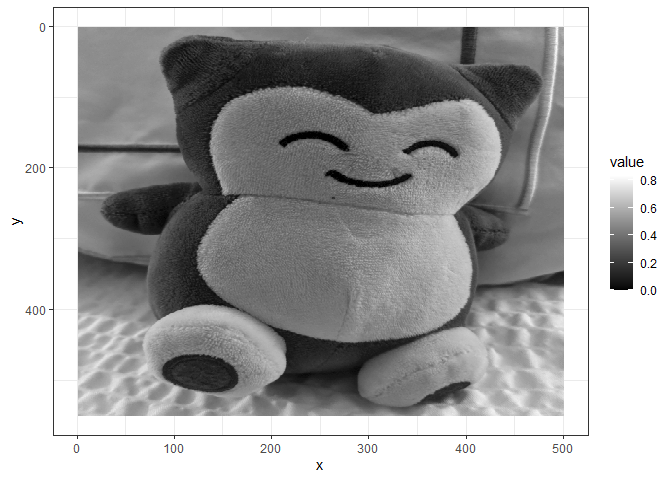
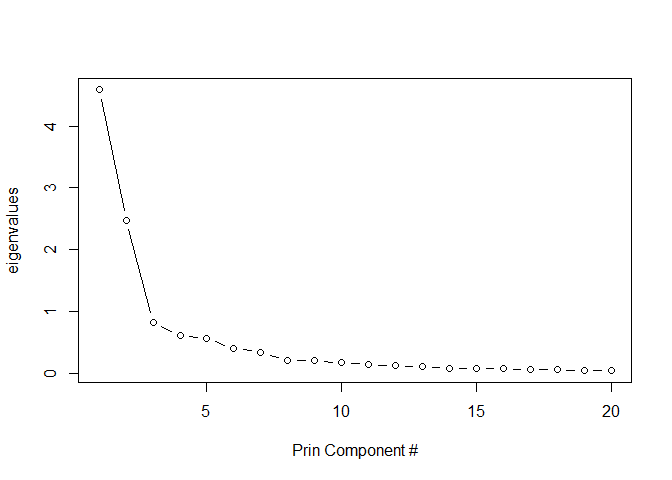
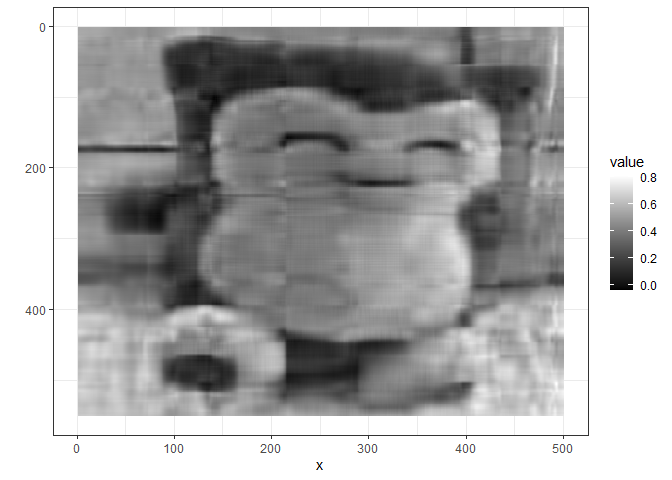
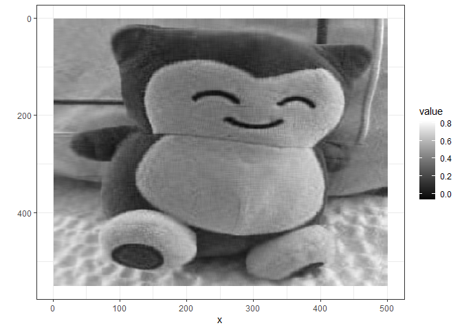

## Creating grayscale images using PCA

The following links were helpful: 1.
<https://cran.r-project.org/web/packages/imager/vignettes/gettingstarted.html>
2.
<https://stats.stackexchange.com/questions/229092/how-to-reverse-pca-and-reconstruct-original-variables-from-several-principal-com>

    library(tidyverse) #for ggplot, %>%
    library(imager) #to read in the jpg

    image1 <- load.image("c:/data/snorlax_g2.jpg")

Can download the image from:
<https://github.com/flh3/pubdata/blob/main/miscdata/snorlax_g2.jpg>

Somehow is not reading directly from the website… To view the image

    plot(image1)

    ## NOTE 0,0 is in the upper left corner

    image1

    ## Image. Width: 500 pix Height: 550 pix Depth: 1 Colour channels: 1

    dim(image1)

    ## [1] 500 550   1   1

    #500 x 550 pixels
    xwidth = dim(image1)[1] #just saving these
    yheight = dim(image1)[2]

    dat <- as.data.frame(image1) #create a tall dataset
    #that can work with ggplot
    head(dat)

    ##   x y     value
    ## 1 1 1 0.5137255
    ## 2 2 1 0.5058824
    ## 3 3 1 0.5098039
    ## 4 4 1 0.5137255
    ## 5 5 1 0.5098039
    ## 6 6 1 0.5098039

    ### plotting the image
    ggplot(dat, aes(x = x, y = y, fill = value)) +
      geom_raster() + theme_bw() +
      scale_fill_gradient(low = "black", high = "white")

    ### NOTE: 0, 0 is in the lower left corner so we 
    ### should just flip it

    ggplot(dat, aes(x = x, y = y, fill = value)) +
      geom_raster() + theme_bw() +
      scale_y_reverse() +  #add to flip scale
      scale_fill_gradient(low = "black", high = "white")

OK, so we know the image renders correctly, let’s experiment using PCA.

First, create a wide data frame to use in a PCA.

## Preparing to run the PCA

    wide <- pivot_wider(dat, id_cols = x,
     names_from = 'y', names_prefix = 'y',
     values_from = 'value')
    dim(wide) #just checking

    ## [1] 500 551

    wide[1:5, 1:5] #just checking

    ## # A tibble: 5 × 5
    ##       x    y1    y2    y3    y4
    ##   <int> <dbl> <dbl> <dbl> <dbl>
    ## 1     1 0.514 0.510 0.510 0.510
    ## 2     2 0.506 0.506 0.510 0.514
    ## 3     3 0.510 0.506 0.514 0.510
    ## 4     4 0.514 0.510 0.510 0.502
    ## 5     5 0.510 0.514 0.510 0.506

    wide2 <- select(wide, -x) #just remove x variable
    wide2[1:5, 1:5]

    ## # A tibble: 5 × 5
    ##      y1    y2    y3    y4    y5
    ##   <dbl> <dbl> <dbl> <dbl> <dbl>
    ## 1 0.514 0.510 0.510 0.510 0.510
    ## 2 0.506 0.506 0.510 0.514 0.506
    ## 3 0.510 0.506 0.514 0.510 0.510
    ## 4 0.514 0.510 0.510 0.502 0.510
    ## 5 0.510 0.514 0.510 0.506 0.506

## Running a PCA (manually)

    cvm <- cov(wide2) #using covariance matrix :: you can use the 
    ## correlation matrix but the scaling will be different (since it's standardized)
    ev <- eigen(cvm)
    str(ev) #has both eigen values and eigen vectors

    ## List of 2
    ##  $ values : num [1:550] 4.583 2.479 0.832 0.609 0.568 ...
    ##  $ vectors: num [1:550, 1:550] 0.00565 0.00565 0.00571 0.00578 0.00528 ...
    ##  - attr(*, "class")= chr "eigen"

    evalues <- ev$values
    loadings <- ev$vectors
    mus <- colMeans(wide2) #need this later when we return to original
    zwide <- scale(wide2, center = T, scale = F) #need this for 
    #principal component scores, just centered, not scaled

    ## principal component scores

    pcs <- as.matrix(zwide) %*% loadings
    cor(pcs)[1:5, 1:5] %>% round #not correlated (as it should be)

    ##      [,1] [,2] [,3] [,4] [,5]
    ## [1,]    1    0    0    0    0
    ## [2,]    0    1    0    0    0
    ## [3,]    0    0    1    0    0
    ## [4,]    0    0    0    1    0
    ## [5,]    0    0    0    0    1

    head(pcs)[1:5, 1:5]

    ##          [,1]      [,2]       [,3]
    ## [1,] 2.922521 0.2774740 -0.8150739
    ## [2,] 2.929396 0.2661346 -0.8064723
    ## [3,] 2.956576 0.2717294 -0.7936503
    ## [4,] 2.980215 0.2632674 -0.7617172
    ## [5,] 2.999131 0.2674471 -0.7381271
    ##            [,4]      [,5]
    ## [1,] -0.2730839 0.9014217
    ## [2,] -0.2990911 0.8866691
    ## [3,] -0.3144499 0.8792177
    ## [4,] -0.3190132 0.8769835
    ## [5,] -0.3130517 0.8847785

    # plot(evalues) #scree plot, if interested, but we have 500+
    # so just limit to first 20
    plot(evalues[1:20], type = 'b', 
         ylab = 'eigenvalues',
         xlab = 'Prin Component #') #scree plot, if

    #what percent do first 10 eigenvalues each account for in variance?
    (evalues / sum(evalues))[1:10] 

    ##  [1] 0.38328068 0.20726950 0.06958218
    ##  [4] 0.05089264 0.04747089 0.03365118
    ##  [7] 0.02876539 0.01757143 0.01710983
    ## [10] 0.01435288

    (evalues / sum(evalues))[1:10] %>% sum #90% of variance

    ## [1] 0.8699466

## Creating original data using all component scores & loadings

    tmp <- pcs %*% t(loadings) #component scores x loadings
    tmp2 <- scale(tmp, center = -mus, scale = F) #reintroduce mean
    head(tmp2)[1:5, 1:5] #reconstituted

    ##           [,1]      [,2]      [,3]
    ## [1,] 0.5137255 0.5098039 0.5098039
    ## [2,] 0.5058824 0.5058824 0.5098039
    ## [3,] 0.5098039 0.5058824 0.5137255
    ## [4,] 0.5137255 0.5098039 0.5098039
    ## [5,] 0.5098039 0.5137255 0.5098039
    ##           [,4]      [,5]
    ## [1,] 0.5098039 0.5098039
    ## [2,] 0.5137255 0.5058824
    ## [3,] 0.5098039 0.5098039
    ## [4,] 0.5019608 0.5098039
    ## [5,] 0.5058824 0.5058824

    head(wide)[1:5, 1:5] #original data frame

    ## # A tibble: 5 × 5
    ##       x    y1    y2    y3    y4
    ##   <int> <dbl> <dbl> <dbl> <dbl>
    ## 1     1 0.514 0.510 0.510 0.510
    ## 2     2 0.506 0.506 0.510 0.514
    ## 3     3 0.510 0.506 0.514 0.510
    ## 4     4 0.514 0.510 0.510 0.502
    ## 5     5 0.510 0.514 0.510 0.506

    ### place the matrix into a data frame
    new2 <- data.frame(tmp2)
    names(new2) <- 1:yheight #add names, just numbers (coordinates)
    new2$x <- row.names(new2) %>% as.numeric #add x coordinate
    tall2 <- pivot_longer(new2, 1:yheight, names_to = 'y') #create tall

    ## Warning: Using an external vector in selections was
    ## deprecated in tidyselect 1.1.0.
    ## ℹ Please use `all_of()` or `any_of()`
    ##   instead.
    ##   # Was:
    ##   data %>% select(yheight)
    ## 
    ##   # Now:
    ##   data %>% select(all_of(yheight))
    ## 
    ## See
    ## <https://tidyselect.r-lib.org/reference/faq-external-vector.html>.
    ## This warning is displayed once every 8
    ## hours.
    ## Call
    ## `lifecycle::last_lifecycle_warnings()` to
    ## see where this warning was generated.

    tall2$y <- as.numeric(tall2$y) #when pivoting, y because a character
    ggplot(tall2, aes(x = x, y = y, fill = value)) +
      geom_raster() + theme_bw() + scale_y_reverse() +
      scale_fill_gradient(low = "black", high = "white")

So what if we just use the first 10 components? (out of 500+)

    ncomp <- 10 #number of components to use
    ### Creating data using 10 components
    tmp <- pcs[,1:ncomp] %*% t(loadings[,1:ncomp]) #component scores x loadings
    tmp2 <- scale(tmp, center = -mus, scale = F) #add back mean
    head(tmp2)[1:5, 1:5] #reconstituted

    ##           [,1]      [,2]      [,3]
    ## [1,] 0.5494325 0.5454111 0.5435424
    ## [2,] 0.5488673 0.5449852 0.5431840
    ## [3,] 0.5484028 0.5446355 0.5428195
    ## [4,] 0.5473589 0.5438008 0.5420109
    ## [5,] 0.5473990 0.5438387 0.5419770
    ##           [,4]      [,5]
    ## [1,] 0.5449286 0.5446933
    ## [2,] 0.5445829 0.5443818
    ## [3,] 0.5441641 0.5439251
    ## [4,] 0.5433143 0.5430735
    ## [5,] 0.5432045 0.5429343

    head(wide)[1:5, 1:5] #original data frame

    ## # A tibble: 5 × 5
    ##       x    y1    y2    y3    y4
    ##   <int> <dbl> <dbl> <dbl> <dbl>
    ## 1     1 0.514 0.510 0.510 0.510
    ## 2     2 0.506 0.506 0.510 0.514
    ## 3     3 0.510 0.506 0.514 0.510
    ## 4     4 0.514 0.510 0.510 0.502
    ## 5     5 0.510 0.514 0.510 0.506

    new2 <- data.frame(tmp2)
    names(new2) <- 1:yheight #add names
    new2$x <- row.names(new2) %>% as.numeric #add x coordinate
    tall2 <- pivot_longer(new2, 1:yheight, names_to = 'y') #create tall
    tall2$y <- as.numeric(tall2$y) #when pivoting, y because a character
    ggplot(tall2, aes(x = x, y = y, fill = value)) +
      geom_raster() + theme_bw() + labs(y = '') + scale_y_reverse() +
      scale_fill_gradient(low = "black", high = "white") 

Image is not very clear!

What if we use more components?

    ncomp <- 40 #number of components to use
    tmp <- pcs[,1:ncomp] %*% t(loadings[,1:ncomp]) #component scores x loadings
    tmp2 <- scale(tmp, center = -mus, scale = F) #add back mean
    ### place the matrix into a data frame
    new2 <- data.frame(tmp2)
    names(new2) <- 1:yheight #add names
    new2$x <- row.names(new2) %>% as.numeric #add x coordinate
    tall2 <- pivot_longer(new2, 1:yheight, names_to = 'y') #create tall
    tall2$y <- as.numeric(tall2$y) #when pivoting, y because a character
    ggplot(tall2, aes(x = x, y = y, fill = value)) +
      geom_raster() + theme_bw() + labs(y = '') + scale_y_reverse() +
      scale_fill_gradient(low = "black", high = "white") 

Much clearer image with 40 components (out of 500+)

## Using Base R and prcomp

Got this from:
<https://kieranhealy.org/blog/archives/2019/10/27/reconstructing-images-using-pca/>

    img_pca <- prcomp(wide2)
    im <- summary(img_pca)
    im$importance[,1:10] #compare with manual computation

    ##                             PC1      PC2
    ## Standard deviation     2.140883 1.574353
    ## Proportion of Variance 0.383280 0.207270
    ## Cumulative Proportion  0.383280 0.590550
    ##                              PC3       PC4
    ## Standard deviation     0.9121861 0.7801209
    ## Proportion of Variance 0.0695800 0.0508900
    ## Cumulative Proportion  0.6601300 0.7110200
    ##                             PC5       PC6
    ## Standard deviation     0.753439 0.6343583
    ## Proportion of Variance 0.047470 0.0336500
    ## Cumulative Proportion  0.758500 0.7921500
    ##                              PC7      PC8
    ## Standard deviation     0.5865021 0.458393
    ## Proportion of Variance 0.0287700 0.017570
    ## Cumulative Proportion  0.8209100 0.838480
    ##                             PC9      PC10
    ## Standard deviation     0.452332 0.4142896
    ## Proportion of Variance 0.017110 0.0143500
    ## Cumulative Proportion  0.855590 0.8699500

    names(img_pca)

    ## [1] "sdev"     "rotation" "center"  
    ## [4] "scale"    "x"

    dim(img_pca$x) #component scores

    ## [1] 500 500

    dim(img_pca$rotation) #loadings (just the eigenvectors)

    ## [1] 550 500

    img_pca$rotation[1:5, 1:5]

    ##            PC1         PC2         PC3
    ## y1 0.005650860 -0.01864489 0.010587733
    ## y2 0.005645269 -0.02003725 0.008689557
    ## y3 0.005712267 -0.02144366 0.007472650
    ## y4 0.005784892 -0.02284957 0.006774656
    ## y5 0.005280473 -0.02349464 0.006134465
    ##            PC4        PC5
    ## y1 -0.02943221 0.05041304
    ## y2 -0.02681190 0.04938164
    ## y3 -0.02769441 0.04921155
    ## y4 -0.02926209 0.05068930
    ## y5 -0.03049060 0.05210808

    ev$vectors[1:5, 1:5] #our original

    ##             [,1]        [,2]         [,3]
    ## [1,] 0.005650860 -0.01864489 -0.010587733
    ## [2,] 0.005645269 -0.02003725 -0.008689557
    ## [3,] 0.005712267 -0.02144366 -0.007472650
    ## [4,] 0.005784892 -0.02284957 -0.006774656
    ## [5,] 0.005280473 -0.02349464 -0.006134465
    ##             [,4]       [,5]
    ## [1,] -0.02943221 0.05041304
    ## [2,] -0.02681190 0.04938164
    ## [3,] -0.02769441 0.04921155
    ## [4,] -0.02926209 0.05068930
    ## [5,] -0.03049060 0.05210808

    ####

    new <- img_pca$x[, 1:xwidth] %*% t(img_pca$rotation)
    new <- scale(new, center = -mus, scale = F)
    new2 <- data.frame(new)
    new2[1:5, 1:5]

    ##          y1        y2        y3        y4
    ## 1 0.5137255 0.5098039 0.5098039 0.5098039
    ## 2 0.5058824 0.5058824 0.5098039 0.5137255
    ## 3 0.5098039 0.5058824 0.5137255 0.5098039
    ## 4 0.5137255 0.5098039 0.5098039 0.5019608
    ## 5 0.5098039 0.5137255 0.5098039 0.5058824
    ##          y5
    ## 1 0.5098039
    ## 2 0.5058824
    ## 3 0.5098039
    ## 4 0.5098039
    ## 5 0.5058824

    names(new2) <- 1:yheight
    dim(new2)

    ## [1] 500 550

    new2$x <- row.names(new2) %>% as.numeric
    tall2 <- pivot_longer(new2, 1:yheight)
    tall2$y <- as.numeric(tall2$name)
    ggplot(tall2, aes(x = x, y = y, fill = value)) +
      geom_raster() + scale_y_reverse() + theme_bw() +
      labs(y = '') + 
      scale_fill_gradient(low = "black", high = "white")

### END (for now)
