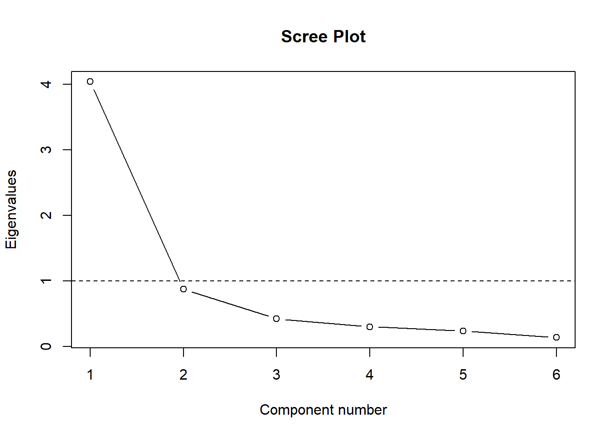

[Rough notes: Let me know if there are corrections]

Principal components analysis (PCA) is a convenient way to reduce high-dimensional data into a smaller number number of ‘components.’ PCA has been referred to as a data reduction/compression technique (i.e., dimensionality reduction). PCA is often used as a means to an end and is not the end in itself. For example, instead of performing a regression with six (and highly correlated) variables, we may be able to compress the data into one or two meaningful components instead and use these in our models instead of the original six variables. Using less variables reduces possible problems associated with multicollinearity. This decreases the problems of redundancy.

Note that PCA has often been called exploratory factor analysis (EFA) probably due to the fact that many software programs list PCA under the factor analysis heading (e.g., in SPSS, analyze \(\rightarrow\) dimension reduction \(\rightarrow\) factor; PROC FACTOR in SAS). They are <strong>NOT</strong> the same. Often though– both procedures will produce similar results (depending on the struture of the dataset) and both can be used to reduce high dimensional data into a smaller number of components or factors. However, the causal structure of both procedures differ. Note the directions of the arrows in both procedures. For a FA, the underlying assumption is that the covariation among observed variables is <em>caused</em> by a common factor (or factors or latent variables). Both procedures can be used for exploratory analysis. EFA (not PCA) is often used as a precursor to Confirmatory Factor Analysis.

<h3>1. Manually running a principal components analysis</h3>

The following example uses sample classroom literacy data (n = 120). We are interested in six variables (rhyme awareness, beginning sound awareness, alphabet recognition, letter sound knowledge, spelling, and concept of word) and will remove the first variable from the dataset (gender). The six variables of interest are subtasks from the <strong>Phonological Awareness Literacy Screening (PALS)</strong> assessment. The raw data is imported and then a correlation matrix is generated (this is using simulated data based on the original correlation matrix). The correlation matrix will then be used to run our PCA.

<pre class="r"><code>dat &lt;- read.csv(&quot;http://faculty.missouri.edu/huangf/data/mvnotes/READING120n.csv&quot;)
str(dat) #just checking on our data</code></pre>
<pre><code>## &#39;data.frame&#39;:    120 obs. of  7 variables:
##  $ GEN     : Factor w/ 2 levels &quot;F&quot;,&quot;M&quot;: 2 1 2 1 1 2 2 2 1 1 ...
##  $ rhyme   : int  10 10 9 5 2 5 8 4 3 9 ...
##  $ Begsnd  : int  10 10 10 10 10 6 5 3 7 10 ...
##  $ ABC     : int  6 22 23 10 4 22 25 26 18 26 ...
##  $ LS      : int  7 19 15 3 0 8 20 16 8 17 ...
##  $ Spelling: int  4 9 5 2 0 17 12 3 3 15 ...
##  $ COW     : int  7 15 6 3 2 6 4 0 0 15 ...</code></pre>
<pre class="r"><code>options(digits = 3) #so we get cleaner output, to the third digit
dat &lt;- dat[,-1] #removing the first variable which is gender
p &lt;- ncol(dat) #no of variables, I know it&#39;s not good to name your variables
# this way (just don&#39;t do it with t or c for example) but that&#39;s it for now...
R &lt;- cor(dat) #saving the correlation matrix
R #displaying the matrix- note: if you put a parenthesis around your statement, </code></pre>
<pre><code>##          rhyme Begsnd   ABC    LS Spelling   COW
## rhyme    1.000  0.616 0.499 0.677    0.668 0.693
## Begsnd   0.616  1.000 0.285 0.347    0.469 0.469
## ABC      0.499  0.285 1.000 0.796    0.589 0.598
## LS       0.677  0.347 0.796 1.000    0.758 0.749
## Spelling 0.668  0.469 0.589 0.758    1.000 0.767
## COW      0.693  0.469 0.598 0.749    0.767 1.000</code></pre>
<pre class="r"><code>#it will also print the output as a default. Just showing it this way for clarity.</code></pre>

For some, the first stop is to check if the data can be reduced. This relies on variables being correlated with each other and allows them to be combined. If not (i.e., if the variables were all orthogonal), there would be no way to combine the variables as factors or components. One basic test is Bartlett’s test of sphericity (as it is called in SPSS)– the null hypothesis of the test is that the correlation matrix is an identity matrix– or that the matrix has one’s on the diagonal and zeroes on all the off diagonals. The test statistic follows a chi square distribution and to proceed, we would want to see statistically significant results.

<pre class="r"><code>#Highlight from the function name to the ending bracket and run. After, a new function called bart will now be available. For now, don&#39;t have to worry about how that is created.
bart &lt;- function(dat){ #dat is your raw data
   R &lt;- cor(dat)
   p &lt;- ncol(dat)
   n &lt;- nrow(dat)
   chi2 &lt;- -((n - 1)-((2 * p)+ 5)/ 6) * log(det(R)) #this is the formula
   df &lt;- (p * (p - 1)/ 2)
   crit &lt;- qchisq(.95, df) #critical value
   p &lt;- pchisq(chi2, df, lower.tail = F) #pvalue
   cat(&quot;Bartlett&#39;s test: X2(&quot;,
    df,&quot;) = &quot;, chi2,&quot;, p = &quot;,
   round(p, 3), sep=&quot;&quot; )   
}</code></pre>

The above lines are a function that we just created. Now we have a homemade <code>bart</code> function and we pass it the raw data we want to analyze.

<pre class="r"><code>bart(dat)</code></pre>
<pre><code>## Bartlett&#39;s test: X2(15) = 497, p = 0</code></pre>

Results indicate that the p value is &lt; .001 (not really 0!) and is statistically significant. PCA can be done. Note: I don’t often use this test but some folks tend to use this. For one, when I have data, I do end up checking, inspecting the correlation matrix or use items in a way where I know they will be correlated with each other to some extent. But, in any case, good to know this. Now, moving on…

<pre class="r"><code>e &lt;- eigen(R) #solving for the eigenvalues and eigenvectors from the correlation matrix
str(e)</code></pre>
<pre><code>## List of 2
##  $ values : num [1:6] 4.042 0.873 0.42 0.299 0.232 ...
##  $ vectors: num [1:6, 1:6] -0.42 -0.307 -0.385 -0.446 -0.436 ...
##  - attr(*, &quot;class&quot;)= chr &quot;eigen&quot;</code></pre>

NOTE: <code>e</code> is a list of two important sets of values. The first set contains the eigenvalues and the second is the set of eigenvectors for the corresponding eigenvalues. We will store them separately and use them in our analyses. The eigenvalue equation is an important equation that is used regularly in MV stats– though fortunately, computers will solve those for us (as we have solved this before using a 2 x 2 matrix and it took a while).

The eigenvalue is a variance for a linear combination of variables (i.e., weighted variables).

<pre class="r"><code>L &lt;- e$values #placing the eigenvalues in L
Vm &lt;- matrix(0, nrow = p, ncol = p) #creating a p x p matrix with zeroes.
#Vm is an orthogonal matrix since all correlations between variable are 0.
diag(Vm) &lt;- L #putting the eigenvalues in the diagonals
Vm #check-- matrix with eigenvalues on the diagonals</code></pre>
<pre><code>##      [,1]  [,2] [,3]  [,4]  [,5]  [,6]
## [1,] 4.04 0.000 0.00 0.000 0.000 0.000
## [2,] 0.00 0.873 0.00 0.000 0.000 0.000
## [3,] 0.00 0.000 0.42 0.000 0.000 0.000
## [4,] 0.00 0.000 0.00 0.299 0.000 0.000
## [5,] 0.00 0.000 0.00 0.000 0.232 0.000
## [6,] 0.00 0.000 0.00 0.000 0.000 0.134</code></pre>
<pre class="r"><code>e$vectors #these are the eigenvectors-- these are the standardized regression weights</code></pre>
<pre><code>##        [,1]    [,2]    [,3]    [,4]    [,5]    [,6]
## [1,] -0.420  0.2993 -0.0927  0.8002 -0.1228  0.2642
## [2,] -0.307  0.7597  0.4314 -0.3329  0.0299 -0.1754
## [3,] -0.385 -0.4678  0.6571 -0.0846  0.0660  0.4354
## [4,] -0.446 -0.3346  0.0653  0.1441 -0.1308 -0.8044
## [5,] -0.436 -0.0389 -0.4390 -0.4379 -0.6046  0.2420
## [6,] -0.439 -0.0290 -0.4201 -0.1709  0.7727  0.0647</code></pre>
<pre class="r"><code>#a quicker way may be to just use Vm &lt;- diag(L)
loadings &lt;- e$vectors %*% sqrt(Vm) #these are the loadings
#or the correlation of the component variables with the original variables-- 
#sometimes referred to as the P matrix. And PP` is the original correlation matrix.
#SPSS refers to this as the component matrix</code></pre>

To reproduce the original correlation matrix (just shown again below):

<pre class="r"><code>cor(dat) #original correlation matrix</code></pre>
<pre><code>##          rhyme Begsnd   ABC    LS Spelling   COW
## rhyme    1.000  0.616 0.499 0.677    0.668 0.693
## Begsnd   0.616  1.000 0.285 0.347    0.469 0.469
## ABC      0.499  0.285 1.000 0.796    0.589 0.598
## LS       0.677  0.347 0.796 1.000    0.758 0.749
## Spelling 0.668  0.469 0.589 0.758    1.000 0.767
## COW      0.693  0.469 0.598 0.749    0.767 1.000</code></pre>

We can use the eigenvalues and the eigenvectors.

<pre class="r"><code>e$vectors %*% Vm %*% t(e$vectors) # V L V`</code></pre>
<pre><code>##       [,1]  [,2]  [,3]  [,4]  [,5]  [,6]
## [1,] 1.000 0.616 0.499 0.677 0.668 0.693
## [2,] 0.616 1.000 0.285 0.347 0.469 0.469
## [3,] 0.499 0.285 1.000 0.796 0.589 0.598
## [4,] 0.677 0.347 0.796 1.000 0.758 0.749
## [5,] 0.668 0.469 0.589 0.758 1.000 0.767
## [6,] 0.693 0.469 0.598 0.749 0.767 1.000</code></pre>
<pre class="r"><code>#NOTE: I use L above in the comment but L is really a diagonal matrix with the L 
#on the diagonal.
#This is the proportion of variance accounted for by each PC
L/length(L)</code></pre>
<pre><code>## [1] 0.6736 0.1454 0.0700 0.0498 0.0387 0.0224</code></pre>

So the original correlation matrix can be reproduced as: the eigenvectors times the diagonal matrix of eigenvalues (has to be a matrix or will be nonconformable) times the tranpose of the matrix of eigenvectors.

To compute component scores– PCA1 = a1z1 + a2z2 + … + a6z6– we need the <em>weights</em> (the eigenvectors) and the <em>standardized</em> values of the original data (z1, z2, etc.). You can have as many component scores as you have variables (but not all will be useful, need to decide how many to retain– if you end up with 6 components from your 6 variables, we haven’t reduced/compressed anything!). To compute the PCA scores (using matrices), zValues x eigenvectors:

<pre class="r"><code>zdat &lt;- scale(dat) #this is just to standardize the original data, M = 0, SD =1
pca.scores &lt;- zdat %*% e$vectors #scaled values x vectors
#this is just P = XA in the notes
colnames(pca.scores) &lt;- paste0(&#39;pca&#39;, 1:6)
head(pca.scores) #just to show some component scores</code></pre>
<pre><code>##        pca1   pca2     pca3   pca4     pca5    pca6
## [1,]  1.119  2.226 -0.80240  0.849 -0.07816 -0.2028
## [2,] -1.345  0.536 -0.00557  0.327  0.21459 -0.2122
## [3,] -0.181  0.610  0.90468  0.477 -0.22323 -0.0487
## [4,]  2.227  1.663  0.07935 -0.374  0.00992 -0.0769
## [5,]  3.370  1.922 -0.22066 -0.990  0.22398 -0.4874
## [6,]  0.427 -0.597 -0.64273 -1.111 -1.20665  1.0341</code></pre>
<pre class="r"><code>#NOTE: these scores are scaled such that they have 
#a mean of zero and the variance comes out to the eigenvalue for 
#that component
round(colMeans(pca.scores), 2) #each pca score has a mean of zero</code></pre>
<pre><code>## pca1 pca2 pca3 pca4 pca5 pca6 
##    0    0    0    0    0    0</code></pre>
<pre class="r"><code>apply(pca.scores, 2, var) #if you get the variance PER column...</code></pre>
<pre><code>##  pca1  pca2  pca3  pca4  pca5  pca6 
## 4.042 0.873 0.420 0.299 0.232 0.134</code></pre>
<pre class="r"><code>e$values #...it will be the same as the eigenvalues too</code></pre>
<pre><code>## [1] 4.042 0.873 0.420 0.299 0.232 0.134</code></pre>

The component scores will differ from what you have with SPSS which scales the components so that it has a mean of zero and an SD of 1. To get the same results (the +/- may just be switched but that does not matter):

<pre class="r"><code>head(scale(pca.scores)[,1]) </code></pre>
<pre><code>## [1]  0.557 -0.669 -0.090  1.108  1.676  0.212</code></pre>

The first component accounts for the most variance (4.042/6). To show the percentage of variance accounted for by each variable– divide the eigenvalues by the number of variables since each scaled variable has a variance of 1. First component accounts for 67% of the variance, second 15%, etc.

<pre class="r"><code>e$values / p </code></pre>
<pre><code>## [1] 0.6736 0.1454 0.0700 0.0498 0.0387 0.0224</code></pre>

Also note, a property of the principal component scores is that they are not correlated with each other– they are completely orthogonal. To see this, generate a correlation matrix based on the pca.scores dataset. So we can see why using PC scores also reduces multicollinearity when these components, if ever, are used in a regression.

<pre class="r"><code>round(cor(pca.scores), 2) #that is not an error, I had it round to 2 decimal places </code></pre>
<pre><code>##      pca1 pca2 pca3 pca4 pca5 pca6
## pca1    1    0    0    0    0    0
## pca2    0    1    0    0    0    0
## pca3    0    0    1    0    0    0
## pca4    0    0    0    1    0    0
## pca5    0    0    0    0    1    0
## pca6    0    0    0    0    0    1</code></pre>
<pre class="r"><code>#to make it clearer. This is a correlation matrix. </code></pre>

To see the structure matrix– which is the correlation of the component scores with the original variables– we can get the correlation between the original values and the newly created component scores. We just correlate the first PC here since that’s the one that accounts for the most variance and the second one accounts for much less.

<pre class="r"><code>cor(dat[,1:6], pca.scores[,1]) #this is correlating the six original variables </code></pre>
<pre><code>##            [,1]
## rhyme    -0.845
## Begsnd   -0.617
## ABC      -0.774
## LS       -0.896
## Spelling -0.876
## COW      -0.882</code></pre>
<pre class="r"><code>#with the first PC.</code></pre>

This is the same as (without having to compute the component scores first):

<pre class="r"><code>comp.matrix &lt;- e$vectors %*% sqrt(Vm) #sometimes referred to as P matrix
#or eigenvectors x sqrt(Vm): P %*% t(P) is equal to the R matrix.
comp.matrix</code></pre>
<pre><code>##        [,1]    [,2]    [,3]    [,4]    [,5]    [,6]
## [1,] -0.845  0.2796 -0.0601  0.4376 -0.0592  0.0968
## [2,] -0.617  0.7097  0.2796 -0.1821  0.0144 -0.0643
## [3,] -0.774 -0.4370  0.4259 -0.0463  0.0318  0.1596
## [4,] -0.896 -0.3126  0.0423  0.0788 -0.0630 -0.2949
## [5,] -0.876 -0.0364 -0.2845 -0.2394 -0.2913  0.0887
## [6,] -0.882 -0.0271 -0.2722 -0.0935  0.3723  0.0237</code></pre>

If you square the correlations, this will give you how much variance the PC accounts for in the original variables. These are referred to as the <strong>communalities</strong>.

<pre class="r"><code>comp.matrix[,1]^2 #comp 1 accounts can account for 71% of the variance </code></pre>
<pre><code>## [1] 0.714 0.381 0.599 0.803 0.768 0.777</code></pre>
<pre class="r"><code>#of the first variable</code></pre>

To get the equivalent of the component matrix (or the weights) can either do:

<pre class="r"><code>solve(R, loadings)</code></pre>
<pre><code>##            [,1]    [,2]   [,3]   [,4]    [,5]   [,6]
## rhyme    -0.209  0.3204 -0.143  1.463 -0.2549  0.721
## Begsnd   -0.153  0.8133  0.666 -0.609  0.0621 -0.478
## ABC      -0.191 -0.5008  1.014 -0.155  0.1370  1.188
## LS       -0.222 -0.3582  0.101  0.263 -0.2715 -2.194
## Spelling -0.217 -0.0417 -0.677 -0.801 -1.2546  0.660
## COW      -0.218 -0.0310 -0.648 -0.313  1.6034  0.177</code></pre>
<pre class="r"><code>#which actually does:
(zweight &lt;- solve(R) %*% loadings ) #solve(R) gets the inverse</code></pre>
<pre><code>##            [,1]    [,2]   [,3]   [,4]    [,5]   [,6]
## rhyme    -0.209  0.3204 -0.143  1.463 -0.2549  0.721
## Begsnd   -0.153  0.8133  0.666 -0.609  0.0621 -0.478
## ABC      -0.191 -0.5008  1.014 -0.155  0.1370  1.188
## LS       -0.222 -0.3582  0.101  0.263 -0.2715 -2.194
## Spelling -0.217 -0.0417 -0.677 -0.801 -1.2546  0.660
## COW      -0.218 -0.0310 -0.648 -0.313  1.6034  0.177</code></pre>

NOTE: these are also weights used in creating a PCA. The difference with what we did earlier is that the sd/var of each component is just scaled to 1. This is what SPSS uses.

<pre class="r"><code>newcomp &lt;- zdat %*% zweight
apply(newcomp, 2, var)</code></pre>
<pre><code>## [1] 1 1 1 1 1 1</code></pre>
<pre class="r"><code>cor(pca.scores[,1], newcomp[,1])</code></pre>
<pre><code>## [1] 1</code></pre>
<pre class="r"><code>plot(pca.scores[,1], newcomp[,1])</code></pre>

NOTE: the end result is the same except that the component score have differing variances.

<h3>2. Using a function for running a principal components analysis</h3>

You can compare our results above (the loadings and the eigenvectors) to what you would get if done in SPSS (or in this case, in <code>R</code> which is done with the <code>psych</code> package– install it if you have not already done so).

<pre class="r"><code>#install.packages(&quot;psych&quot;)
library(psych)</code></pre>

You can run the Bartlett test as we did and you can also run a Kaiser, Meyer, Olkin (KMO) Measure of Sampling Adequacy (MSA, see Word doc class notes for interpretation).

<pre class="r"><code>cortest.bartlett(dat) #indicating that n equals the number of rows in our dataset. </code></pre>
<pre><code>## R was not square, finding R from data</code></pre>
<pre><code>## $chisq
## [1] 497
## 
## $p.value
## [1] 2.06e-96
## 
## $df
## [1] 15</code></pre>
<pre class="r"><code>#If not, it will default to n=100. 
#cortest.bartlett(R, n = nrow(dat)) 
#using the correlation matrix
KMO(dat) #raw data</code></pre>
<pre><code>## Kaiser-Meyer-Olkin factor adequacy
## Call: KMO(r = dat)
## Overall MSA =  0.83
## MSA for each item = 
##    rhyme   Begsnd      ABC       LS Spelling      COW 
##     0.84     0.77     0.80     0.77     0.89     0.90</code></pre>
<pre class="r"><code>#KMO(R) #using correlation matrix</code></pre>

The following lines perform the actual PCA.

<pre class="r"><code>pca &lt;- principal(dat, nfactor = p, rotate = &quot;none&quot;) #forcing to extract 
#p = 6 components-- use the rotate = &#39;none&#39;-- 
#if not, it will create a correlated component matrix.
#The default is one for the number of factors. 
pca</code></pre>
<pre><code>## Principal Components Analysis
## Call: principal(r = dat, nfactors = p, rotate = &quot;none&quot;)
## Standardized loadings (pattern matrix) based upon correlation matrix
##           PC1   PC2   PC3   PC4   PC5   PC6 h2       u2 com
## rhyme    0.84  0.28 -0.06 -0.44 -0.06  0.10  1  1.1e-16 1.8
## Begsnd   0.62  0.71  0.28  0.18  0.01 -0.06  1 -2.2e-16 2.5
## ABC      0.77 -0.44  0.43  0.05  0.03  0.16  1  5.6e-16 2.3
## LS       0.90 -0.31  0.04 -0.08 -0.06 -0.29  1 -2.2e-16 1.5
## Spelling 0.88 -0.04 -0.28  0.24 -0.29  0.09  1 -4.4e-16 1.6
## COW      0.88 -0.03 -0.27  0.09  0.37  0.02  1 -4.4e-16 1.6
## 
##                        PC1  PC2  PC3  PC4  PC5  PC6
## SS loadings           4.04 0.87 0.42 0.30 0.23 0.13
## Proportion Var        0.67 0.15 0.07 0.05 0.04 0.02
## Cumulative Var        0.67 0.82 0.89 0.94 0.98 1.00
## Proportion Explained  0.67 0.15 0.07 0.05 0.04 0.02
## Cumulative Proportion 0.67 0.82 0.89 0.94 0.98 1.00
## 
## Mean item complexity =  1.9
## Test of the hypothesis that 6 components are sufficient.
## 
## The root mean square of the residuals (RMSR) is  0 
##  with the empirical chi square  0  with prob &lt;  NA 
## 
## Fit based upon off diagonal values = 1</code></pre>

NOTE: What is being shown is more commonly referred to as the <em>pattern matrix</em>- which contain the zero-order correlations between the factor and the original variables and the loading (regression weights) when no rotation is used. You can compare these to the results generated using the eigenvectors x the square root of the matrix of eigenvalues (really a diagonal matrix with a the square root of the eigenvalues on the diagonal).

<pre class="r"><code>loadings &lt;- e$vectors %*% sqrt(Vm) #these are the correlations as we have shown earlier
round(loadings, 2) #signs are just different</code></pre>
<pre><code>##       [,1]  [,2]  [,3]  [,4]  [,5]  [,6]
## [1,] -0.84  0.28 -0.06  0.44 -0.06  0.10
## [2,] -0.62  0.71  0.28 -0.18  0.01 -0.06
## [3,] -0.77 -0.44  0.43 -0.05  0.03  0.16
## [4,] -0.90 -0.31  0.04  0.08 -0.06 -0.29
## [5,] -0.88 -0.04 -0.28 -0.24 -0.29  0.09
## [6,] -0.88 -0.03 -0.27 -0.09  0.37  0.02</code></pre>

NOTE: the correlations are the same. Except that eigenvectors 1 and 4 have the opposite signs in their loadings compared to the output from SPSS and R (using the principal function in base R). To get the exact same output, the syntax below can be applied to change the signs (if this bothers you).

<pre class="r"><code>sign &lt;- vector(mode = &quot;numeric&quot;, length = p)
sign &lt;- sign(colSums(loadings)) 
#generates a -1 if total is a negative number and keeps it at +1 if &gt; 0. 
#This is then applied to the loadings to flip the signs. See below:
loadings2 &lt;- loadings %*% diag(sign)
loadings2</code></pre>
<pre><code>##       [,1]    [,2]    [,3]    [,4]    [,5]    [,6]
## [1,] 0.845  0.2796 -0.0601 -0.4376 -0.0592  0.0968
## [2,] 0.617  0.7097  0.2796  0.1821  0.0144 -0.0643
## [3,] 0.774 -0.4370  0.4259  0.0463  0.0318  0.1596
## [4,] 0.896 -0.3126  0.0423 -0.0788 -0.0630 -0.2949
## [5,] 0.876 -0.0364 -0.2845  0.2394 -0.2913  0.0887
## [6,] 0.882 -0.0271 -0.2722  0.0935  0.3723  0.0237</code></pre>

The component weights can be displayed using:

<pre class="r"><code>pca$weights #these are the weights</code></pre>
<pre><code>##            PC1     PC2    PC3    PC4     PC5    PC6
## rhyme    0.209  0.3204 -0.143 -1.463 -0.2549  0.721
## Begsnd   0.153  0.8133  0.666  0.609  0.0621 -0.478
## ABC      0.191 -0.5008  1.014  0.155  0.1370  1.188
## LS       0.222 -0.3582  0.101 -0.263 -0.2715 -2.194
## Spelling 0.217 -0.0417 -0.677  0.801 -1.2546  0.660
## COW      0.218 -0.0310 -0.648  0.313  1.6034  0.177</code></pre>

You can also use the eigenvalues to draw a scree plot like in SPSS (in case you want to refer to something like Kaiser’s rule later on– which many studies have shown to not be very exact– but it is simple):

<pre class="r"><code>#remember, L here refers to the eigenvalues we created earlier
plot(L, main = &quot;Scree Plot&quot;, ylab = &quot;Eigenvalues&quot;, xlab = &quot;Component number&quot;, 
    type = &#39;b&#39;)
abline(h = 1, lty = 2)</code></pre>

This shows you what percent of overall variance each component accounts for, the first component accounts for 63% of the variance, the second, 15% –&gt; have shown this already twice before.

<pre class="r"><code>L/p </code></pre>
<pre><code>## [1] 0.6736 0.1454 0.0700 0.0498 0.0387 0.0224</code></pre>

<h3>3. Number of components to retain</h3>

Several methods have been suggested to decide how many components/factors to retain. There are several methods, some of which are better than others. Kaiser’s rule suggests eigenvalues &gt; 1 but that is not always a good way to decide (the thought being that if the L &lt; 1 then the component accounts for less variance than one of the original variables). Others may suggest using the % of variance accounted for (as long as it is ‘meaningful’). One of the better recognized ways to empirically decide how many factors to retain is to run a parallel analysis (Horn, 1965).

From the <code>hornpa</code> function: The program generates a specified number of <strong>random</strong> datasets based on the number of variables entered by the user. As the correlation matrices have an eigenvalue based on random noise, these eigenvalues are computed for the each dataset and collected. The mean and the specified percentile (95th is the default) are computed. The output table shows how large eigenvalues can be as a result of merely using randomly generated datasets. If the user’s own dataset has an actual eigenvalue greater than the generated eigenvalue (which is based on random noise), that lends support to retain that factor. In other words, if the i(th) eigenvalue from the actual data was larger than the percentile of the (i)th eigenvalue generated using randomly generated data, empirical support is provided to retain that factor. Install the <code>hornpa</code> package if you have not already done so.

We specify how many variables are in the original dataset (k = 6), how big our sample is (size = 120), how many repetitions to run (reps = 500), and we set an optional seed so we get the same results if we run it again (seed = 1234).

<pre class="r"><code>library(hornpa)
hornpa(k = 6, size = 120, reps = 500, seed = 1234) </code></pre>
<pre><code>## 
##  Parallel Analysis Results  
##  
## Method: pca 
## Number of variables: 6 
## Sample size: 120 
## Number of correlation matrices: 500 
## Seed: 1234 
## Percentile: 0.95 
##  
## Compare your observed eigenvalues from your original dataset to the 95 percentile in the table below generated using random data. If your eigenvalue is greater than the percentile indicated (not the mean), you have support to retain that factor/component. 
##  
##  Component  Mean  0.95
##          1 1.312 1.448
##          2 1.159 1.247
##          3 1.042 1.109
##          4 0.939 1.007
##          5 0.836 0.912
##          6 0.712 0.804</code></pre>
<pre class="r"><code>L #our original eigenvalues again</code></pre>
<pre><code>## [1] 4.042 0.873 0.420 0.299 0.232 0.134</code></pre>

Since our first eigenvalue (4.04) is &gt; 1.448, we have support to retain the first component. The second eigenvalue (0.87) is &lt; 1.247– so we may opt to drop the second component and just retain the first one.

Try to find a consensus among the different methods. For the above example, this satisfies the eigenvalue &gt; 1 rule AND more importantly, is suggested by parallel analysis. Although we only account for 60%+ of the variance, that may be acceptable.

<h3>4. Generating component scores</h3>

Remember, the weights are used just like in a regression.

<pre class="r"><code>fs &lt;- factor.scores(x = dat, f = pca) #NOTE: these are your component scores-- 
#even if the function is called factor.scores. places the raw data in x and put the 
#output of your principal function for f.
str(fs) #contains a lot of stuff, if you just want the scores:</code></pre>
<pre><code>## List of 5
##  $ scores  : num [1:120, 1:6] -0.557 0.669 0.09 -1.108 -1.676 ...
##   ..- attr(*, &quot;dimnames&quot;)=List of 2
##   .. ..$ : NULL
##   .. ..$ : chr [1:6] &quot;PC1&quot; &quot;PC2&quot; &quot;PC3&quot; &quot;PC4&quot; ...
##  $ weights : num [1:6, 1:6] 0.209 0.153 0.191 0.222 0.217 ...
##   ..- attr(*, &quot;dimnames&quot;)=List of 2
##   .. ..$ : chr [1:6] &quot;rhyme&quot; &quot;Begsnd&quot; &quot;ABC&quot; &quot;LS&quot; ...
##   .. ..$ : chr [1:6] &quot;PC1&quot; &quot;PC2&quot; &quot;PC3&quot; &quot;PC4&quot; ...
##  $ r.scores: num [1:6, 1:6] 1.00 -5.52e-16 -6.94e-17 -1.11e-16 -8.33e-17 ...
##   ..- attr(*, &quot;dimnames&quot;)=List of 2
##   .. ..$ : chr [1:6] &quot;PC1&quot; &quot;PC2&quot; &quot;PC3&quot; &quot;PC4&quot; ...
##   .. ..$ : chr [1:6] &quot;PC1&quot; &quot;PC2&quot; &quot;PC3&quot; &quot;PC4&quot; ...
##  $ missing : num [1:120] 0 0 0 0 0 0 0 0 0 0 ...
##  $ R2      : num [1:6] 1 NA 1 NA 1 ...</code></pre>
<pre class="r"><code>fscores &lt;- fs$scores[,1] #use the [,1] just to get the first column

#what if I just unit weight the raw scores? manual just adds them together

manual &lt;- with(dat, rhyme + Begsnd + ABC + LS + Spelling + COW)
cor(manual, fscores) #almost perfect!</code></pre>
<pre><code>## [1] 0.993</code></pre>
<pre class="r"><code>plot(manual, fscores)</code></pre>

In this case, it seems like the weighting was more complicated when we could just have added the raw scores together!

<h3>5. Reliability estimates</h3>

What about internal consistency or reliability estimates? Can use the <code>alpha</code> function in the <code>psych</code> package too.

<pre class="r"><code>psych::alpha(dat)</code></pre>
<pre><code>## 
## Reliability analysis   
## Call: psych::alpha(x = dat)
## 
##   raw_alpha std.alpha G6(smc) average_r S/N   ase mean  sd median_r
##       0.88       0.9    0.91       0.6   9 0.012   11 4.7     0.62
## 
##  lower alpha upper     95% confidence boundaries
## 0.86 0.88 0.91 
## 
##  Reliability if an item is dropped:
##          raw_alpha std.alpha G6(smc) average_r  S/N alpha se  var.r med.r
## rhyme         0.87      0.87    0.88      0.58  7.0    0.014 0.0342  0.59
## Begsnd        0.90      0.91    0.91      0.68 10.6    0.012 0.0089  0.68
## ABC           0.86      0.89    0.89      0.62  8.2    0.014 0.0209  0.67
## LS            0.83      0.87    0.86      0.57  6.5    0.019 0.0192  0.59
## Spelling      0.84      0.87    0.89      0.57  6.7    0.016 0.0287  0.61
## COW           0.84      0.87    0.89      0.57  6.6    0.017 0.0284  0.60
## 
##  Item statistics 
##            n raw.r std.r r.cor r.drop mean  sd
## rhyme    120  0.79  0.85  0.81   0.75  7.3 3.0
## Begsnd   120  0.55  0.65  0.56   0.47  7.9 2.7
## ABC      120  0.82  0.77  0.73   0.71 20.9 6.9
## LS       120  0.92  0.88  0.88   0.86 14.5 7.5
## Spelling 120  0.87  0.87  0.84   0.81  7.5 6.0
## COW      120  0.89  0.87  0.85   0.81 10.2 7.2</code></pre>

NOTE: I use the format <code>psych::alpha</code> to specifically call the <code>alpha</code> function in the <code>psych</code> package. Sometimes, different packages will have the name for a function. If you use the <code>::</code> you don’t even have to load in the library anymore and call the function directly. The alpha of our measure is quite good, \(\alpha = .88\).

You can also use the <code>ci.reliability</code> function in the <code>MBESS</code> package which can compute Omega (w/c I prefer and is often even better, \(\omega = .92\).).

<pre class="r"><code>MBESS::ci.reliability(dat)</code></pre>
<pre><code>## $est
## [1] 0.919
## 
## $se
## [1] 0.0104
## 
## $ci.lower
## [1] 0.898
## 
## $ci.upper
## [1] 0.939
## 
## $conf.level
## [1] 0.95
## 
## $type
## [1] &quot;omega&quot;
## 
## $interval.type
## [1] &quot;robust maximum likelihood (wald ci)&quot;</code></pre>

<h2 id="references">References</h2>

Bartlett, M. S. (1951). The effect of standardization on a chi square approximation in factor analysis, <em>Biometrika, 38</em>, 337-344.

Horn, J. (1965). A rationale and test for the number of factors in factor analysis. <em>Psychometrika, 32</em>, 179-185

