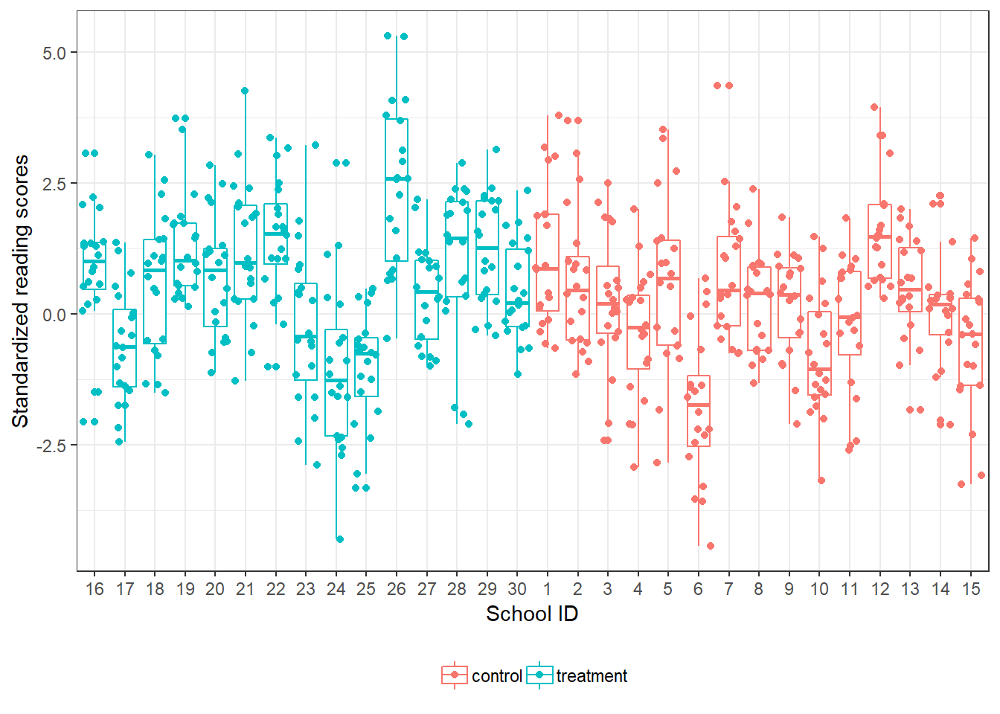

In our module on regression diagnostics, I mentioned 1) that at times (with clustered data) standard errors may be misestimated and may be too low, resulting in a greater chance of making a Type I error (i.e., claiming statistically significant results when they should not be). In our ANCOVA session, I also indicated that 2) covariates are helpful because they help to lower the (standard) error in the model and increase power. So, it sounds like we would like to have models with lower standard errors. However, there are cases when the standard error is estimated <em>lower</em> than it should be (i.e., the standard error is <em>biased</em>).

Here’s an example– we have 30 schools with 20 student participants in each school. Fifteen schools are assigned to the treatment group (tr = 1) and 15 schools are assigned to the control (tr = 0) condition. The treatment is expected to improve reading achievement (Y). We also have a pre-test for each child (Ypre) which we can use as a covariate.

<pre class="r"><code>### These next few lines create the simulated dataset
set.seed(12345)
sid &lt;- rep(1:30, each = 20) #10 school ids
tr &lt;- rep(0:1, each = 300) #treatment status
err2 &lt;- rep(rnorm(30), each = 20) #L2 error
Ypre &lt;- rnorm(600)
Y &lt;- .5 * tr + err2 + .7 * Ypre + rnorm(600) #generate the outcome
tr &lt;- factor(tr, labels = c(&#39;control&#39;, &#39;treatment&#39;)) #label after
dat &lt;- data.frame(Y, sid, Ypre, tr) #create data frame</code></pre>

A way to visualize this (each point is a child’s reading score):

<pre class="r"><code>library(forcats)
library(ggplot2) #to visualize the scores
dat$sid &lt;- factor(dat$sid)
ggplot(dat, aes(x = fct_reorder2(sid, Y, as.numeric(tr)), y = Y, col = tr)) + geom_boxplot() + geom_point(position = &#39;jitter&#39;) + labs(y = &quot;Standardized reading scores&quot;, x = &#39;School ID&#39;) + theme_bw() + theme(legend.position=&quot;bottom&quot;, legend.title = element_blank())</code></pre>

Comparing outcomes in the treatment vs. control suggests that the treatment was effective with students on average in the treatment group scoring higher (0.59) vs students in the control schools (0.15). So the difference in scores is around 0.44 points.

<pre class="r"><code>aggregate(Y ~ tr, dat, FUN = mean)</code></pre>
<pre><code>##          tr         Y
## 1   control 0.1535202
## 2 treatment 0.5886845</code></pre>
<pre class="r"><code>mod1 &lt;- lm(Y ~ tr + Ypre, data = dat)
summary(mod1)</code></pre>
<pre><code>## 
## Call:
## lm(formula = Y ~ tr + Ypre, data = dat)
## 
## Residuals:
##     Min      1Q  Median      3Q     Max 
## -3.7011 -0.8952  0.0623  0.8584  4.0943 
## 
## Coefficients:
##             Estimate Std. Error t value Pr(&gt;|t|)    
## (Intercept)  0.06997    0.07433   0.941    0.347    
## trtreatment  0.48542    0.10487   4.629 4.52e-06 ***
## Ypre         0.78547    0.05260  14.934  &lt; 2e-16 ***
## ---
## Signif. codes:  0 &#39;***&#39; 0.001 &#39;**&#39; 0.01 &#39;*&#39; 0.05 &#39;.&#39; 0.1 &#39; &#39; 1
## 
## Residual standard error: 1.284 on 597 degrees of freedom
## Multiple R-squared:  0.287,  Adjusted R-squared:  0.2846 
## F-statistic: 120.1 on 2 and 597 DF,  p-value: &lt; 2.2e-16</code></pre>

<strong>The OLS regression results show that the difference between treatment and control groups are statistically significant, t(597) = 4.63, p &lt; .001.</strong> Note though that the treatment is a group/cluster level variable. All students in the same school are in the same treatment or control group. The overall n is 600 (600 students) but then we actually only have 30 schools. Remember, larger ns result in lower standard errors. The ns also affect the critical value.

One way to test this though would be to get the mean scores per school and test for differences between the treatment and control schools (since the school was the unit of analysis). However, instead of 600 observations, we end up with only 30 schools.

<pre class="r"><code>agg.data &lt;- aggregate(Y ~ tr + sid, FUN = mean)
#view agg.data to see
head(agg.data, n = 3)</code></pre>
<pre><code>##        tr sid         Y
## 1 control   1 1.1084184
## 2 control   2 0.6630194
## 3 control   3 0.2631278</code></pre>
<pre class="r"><code>tail(agg.data, n = 3)</code></pre>
<pre><code>##           tr sid         Y
## 28 treatment  28 1.0279860
## 29 treatment  29 1.2251011
## 30 treatment  30 0.4352093</code></pre>
<pre class="r"><code>mod2 &lt;- lm(Y ~ tr, data = agg.data)
summary(mod2)</code></pre>
<pre><code>## 
## Call:
## lm(formula = Y ~ tr, data = agg.data)
## 
## Residuals:
##     Min      1Q  Median      3Q     Max 
## -1.9137 -0.4653  0.1002  0.5981  1.8768 
## 
## Coefficients:
##             Estimate Std. Error t value Pr(&gt;|t|)
## (Intercept)   0.1535     0.2333   0.658    0.516
## trtreatment   0.4352     0.3300   1.319    0.198
## 
## Residual standard error: 0.9037 on 28 degrees of freedom
## Multiple R-squared:  0.05847,    Adjusted R-squared:  0.02485 
## F-statistic: 1.739 on 1 and 28 DF,  p-value: 0.198</code></pre>

Our results show– using aggregated data– that the treatment schools scored .44 points higher vs control schools. <strong>However, results are not statistically significant (using \(\alpha\) = .05), t(28) = 1.32, p = .20.</strong> A more common way to estimate these effects is using multilevel modeling (or hierarchical linear modeling / HLM).

<pre class="r"><code>library(nlme) #this is for running a MLM
mod2 &lt;- lme(Y ~ tr + Ypre, random = ~1|sid) #this is the multilevel model
summary(mod2)</code></pre>
<pre><code>## Linear mixed-effects model fit by REML
##  Data: NULL 
##        AIC      BIC    logLik
##   1790.635 1812.595 -890.3177
## 
## Random effects:
##  Formula: ~1 | sid
##         (Intercept)  Residual
## StdDev:   0.8396444 0.9935838
## 
## Fixed effects: Y ~ tr + Ypre 
##                 Value Std.Error  DF   t-value p-value
## (Intercept) 0.0723148 0.2242997 569  0.322402  0.7473
## trtreatment 0.4840115 0.3171574  28  1.526093  0.1382
## Ypre        0.7634510 0.0414719 569 18.408893  0.0000
##  Correlation: 
##             (Intr) trtrtm
## trtreatment -0.707       
## Ypre        -0.020  0.008
## 
## Standardized Within-Group Residuals:
##         Min          Q1         Med          Q3         Max 
## -2.74065672 -0.67229384  0.02075635  0.65358281  3.00500913 
## 
## Number of Observations: 600
## Number of Groups: 30</code></pre>

Results are similar to our <em>t</em>-test. Compare the standard errors of the models. The naive model (ignoring the clustering) has a standard error of 0.10. The MLM has a standard error of 0.32. Results are also not statistically significant.

<h2>Yet another way…</h2>

Another way to estimate this is to use cluster robust standard errors (CRSEs). CRSEs adjust the standard errors of the OLS regression model. The CRSEs are 0.33, similar to the MLM model. <strong>NOTE: CRSEs are only <code>good</code> if the number of clusters is at least 25.</strong> With fewer clusters, the standard errors will still be too small.

<pre class="r"><code>library(jtools) #need both the cluster and robust options
summ(mod1, cluster = &#39;sid&#39;, robust = T, digits = 3)</code></pre>
<pre><code>## MODEL INFO:
## Observations: 600
## Dependent Variable: Y
## Type: OLS linear regression 
## 
## MODEL FIT:
## F(2,597) = 120.125, p = 0.000
## R² = 0.287
## Adj. R² = 0.285 
## 
## Standard errors: Cluster-robust, type = HC3
##              Est.  S.E. t val.     p    
## (Intercept) 0.070 0.225  0.311 0.756    
## trtreatment 0.485 0.329  1.476 0.140    
## Ypre        0.785 0.059 13.395 0.000 ***</code></pre>
<pre class="r"><code>#Code below shows how to estimate the same results but use more lines
#library(sandwich)
#library(lmtest)
#vc &lt;- vcovCL(mod1, cluster = dat$sid)
#coeftest(mod1, vc)</code></pre>

We can use <code>jtools</code> for this. Note: we can’t have missing data in the data.frame to make this work properly (so use <code>na.omit</code> to remove missing data).

For more, see article: Huang, F. (2016). Alternatives to multilevel modeling.

