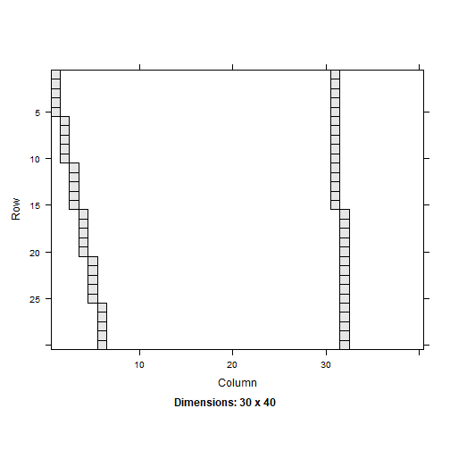
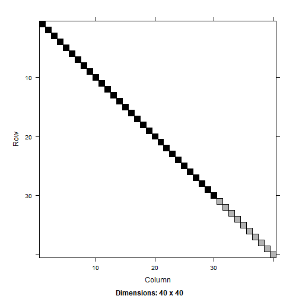
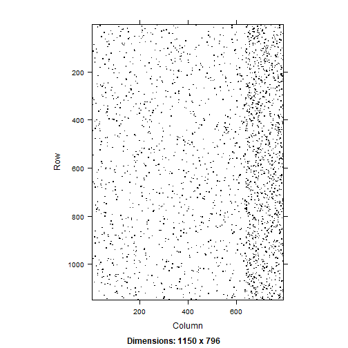

*Notes to self (and anyone else who might find this useful).* With the general linear mixed models (to simplify, I am just omitting super/subscripts):

$$Y = X\beta + Zu + e$$
where we assume $u \sim MVN(0, G)$ and $e \sim MVN(0, R)$. $V$ is: 

$$V = ZGZ^T + R$$

Software estimates $V$ iteratively and maximizes the likelihood (the function of which depends on whether ML or REML is used). The value of $\beta$ can be obtained using:

$$\hat{\beta} = (X^TV^{-1}X)^{-1}X^TV^{-1}y$$.

I just wanted to figure out how to extract $V$ from the R output.

## 1. Manual method

Just using the `sleepstudy` dataset:


``` r
library(lme4)
data(sleepstudy)
nrow(sleepstudy) #total number of observations
```

```
[1] 180
```

``` r
dplyr::n_distinct(sleepstudy$Subject) #number of clusters
```

```
[1] 18
```

``` r
m1 <- lmer(Reaction ~ Days + (Days | Subject), sleepstudy)
summary(m1)
```

```
Linear mixed model fit by REML. t-tests use Satterthwaite's method [
lmerModLmerTest]
Formula: Reaction ~ Days + (Days | Subject)
   Data: sleepstudy

REML criterion at convergence: 1744

Scaled residuals: 
   Min     1Q Median     3Q    Max 
-3.954 -0.463  0.023  0.463  5.179 

Random effects:
 Groups   Name        Variance Std.Dev. Corr
 Subject  (Intercept) 612.1    24.74        
          Days         35.1     5.92    0.07
 Residual             654.9    25.59        
Number of obs: 180, groups:  Subject, 18

Fixed effects:
            Estimate Std. Error     df t value Pr(>|t|)    
(Intercept)   251.41       6.82  17.00   36.84  < 2e-16 ***
Days           10.47       1.55  17.00    6.77  3.3e-06 ***
---
Signif. codes:  0 '***' 0.001 '**' 0.01 '*' 0.05 '.' 0.1 ' ' 1

Correlation of Fixed Effects:
     (Intr)
Days -0.138
```
To obtain the $V$ matrix:


``` r
Z <- getME(m1, 'Z') #180 x 36
G <- bdiag(VarCorr(m1)) #2 x 2
G #the vcov matrix for RE
```

```
## 2 x 2 sparse Matrix of class "dsCMatrix"
##             (Intercept) Days
## (Intercept)       612.1  9.6
## Days                9.6 35.1
```

``` r
R <- diag(sigma(m1)^2, nobs(m1)) #180 x 180
```
$G$ is a 2 $\times$ 2 matrix. Need to expand this based on the number of cluster/subjects.


``` r
Gm <- kronecker(diag(18), G)
Gm[1:6, 1:6] #just to show this
```

```
## 6 x 6 sparse Matrix of class "dgCMatrix"
##                                      
## [1,] 612.1  9.6   .    .     .    .  
## [2,]   9.6 35.1   .    .     .    .  
## [3,]   .    .   612.1  9.6   .    .  
## [4,]   .    .     9.6 35.1   .    .  
## [5,]   .    .     .    .   612.1  9.6
## [6,]   .    .     .    .     9.6 35.1
```

``` r
V <- Z %*% Gm %*% t(Z) + R
```

Knowing $V$, we can put this together to get the fixed effects:


``` r
X <- model.matrix(m1)
y <- m1@resp$y
```

I will just make a function to put this together:


``` r
getFE <- function(X, V, y){
  solve(t(X) %*% solve(V) %*% X) %*% t(X) %*% solve(V) %*% y
}
getFE(X, V, y) 
```

```
## 2 x 1 Matrix of class "dgeMatrix"
##              [,1]
## (Intercept) 251.4
## Days         10.5
```

``` r
fixef(m1) #the same
```

```
## (Intercept)        Days 
##       251.4        10.5
```

Doing this way is fine for simple, well arranged (sorted) datasets but can get more complicated with more levels of clustering (three or more levels). I had to create the Gm matrix.

## 2. More automated way:

After some Googling, I found [this](https://stackoverflow.com/questions/45650548/get-residual-variance-covariance-matrix-in-lme4) which shows how to make a more general function to construct that $V$ matrix. I just put this into a function which will make it easier to call and should work with more complicated RE specifications:


``` r
getV <- function(x){
  var.d <- crossprod(getME(x, "Lambdat"))
  Zt <- getME(x, "Zt")
  vr <- sigma(x)^2
  var.b <- vr * (t(Zt) %*% var.d %*% Zt)
  sI <- vr * Matrix::Diagonal(nobs(x)) #for a sparse matrix
  var.y <- var.b + sI
}
```

Just using the earlier example:


``` r
getFE(X, getV(m1), y) #works
```

```
## 2 x 1 Matrix of class "dgeMatrix"
##              [,1]
## (Intercept) 251.4
## Days         10.5
```

## 3. Try it with simple three level data...

Just make a small dataset that is manageable (always helpful to be able to see the data). Five students with 3 teachers in 10 sch (or 15 students per school)


``` r
n1 <- 5; n2 = 3; n3 = 10
sch <- letters[1:10] #schoolid
tch <- 1:30 #teacherid
sch.cl <- rep(sch, each = n1 * n2) #cluster var
tch.cl <- rep(tch, each = n1)
set.seed(123)
e3 <- rep(rnorm(n1), each = n1 * n2)
e2 <- rep(rnorm(n2 * n1), each = n1)
x1 <- rnorm(n1 * n2 * n3)
e1 <- rnorm(n1 * n2 * n3)
y <- e3 + e2 + .5 * x1 + e1
dat <- data.frame(y, sch.cl, tch.cl, e3, e2, x1, e1)
dat[1:30, ]
```

```
        y sch.cl tch.cl    e3     e2      x1      e1
1   0.405      a      1 -0.56  1.715 -1.0678 -0.2154
2   1.111      a      1 -0.56  1.715 -0.2180  0.0653
3   0.608      a      1 -0.56  1.715 -1.0260 -0.0341
4   2.919      a      1 -0.56  1.715 -0.7289  2.1285
5   0.101      a      1 -0.56  1.715 -0.6250 -0.7413
6  -2.039      a      2 -0.56  0.461 -1.6867 -1.0960
7   0.357      a      2 -0.56  0.461  0.8378  0.0378
8   0.288      a      2 -0.56  0.461  0.1534  0.3105
9  -0.232      a      2 -0.56  0.461 -1.1381  0.4365
10  0.069      a      2 -0.56  0.461  1.2538 -0.4584
11 -2.676      a      3 -0.56 -1.265  0.4265 -1.0633
12 -0.710      a      3 -0.56 -1.265 -0.2951  1.2632
13 -1.728      a      3 -0.56 -1.265  0.8951 -0.3497
14 -2.252      a      3 -0.56 -1.265  0.8781 -0.8655
15 -1.651      a      3 -0.56 -1.265  0.8216 -0.2363
16 -0.770      b      4 -0.23 -0.687  0.6886 -0.1972
17  0.470      b      4 -0.23 -0.687  0.5539  1.1099
18 -0.863      b      4 -0.23 -0.687 -0.0619  0.0847
19 -0.316      b      4 -0.23 -0.687 -0.3060  0.7541
20 -1.607      b      4 -0.23 -0.687 -0.3805 -0.4993
21 -0.809      b      5 -0.23 -0.446 -0.6947  0.2144
22 -1.104      b      5 -0.23 -0.446 -0.2079 -0.3247
23 -1.214      b      5 -0.23 -0.446 -1.2654  0.0946
24 -0.487      b      5 -0.23 -0.446  2.1690 -0.8954
25 -1.383      b      5 -0.23 -0.446  1.2080 -1.3108
26  2.430      b      6 -0.23  1.224 -1.1231  1.9972
27  1.393      b      6 -0.23  1.224 -0.4029  0.6007
28 -0.491      b      6 -0.23  1.224 -0.4667 -1.2513
29  0.773      b      6 -0.23  1.224  0.7800 -0.6112
30 -0.233      b      6 -0.23  1.224 -0.0834 -1.1855
```

``` r
m2 <- lmer(y ~ x1 + (1|sch.cl/tch.cl), data = dat)
summary(m2)
```

```
Linear mixed model fit by REML. t-tests use Satterthwaite's method [
lmerModLmerTest]
Formula: y ~ x1 + (1 | sch.cl/tch.cl)
   Data: dat

REML criterion at convergence: 490

Scaled residuals: 
    Min      1Q  Median      3Q     Max 
-2.5495 -0.5604 -0.0782  0.5296  2.0960 

Random effects:
 Groups        Name        Variance Std.Dev.
 tch.cl:sch.cl (Intercept) 1.226    1.107   
 sch.cl        (Intercept) 0.420    0.648   
 Residual                  0.981    0.991   
Number of obs: 150, groups:  tch.cl:sch.cl, 30; sch.cl, 10

Fixed effects:
            Estimate Std. Error       df t value Pr(>|t|)    
(Intercept)   0.3759     0.2991   8.9956    1.26  0.24045    
x1            0.3588     0.0922 124.7229    3.89  0.00016 ***
---
Signif. codes:  0 '***' 0.001 '**' 0.01 '*' 0.05 '.' 0.1 ' ' 1

Correlation of Fixed Effects:
   (Intr)
x1 0.005 
```

``` r
Z <- getME(m2, "Z") #n x (sch + tch; just intercepts)
dim(Z)
```

```
[1] 150  40
```

``` r
image(Z[1:30,]) #just showing the Z matrix for the first 30 obs
```



The $Z$ design matrix is different now since there are more than two levels. This needs to be multiplied by the $Gm$ matrix to follow:


``` r
G <- bdiag(VarCorr(m2))
G #how should G then be formed for the Gm?
```

```
2 x 2 sparse Matrix of class "dsCMatrix"
              
[1,] 1.23 .   
[2,] .    0.42
```

Intercept variance on upper left is for teachers and lower right is for schools. Constructing the matrix is relatively straightforward. Doing this manually.


``` r
a1 <- kronecker(diag(30), 1.226473) #for teachers
a2 <- kronecker(diag(10), .4201496) #for schools
Gm <- bdiag(a1, a2) #stacking as a diagonal matrix
dim(Gm)
```

```
## [1] 40 40
```

``` r
image(Gm)
```



Can then use this to create the $V$ matrix:


``` r
V <- Z %*% Gm %*% t(Z) + diag(sigma(m2)^2, nobs(m2))
X <- model.matrix(m2)
y <- m2@resp$y
getFE(X, V, y) #compute our fixed effects
```

```
## 2 x 1 Matrix of class "dgeMatrix"
##              [,1]
## (Intercept) 0.376
## x1          0.359
```

``` r
fixef(m2) #the same
```

```
## (Intercept)          x1 
##       0.376       0.359
```

If we use our `getV` function, this just works too which much less hassle!


``` r
getFE(X, getV(m2), y)
```

```
## 2 x 1 Matrix of class "dgeMatrix"
##              [,1]
## (Intercept) 0.376
## x1          0.359
```

## 4. Throw in random slopes

The above will only work if the structure of $Z$ and $G$ are simple. If data are not sorted, that may not work.


``` r
library(mlmRev)
library(dplyr)
data(star)
set.seed(123)
konly <- filter(star, gr == 'K') %>% sample_frac(.2) #just selecting a few
#so the Z matrix can be seen
m3 <- lmer(read ~ cltype + sx + (sx|sch/tch), data = konly)
X <- model.matrix(m3)
y <- m3@resp$y
Vm <- getV(m3)
getFE(X, Vm, y)
```

```
4 x 1 Matrix of class "dgeMatrix"
              [,1]
(Intercept) 438.91
cltypereg    -5.92
cltypereg+A  -2.21
sxF           2.05
```

``` r
fixef(m3) #the same!
```

```
(Intercept)   cltypereg cltypereg+A         sxF 
     438.91       -5.92       -2.21        2.05 
```

Look at the $G$ matrix:


``` r
bdiag(VarCorr(m3))
```

```
## 4 x 4 sparse Matrix of class "dsCMatrix"
##                                
## [1,] 141.8 -10.118   .    .    
## [2,] -10.1   0.722   .    .    
## [3,]   .     .     153.9 -6.399
## [4,]   .     .      -6.4  0.266
```
The `Z` matrix is a mess!

``` r
Z <- getME(m3, 'Z')
image(Z)
```



You can compute the $V$ matrix per cluster but in this example, just wanted to get the overall matrix.


--END
