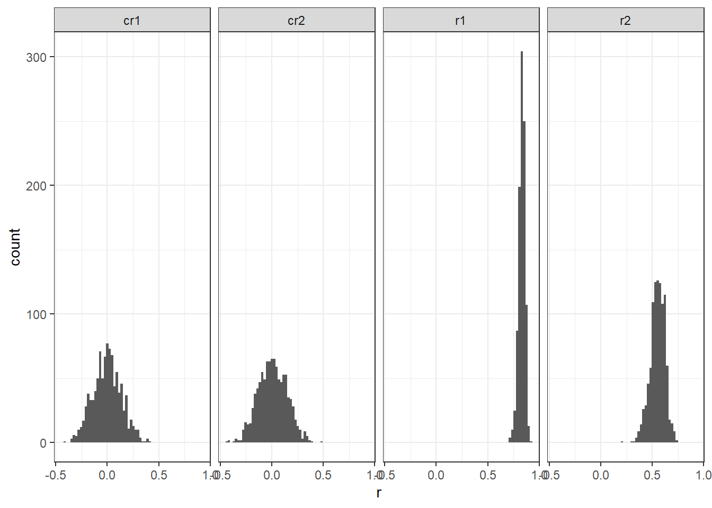

Centering often reduces the correlation between the individual variables (x1, x2) and the product term (x1 \(\times\) x2). In the example below, r(x1, x1x2) = .80. With the centered variables, r(x1c, x1x2c) = -.15.

<em>NOTE:</em> For examples of when centering may <strong>not</strong> reduce multicollinearity but may make it worse, see <a href="https://pubmed.ncbi.nlm.nih.gov/31488914/">EPM article</a>.

<pre class="r"><code>set.seed(123)
x1 &lt;- rnorm(100, 10, 1)
x2 &lt;- rnorm(100, 15, 1) 
x1x2 &lt;- x1*x2
x1c &lt;- x1 - mean(x1)
x2c &lt;- x2 - mean(x2)
x1x2c &lt;- x1c * x2c
dat &lt;- data.frame(x1, x2, x1x2, x1c, x2c, x1x2c)
round(cor(dat), 2)</code></pre>
<pre><code>##          x1    x2  x1x2   x1c   x2c x1x2c
## x1     1.00 -0.05  0.80  1.00 -0.05 -0.15
## x2    -0.05  1.00  0.55 -0.05  1.00 -0.17
## x1x2   0.80  0.55  1.00  0.80  0.55 -0.17
## x1c    1.00 -0.05  0.80  1.00 -0.05 -0.15
## x2c   -0.05  1.00  0.55 -0.05  1.00 -0.17
## x1x2c -0.15 -0.17 -0.17 -0.15 -0.17  1.00</code></pre>

A question though may be raised why centering reduces collinearity?

Consider the basic equation for a correlation:

\[r_{(X, Y)} = \frac{cov(X,Y)}{\sqrt{(var(X) \cdot var(Y))}}\]

For the product score (X1X2) and X1:

\[r_{(X1X2, X1) = \frac{cov(X1X2, X1)}{\sqrt{(var(X1X2) \cdot var(X1))}}}\]

Focusing only on the <em>numerator</em> and using covariance algebra, the covariance of a product score (X1X2) with another variable (X1) can be written as:

\[cov(AB, C) = \mathbb{E}(A) \cdot cov(B, C) + \mathbb{E}(B) \cdot cov(A, C)\]
\[= \mathbb{E}(X1) \cdot cov(X2, X1) + \mathbb{E}(X2) \cdot cov(X1, X1)\]
\[= \mathbb{E}(X1) \cdot cov(X2, X1) + \mathbb{E}(X2) \cdot var(X1)\]

With <strong>mean-centered</strong> variables:

\[r_{((X1 - \bar{X}1)(X2 - \bar{X}2), (X1 - \bar{X}1))} = \frac{cov((X1 - \bar{X}1)(X2 - \bar{X}2), (X1 - \bar{X}1))}{\sqrt{var((X1 - \bar{X}1)(X2 - \bar{X}2)) \cdot var((X1 - \bar{X}1))}}\]

Focusing only on the <em>numerator</em> again:

\[= \mathbb{E}(X1 - \bar{X}1) \cdot cov(X2 - \bar{X}2, X1 - \bar{X}1) + \mathbb{E}(X2 - \bar{X}2) \cdot cov(X1 - \bar{X}1, X1 - \bar{X}1)\]
\[= \mathbb{E}(X1 - \bar{X}1)  \cdot cov(X2 - \bar{X}2, X1 - \bar{X}1) + \mathbb{E}(X2 - \bar{X}2)  \cdot var(X1 - \bar{X}1)\]

The expected value though of a mean centered variable is zero. So if the numerator is zero, the whole equation reduces to zero (on average).

\[= 0  \cdot cov(X2 - \bar{X}2, X1 - \bar{X}1) + 0 \cdot var(X1 - \bar{X}1)\]

<h2>Using a short simulation</h2>
<ul>
<li>Randomly generate 100 x1 and x2 variables</li>
<li>Mean center the variables</li>
<li>Compute corresponding interactions (x1x2 and x1x2c)</li>
<li>Get the correlations of the variables and the product term (<code>r</code> is for the raw variables, <code>cr</code> is for the centered variables)</li>
<li>Get the average of the terms over the replications</li>
</ul>
<pre class="r"><code>set.seed(4567)
reps &lt;- 1000
r1 &lt;- r2 &lt;- cr1 &lt;- cr2 &lt;- numeric(reps)
for (i in 1:reps){
  x1 &lt;- rnorm(100, 10, 1) #mean of 10, SD = 1
  x2 &lt;- rnorm(100, 15, 1) #mean of 15, SD = 1 
  x1x2 &lt;- x1*x2
  x1c &lt;- x1 - mean(x1)
  x2c &lt;- x2 - mean(x2)
  x1x2c &lt;- x1c * x2c
  cr1[i] &lt;- cor(x1c, x1x2c)
  cr2[i] &lt;- cor(x2c, x1x2c)
  r1[i] &lt;- cor(x1, x1x2)
  r2[i] &lt;- cor(x2, x1x2)
}
</code></pre>

r(x1,x2) should be zero because they were generated independently.
<pre class="r"><code>
res &lt;- data.frame(r1, r2, cr1, cr2)
round(colMeans(res), 3)</code></pre>
<pre><code>##     r1     r2    cr1    cr2 
##  0.829  0.551 -0.001  0.008</code></pre>

On average, the correlations of the centered variables are 0 or near 0. They are not always zero and plotting the distribution shows the range of correlations.

<pre class="r"><code>library(dplyr)
library(tidyr)
library(ggplot2)
mm &lt;- gather(res, key = &#39;vars&#39;, value = &#39;r&#39;)
mm %&gt;% ggplot(aes(x = r)) +
  geom_histogram(bins = 60) + facet_grid(~vars) +
  theme_bw()</code></pre>

– END

