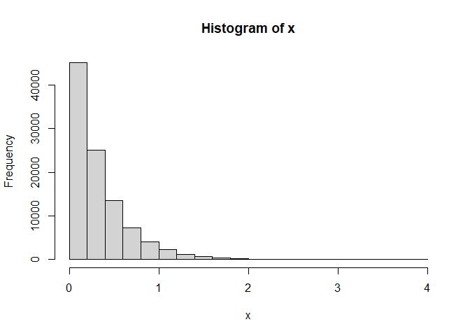

Statistics students are taught that correlation does not equal
causation. Just because two variables (e.g., x and y) are related to
each other does not necessarily mean that one causes the other (e.g., x
causes y). The correlation coefficients (i.e., *ρ*) for *ρ*(*x*, *y*)
and *ρ*(*y*, *x*) are the same and does not provide information on the
directionality of the effect (e.g., *x* → *y* or *x* ← *y*). It could
also be that the variables are related due to a third variable z which
causes both (i.e., a confounder).

However, over, two decades ago, Dodge and Rousson (DR; 2001) published a
paper on *On Asymmetric Properties of the Correlation Coefficient in the
Regression Setting* (which, as of 2025.05.26 had 106 citations based on Google Scholar). In the
paper, *when one of the variables is skewed or non-normally
distributed*, DR indicated that the cube of the correlation coefficient
(*ρ*3) is equal to the ratio of the skewness of y and the
skewness of x (see DR eq. 5):

$$\rho(x, y)^3 = \frac{\gamma_y}{\gamma_x}$$
where the $\gamma$s represent the skewness of the variables. 

We can show this
using simulated data. We create a skewed *x* variable using a gamma
distribution (other code is there to show this using a chisq or a beta
distribution):

    library(psych) #for skew and kurtosi
    set.seed(246) #for reproducabiity
    ns <- 100000 #how many
    # x <- rchisq(ns, 1)
    x <- rgamma(ns, 1, 3)
    # x <- rbeta(ns, 2, 5)
    hist(x) #show the skewness

We then create a *y* variable which is a function of *x* plus some
random error. In this case, by construction, we know that *x* → *y* and
not *x* ← *y*.

    y <- x + rnorm(ns)
    #plot(x, y)
    cor(x, y)

    [1] 0.3116695

We can investigate eq. 5 of DR:

    cor(x, y)^3

    [1] 0.03027492

    skew(y) / skew(x) #correct

    [1] 0.03017388

They are similar and this is quite different from the skewness of x over
the skewness of y (the alternative model).

    skew(x) / skew(y) #incorrect

    [1] 33.14125

In this case, we have support to show that *y* is our response/outcome variable.

This also extends to the kurtosis of the distributions:

$$\rho(x, y)^4 = \frac{\kappa_y}{\kappa_x}$$

where *κ* refers to the kurtosis which is equivalent to the correlation
to the fourth power.

    cor(x, y)^4

    [1] 0.009435768

    kurtosi(y) / kurtosi(x)

    [1] 0.009291302

The following (for the competing model) is way off:

    kurtosi(x) / kurtosi(y) #incorrect

    [1] 107.6275

These higher order moments (e.g., skewness and kurtosis) can be used to
test competing hypotheses of whether *x* → *y* or *y* → *x*. The many
papers of Wiedermann (see [here](https://www.ddaproject.com/) for a list
of papers and macros) explore different methods of testing what is
referred to as the directionality of the effect (under more complex
situations). There are many types of decision rules that can be used to
test these hypothesis:

For example, in a regression framework (which is useful when there are
more variables present), two competing models can be tested and the
residuals from the model that are more normally distributed (closer to
zero) is a more likely model:

    m1 <- lm(y ~ x)
    m2 <- lm(x ~ y)
    skew(resid(m1)) #closer to zero

    [1] -0.005953778

    skew(resid(m2)) #further from zero

    [1] 1.699309

<ins>
NOTE: an important limitation is that one of the variables
should be skewed/non-normal.
</ins>

If both variables are normally distributed (e.g., the skewness is zero),
then the ratio of the skewness of y and x will be undefined (i.e.,
division by zero). In such a case, the results of the hypothesis testing
procedure will be inconclusive and requires that one variable be
non-normally distributed. So, if you have two sets of variables that are
not skewed, this may be of more limited use. Also, the procedure has
been critiqued by Thoemmes (2020) who suggests more sensitivity analysis
be conducted when using these procedures (and also does not rule out
that coefficients may be biased).

**References**

Dodge, Y., & Rousson, V. (2001). On asymmetric properties of the
correlation coeffcient in the regression setting. *The American
Statistician, 55*(1), 51–54.
<https://doi.org/10.1198/000313001300339932>

Thoemmes, F. (2020). The assumptions of direction dependence analysis.
*Multivariate Behavioral Research, 55*(4), 516–522.
<https://doi.org/10.1080/00273171.2019.1608800>

Wiedermann, W., & von Eye, A. (2015). Direction-dependence analysis: A
confirmatory approach for testing directional theories. *International
Journal of Behavioral Development, 39*(6), 570–580.
<https://doi.org/10.1177/0165025415582056>
