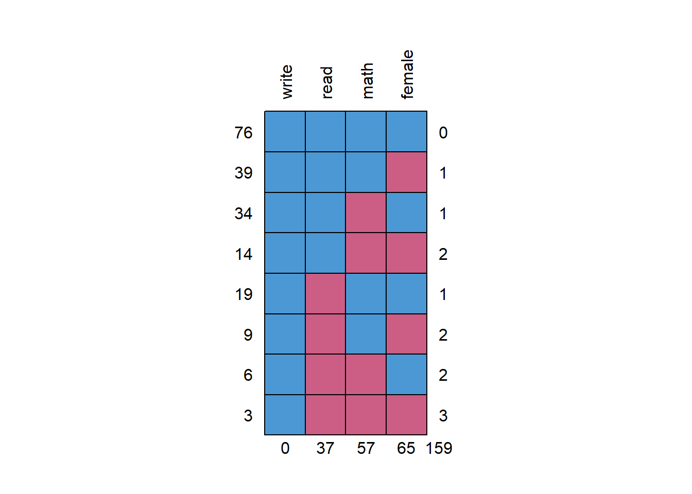

  

<h2>Using FIML in R (Part 2)</h2>

A recurring question that I get asked is how to handle missing data when researchers are interested in performing a multiple regression analysis. There are so many excellent articles, books, and websites that discuss the theory and rationale behind what can be done. Often, what is recommended is to either use full information likelihood (FIML) or multiple imputation (MI). Many excellent articles explain in detail how these work. The purpose though of this post is to show <em>how</em> (again) to just run these models in <code>R</code> (the examples I show here are just for single-level data). I had already shown some of this before over <a href="https://francish.netlify.com/post/01_missing/">here</a> though I am adding to those notes to show some comparability with Mplus results. I will use <code>lavaan</code> for getting FIML results.

<h3>Read in the data</h3>

For purposes of comparability, I will just use the <em>High School and Beyond</em> demo data (n = 200) found on the <a href="https://stats.idre.ucla.edu/mplus/seminars/mplus-class-notes/analyze/">UCLA Statistical Computing</a> website which shows how to use FIML with Mplus. We first read in the <em>complete</em> data which we can use later when comparing results when using the dataset with missing data.

<pre class="r"><code>library(dplyr) #for selecting and using the pipe
hsbnomiss &lt;- read.csv(&#39;https://stats.idre.ucla.edu/wp-content/uploads/2016/02/hsbdemo.dat&#39;, 
    header = F)
#note when data prepared for Mplus, there are no headers
#indicating the variable names 
hsbnomiss2 &lt;- select(hsbnomiss, 2, 6:8) 
#only select columns we want
names(hsbnomiss2) &lt;- c(&#39;female&#39;, &#39;read&#39;, &#39;write&#39;, &#39;math&#39;) 
#name the columns
head(hsbnomiss2)</code></pre>
<pre><code>##   female read write math
## 1      1   34    35   41
## 2      0   34    33   41
## 3      0   39    39   44
## 4      0   37    37   42
## 5      0   39    31   40
## 6      1   42    36   42</code></pre>
<pre class="r"><code>str(hsbnomiss2)</code></pre>
<pre><code>## &#39;data.frame&#39;:    200 obs. of  4 variables:
##  $ female: int  1 0 0 0 0 1 0 0 1 0 ...
##  $ read  : int  34 34 39 37 39 42 31 50 39 34 ...
##  $ write : int  35 33 39 37 31 36 36 31 41 37 ...
##  $ math  : int  41 41 44 42 40 42 46 40 33 46 ...</code></pre>

<h3>Run the regression (complete data)</h3>

In this example, we want to predict <code>write</code> using <code>female</code>, <code>read</code>, and <code>math</code>.

<pre class="r"><code>nomiss1 &lt;- lm(write ~ female + read + math, data = hsbnomiss2)
summary(nomiss1)$coef %&gt;% round(3)</code></pre>
<pre><code>##             Estimate Std. Error t value Pr(&gt;|t|)
## (Intercept)   11.896      2.863   4.155        0
## female         5.443      0.935   5.822        0
## read           0.325      0.061   5.355        0
## math           0.397      0.066   5.986        0</code></pre>

We can also do this using <code>lavaan</code> and the <code>sem</code> function. <strong>Note, in this case, the formula I specified is in between quotes.</strong> <code>lavaan</code> is often used for cfa and sem where the interrelationships between variables and latent factors are specified. Since this is just a regression with all observed variables, we can specify this in just one line (representing the formula).

<pre class="r"><code>library(lavaan)
nomiss2 &lt;- sem(&#39;write ~ female + read + math&#39;, data = hsbnomiss2)
summary(nomiss2) #lot more information</code></pre>
<pre><code>## lavaan 0.6-5 ended normally after 17 iterations
## 
##   Estimator                                         ML
##   Optimization method                           NLMINB
##   Number of free parameters                          4
##                                                       
##   Number of observations                           200
##                                                       
## Model Test User Model:
##                                                       
##   Test statistic                                 0.000
##   Degrees of freedom                                 0
## 
## Parameter Estimates:
## 
##   Information                                 Expected
##   Information saturated (h1) model          Structured
##   Standard errors                             Standard
## 
## Regressions:
##                    Estimate  Std.Err  z-value  P(&gt;|z|)
##   write ~                                             
##     female            5.443    0.926    5.881    0.000
##     read              0.325    0.060    5.409    0.000
##     math              0.397    0.066    6.047    0.000
## 
## Variances:
##                    Estimate  Std.Err  z-value  P(&gt;|z|)
##    .write            42.368    4.237   10.000    0.000</code></pre>

These results provide a benchmark of what the results should be when data are not missing.

<h3>Read in missing data</h3>
<pre class="r"><code>hsbwmiss &lt;- read.csv(&#39;https://stats.idre.ucla.edu/wp-content/uploads/2017/04/hsbmis2.dat&#39;, 
    header = F)
#missing data are coded as -9999, recode to NA
hsbwmiss[hsbwmiss == -9999] &lt;- NA
#I know you can do this in dplyr using some command
#but this is quick and basic
hsbwmiss2 &lt;- dplyr::select(hsbwmiss, 2, 8:10)
names(hsbwmiss2) &lt;- c(&#39;female&#39;, &#39;read&#39;, &#39;write&#39;, &#39;math&#39;)</code></pre>

We can just look at the patterns of missing data quickly too using the <code>mice</code> package.

<pre class="r"><code>library(mice)
md.pattern(hsbwmiss2, rotate.names = T)</code></pre>

<pre><code>##    write read math female    
## 76     1    1    1      1   0
## 39     1    1    1      0   1
## 34     1    1    0      1   1
## 14     1    1    0      0   2
## 19     1    0    1      1   1
## 9      1    0    1      0   2
## 6      1    0    0      1   2
## 3      1    0    0      0   3
##        0   37   57     65 159</code></pre>

The missing data patterns show a lot of missing data. We can run a naive regression and compare results to the complete case analysis. Also shows that only 48% of respondents have complete data. NOTE: There is no threshold as to what is considered an unacceptable amount of missing data.

<pre class="r"><code>wmiss1 &lt;- lm(write ~ female + read + math, data = hsbwmiss2)
library(stargazer) #to show side-by-side output</code></pre>
<pre><code>## 
## Please cite as:</code></pre>
<pre><code>##  Hlavac, Marek (2018). stargazer: Well-Formatted Regression and Summary Statistics Tables.</code></pre>
<pre><code>##  R package version 5.2.2. https://CRAN.R-project.org/package=stargazer</code></pre>
<pre class="r"><code>stargazer(nomiss1, wmiss1, 
          star.cutoffs = c(.05, .01, .001), 
  no.space = T, type = &#39;text&#39;)</code></pre>
<pre><code>## 
## ==================================================================
##                                  Dependent variable:              
##                     ----------------------------------------------
##                                         write                     
##                               (1)                    (2)          
## ------------------------------------------------------------------
## female                     5.443***                7.247***       
##                             (0.935)                (1.620)        
## read                       0.325***                 0.167         
##                             (0.061)                (0.107)        
## math                       0.397***                0.447***       
##                             (0.066)                (0.117)        
## Constant                   11.896***              17.160***       
##                             (2.863)                (4.964)        
## ------------------------------------------------------------------
## Observations                  200                     76          
## R2                           0.526                  0.468         
## Adjusted R2                  0.519                  0.446         
## Residual Std. Error    6.575 (df = 196)        6.966 (df = 72)    
## F Statistic         72.518*** (df = 3; 196) 21.111*** (df = 3; 72)
## ==================================================================
## Note:                                *p&lt;0.05; **p&lt;0.01; ***p&lt;0.001</code></pre>

Regressions here show different results with reading not being predictive anymore of writing and the strength of the female coefficient increasing (and SEs are much higher).

<h3>Run the model accounting for missing data</h3>

We will now use FIML to account for the missing data. We will again use the <code>sem</code> function but will some additional options:

<pre class="r"><code>wmiss2 &lt;- sem(&#39;write ~ female + read + math&#39;, data = hsbwmiss2, 
  missing = &#39;fiml&#39;, fixed.x = F)</code></pre>

We specify <code>missing = "fiml"</code> which then uses fiml to account for the missing data. In addition, we include: <code>fixed.x = F</code>. FIML works by estimating the relationships of the variables with each other and requires estimating the means and variances of the variables. If <code>fixed.x = T</code> (the default), then the variances and covariances are fixed and are based on the existing sample values and are not estimated. You can specify the means and variances to be estimated in the model but requires more typing.

View the results:

<pre class="r"><code>summary(wmiss2)</code></pre>
<pre><code>## lavaan 0.6-5 ended normally after 46 iterations
## 
##   Estimator                                         ML
##   Optimization method                           NLMINB
##   Number of free parameters                         14
##                                                       
##   Number of observations                           200
##   Number of missing patterns                         8
##                                                       
## Model Test User Model:
##                                                       
##   Test statistic                                 0.000
##   Degrees of freedom                                 0
## 
## Parameter Estimates:
## 
##   Information                                 Observed
##   Observed information based on                Hessian
##   Standard errors                             Standard
## 
## Regressions:
##                    Estimate  Std.Err  z-value  P(&gt;|z|)
##   write ~                                             
##     female            5.436    1.130    4.809    0.000
##     read              0.298    0.073    4.080    0.000
##     math              0.401    0.078    5.117    0.000
## 
## Covariances:
##                    Estimate  Std.Err  z-value  P(&gt;|z|)
##   female ~~                                           
##     read             -0.255    0.462   -0.551    0.582
##     math              0.080    0.451    0.177    0.860
##   read ~~                                             
##     math             68.122    9.634    7.071    0.000
## 
## Intercepts:
##                    Estimate  Std.Err  z-value  P(&gt;|z|)
##    .write            12.949    3.013    4.298    0.000
##     female            0.591    0.041   14.384    0.000
##     read             51.898    0.776   66.855    0.000
##     math             52.724    0.756   69.714    0.000
## 
## Variances:
##                    Estimate  Std.Err  z-value  P(&gt;|z|)
##    .write            41.622    4.744    8.773    0.000
##     female            0.238    0.029    8.321    0.000
##     read            107.510   11.881    9.049    0.000
##     math             95.591   10.940    8.737    0.000</code></pre>

The summary presents more information and shows that the analysis is based on the 200 observations. The intercept here is shown under <code>Intercepts</code> –&gt; <code>.write</code>. Results are much closer to the original results with no missing data (shown again below):

<pre><code>            Estimate Std. Error t value Pr(&gt;|t|)
(Intercept)   11.896      2.863   4.155        0
female         5.443      0.935   5.822        0
read           0.325      0.061   5.355        0
math           0.397      0.066   5.986        0</code></pre>

If you just want the coefficients without the summary statistics (but still showing all the variances and covariances indicated by <code>~~</code> and the means denoted by <code>~</code>:

<pre class="r"><code>parameterestimates(wmiss2)</code></pre>
<pre><code>##       lhs op    rhs     est     se      z pvalue ci.lower ci.upper
## 1   write  ~ female   5.436  1.130  4.809  0.000    3.221    7.651
## 2   write  ~   read   0.298  0.073  4.080  0.000    0.155    0.442
## 3   write  ~   math   0.401  0.078  5.117  0.000    0.247    0.554
## 4   write ~~  write  41.622  4.744  8.773  0.000   32.324   50.920
## 5  female ~~ female   0.238  0.029  8.321  0.000    0.182    0.294
## 6  female ~~   read  -0.255  0.462 -0.551  0.582   -1.160    0.651
## 7  female ~~   math   0.080  0.451  0.177  0.860   -0.804    0.964
## 8    read ~~   read 107.510 11.881  9.049  0.000   84.223  130.796
## 9    read ~~   math  68.122  9.634  7.071  0.000   49.240   87.004
## 10   math ~~   math  95.591 10.940  8.737  0.000   74.148  117.034
## 11  write ~1         12.949  3.013  4.298  0.000    7.044   18.854
## 12 female ~1          0.591  0.041 14.384  0.000    0.511    0.672
## 13   read ~1         51.898  0.776 66.855  0.000   50.377   53.420
## 14   math ~1         52.724  0.756 69.714  0.000   51.242   54.206</code></pre>

You can compare the results with those derived using Mplus. Results are comparable:

<pre><code>MODEL RESULTS

                                                    Two-Tailed
                    Estimate       S.E.  Est./S.E.    P-Value

 WRITE    ON
    FEMALE             5.435      1.121      4.847      0.000
    READ               0.298      0.072      4.168      0.000
    MATH               0.401      0.077      5.236      0.000

 Intercepts
    WRITE             12.950      2.951      4.388      0.000

 Residual Variances
    WRITE             41.622      4.716      8.825      0.000
</code></pre>

Try estimating the model using MI (see my previous post). Are results similar to the complete case results?

<pre><code>imp &lt;- mice(hsbwmiss2, m = 50, seed = 1234)
mi1 &lt;- with(imp, lm(write ~ female + read + math))
round(summary(pool(mi1)), 3)</code></pre>

