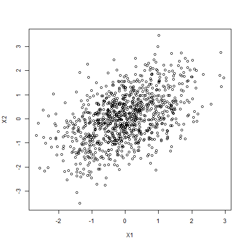
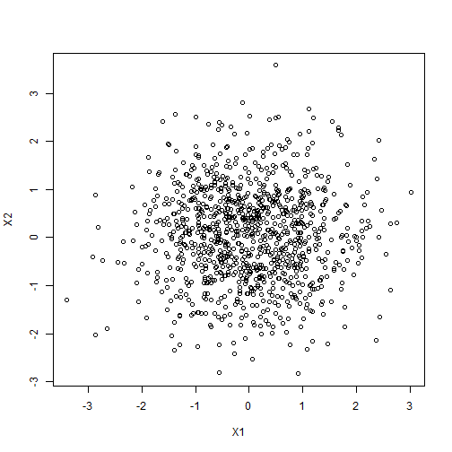

## Illustrates why OVB is an issue

This issue plagues a lot of the analysis using secondary or observational data

- Data are already existing
- We may have unobserved characteristics that were not collected

To illustrate how OVB may affect regression results, we examine some simulated data.

## Create some correlated data


``` r
library(stargazer) #to create simpler regression output
library(gendata) #to simulate data

#1 create two correlated variables X1 and X2 (r = .50)
dat <- genmvnorm(k = 2, .5, n = 1000, seed = 123)
cor(dat)
```

```
##       X1    X2
## X1 1.000 0.488
## X2 0.488 1.000
```

## Plot of the correlated variables


``` r
plot(dat)
```



## Create Y through this data generating process


``` r
B1 <- 3
B2 <- 5
set.seed(1234) #add seed so the error is the same
dat$Y <- dat$X1 * B1 + dat$X2 * B2 + rnorm(1000) #add error 
#coefficient for B1 = 3 and B2 = 5
```

## Run some regressions
B1 should be 3 and B2 should be 5.


``` r
m1 <- lm(Y ~ X1 + X2, data = dat)
summary(m1) #correct
```

```
## 
## Call:
## lm(formula = Y ~ X1 + X2, data = dat)
## 
## Residuals:
##    Min     1Q Median     3Q    Max 
## -3.296 -0.656 -0.012  0.637  3.202 
## 
## Coefficients:
##             Estimate Std. Error t value Pr(>|t|)    
## (Intercept)  -0.0265     0.0316   -0.84      0.4    
## X1            3.0437     0.0377   80.66   <2e-16 ***
## X2            5.0062     0.0350  143.10   <2e-16 ***
## ---
## Signif. codes:  0 '***' 0.001 '**' 0.01 '*' 0.05 '.' 0.1 ' ' 1
## 
## Residual standard error: 0.997 on 997 degrees of freedom
## Multiple R-squared:  0.981,	Adjusted R-squared:  0.98 
## F-statistic: 2.51e+04 on 2 and 997 DF,  p-value: <2e-16
```

## What about if we 'forget' or omit X1 or X2? 

``` r
m2 <- lm(Y ~ X1, data = dat)
m3 <- lm(Y ~ X2, data = dat)
#export_summs(m1, m2, m3) 
```
Compare models side by side:

``` r
stargazer(m1, m2, m3, type = 'text', no.space = T,
                     star.cutoffs = c(.05, .01, .001),
                     keep.stat = c("n","rsq"))
```

```
## 
## ============================================
##                    Dependent variable:      
##              -------------------------------
##                             Y               
##                 (1)        (2)        (3)   
## --------------------------------------------
## X1            3.040***   5.680***           
##               (0.038)    (0.153)            
## X2            5.010***             6.380*** 
##               (0.035)               (0.084) 
## Constant       -0.026     0.169     -0.097  
##               (0.032)    (0.146)    (0.087) 
## --------------------------------------------
## Observations   1,000      1,000      1,000  
## R2             0.981      0.580      0.853  
## ============================================
## Note:          *p<0.05; **p<0.01; ***p<0.001
```

## Notice

- How strong the bias is when the variables are correlated with each other
- Notice how different the coefficients are in models 2 and 3 
-  The bias will change based on the strength of the correlation and the direction of the correlation

## If the variables are not correlated with each other
- Will not be an issue

``` r
set.seed(541)
X1 <- rnorm(1000)
X2 <- rnorm(1000)
Y <- X1 * B1 + X2 * B2 + rnorm(1000) 
```

## By construction, X1 and X2 are not correlated with each other

``` r
cor(X1, X2)
```

```
## [1] 0.00236
```

``` r
plot(X1, X2)
```



## Results will not be biased


``` r
m4 <- lm(Y ~ X1 + X2)
m5 <- lm(Y ~ X1)
m6 <- lm(Y ~ X2)
stargazer(m4, m5, m6, type = 'text', no.space = T,
                     star.cutoffs = c(.05, .01, .001),
                     keep.stat = c("n","rsq"))
```

```
## 
## ============================================
##                    Dependent variable:      
##              -------------------------------
##                             Y               
##                 (1)        (2)        (3)   
## --------------------------------------------
## X1            3.000***   3.010***           
##               (0.031)    (0.159)            
## X2            4.980***             4.990*** 
##               (0.032)               (0.101) 
## Constant       0.0003     0.301     -0.010  
##               (0.031)    (0.159)    (0.100) 
## --------------------------------------------
## Observations   1,000      1,000      1,000  
## R2             0.972      0.263      0.711  
## ============================================
## Note:          *p<0.05; **p<0.01; ***p<0.001
```

## This is also a reason why experiments use random assignment 
- Due to randomization, X (or the treatment assignment variable) will not be related to the error term
- Two groups will be the 'same' on both observed and unobserved characteristics (with happy randomization) 
- Notice as well the differences in the standard errors (much smaller in the full model)
