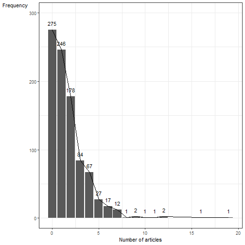
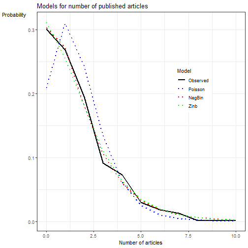
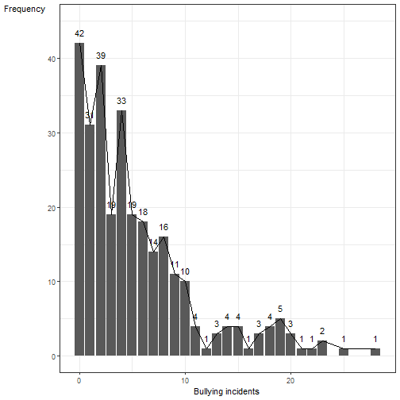
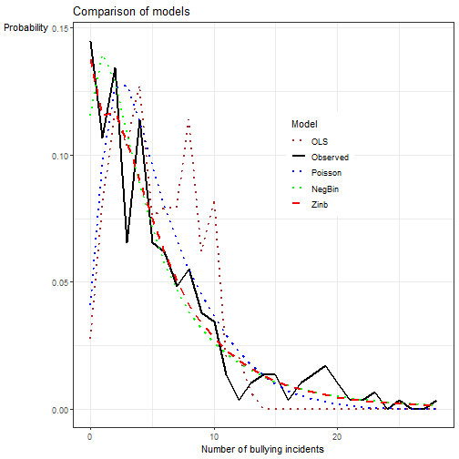
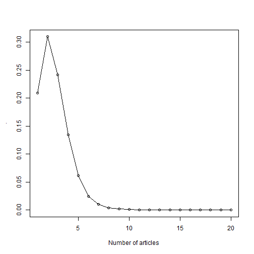
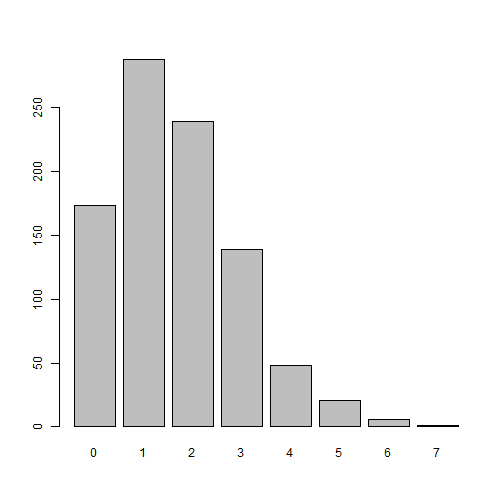

A few years ago, I  published an article on using Poisson, negative binomial, and zero inflated models in analyzing count data (see [Pick Your Poisson](https://www.tandfonline.com/doi/abs/10.1080/15388220.2012.682010)). The abstract of the article indicates:

> School violence research is often concerned with infrequently occurring events such as counts of the number of bullying incidents or fights a student may experience. Analyzing count data using ordinary least squares regression may produce improbable predicted values, and as a result of regression assumption violations, result in higher Type I errors. Count data are optimally analyzed using Poisson-based regression techniques such as Poisson or negative binomial regression. We apply these techniques to an example study of bullying in a statewide sample of 290 high schools and explain how Poisson-based analyses, although less familiar to many researchers, can produce findings that are more accurate and reliable, and are easier to interpret in real-world contexts.

At the time, I had included syntax using both SAS and SPSS. This post extends the original article by now including R syntax. For the specifics on the whys and hows, consult the article (see Example 2). I show two examples: the first using data from Long (1990) and the second using Huang and Cornell (2012).

## Example 1: Long (1990)

This replicates the [SAS](http://support.sas.com/kb/26/161.html) results where Long (1990) examined the relationship of gender (`fem`), marital status (`mar`), number of children (`kid5`), prestige of graduate program (`phd`), and the number of articles (`ment`) published by the individual's mentor on the number of articles published by the scientist (`art`: the outcome).


``` r
library(dplyr) #basic data management & %>%
library(MASS) #for negative bin regression
library(stargazer) #for combining output
library(ggplot2) #for graphing
library(pscl) #for zero inflated models & predprob
library(reshape2) #convert wide to tall
library(summarytools) #freq

articles <- rio::import("https://raw.githubusercontent.com/flh3/pubdata/1a8cc7757e6cd975894ee76a4d79832e714e1aba/miscdata/articles.csv")
head(articles)
```

```
##   fem ment  phd mar kid5 art
## 1   0    8 1.38   1    2   3
## 2   0    7 4.29   0    0   0
## 3   0   47 3.85   0    0   4
## 4   0   19 3.59   1    1   1
## 5   0    0 1.81   1    0   1
## 6   0    6 3.59   1    1   1
```

``` r
dim(articles)
```

```
## [1] 915   6
```

``` r
freq(articles$art)
```

```
## Frequencies  
## articles$art  
## Type: Integer  
## 
##               Freq   % Valid   % Valid Cum.   % Total   % Total Cum.
## ----------- ------ --------- -------------- --------- --------------
##           0    275     30.05          30.05     30.05          30.05
##           1    246     26.89          56.94     26.89          56.94
##           2    178     19.45          76.39     19.45          76.39
##           3     84      9.18          85.57      9.18          85.57
##           4     67      7.32          92.90      7.32          92.90
##           5     27      2.95          95.85      2.95          95.85
##           6     17      1.86          97.70      1.86          97.70
##           7     12      1.31          99.02      1.31          99.02
##           8      1      0.11          99.13      0.11          99.13
##           9      2      0.22          99.34      0.22          99.34
##          10      1      0.11          99.45      0.11          99.45
##          11      1      0.11          99.56      0.11          99.56
##          12      2      0.22          99.78      0.22          99.78
##          16      1      0.11          99.89      0.11          99.89
##          19      1      0.11         100.00      0.11         100.00
##        <NA>      0                               0.00         100.00
##       Total    915    100.00         100.00    100.00         100.00
```

``` r
mean(articles$art) #average number of articles
```

```
## [1] 1.69
```

Based on the frequency count, 275 scientists had no publications (0) or 30.05%. If we compare this to predicted probability based on the mean: $P(art = x) = \frac{\lambda^x e^{-\lambda}}{x!}$ where $x = 0$.


``` r
1.69^0 * exp(-1.69) / factorial(0) #probability of zero articles is 18.5%
```

```
## [1] 0.185
```

``` r
#which is quite different from the 30.05%
```


``` r
fr <- table(articles$art) %>% data.frame
names(fr) <- c('articles', 'freq')
fr$articles <- as.numeric(as.character(fr$articles)) #convert factor to numeric
ggplot(fr, aes(x = articles, y = freq)) +
  geom_col() +
  theme_bw() +
  lims(y = c(0, 300)) + 
  geom_line() + 
  labs(x = "Number of articles", y = "Frequency") +
  geom_text(aes(x = articles, y = freq, label = freq, vjust = -1)) +
  theme(axis.title.y = element_text(angle = 0)) 
```


With a Poisson distribution, the mean and the variances are both equal ($\mu = \sigma^2$): a condition (i.e., equidispersion) I am not sure how often occurs in reality. So a negative binomial should be more flexible as it does not have the assumption of equidispersion. With many zeroes, a zero inflated model should fit even better

The following code shows how to estimate different types of models:


``` r
### Run the models
linear <- glm(art ~ fem + ment + phd + mar + kid5, data = articles) #identity link, OLS
pois <- glm(art ~ fem + ment + phd + mar + kid5, "poisson", data = articles) #Poisson
negb <- glm.nb(art ~ fem + ment + phd + mar + kid5, data = articles) #negative binomial
#in the MASS package
zinb <- zeroinfl(art ~ fem + ment + phd + mar + kid5 | fem + ment + phd + mar + kid5,
               dist = "negbin", data = articles) #zero inflated nb, in the pscl package
```

Of course, to interpet the results with the log or logit links, we need to exponentiate the coefficients to get the incidence rate ratios. The `jtools` package provides an easy way to do this:


``` r
library(jtools)
summ(pois, exp = T) #could exp the coefficients but this is
```

<table class="table table-striped table-hover table-condensed table-responsive" style="color: black; width: auto !important; margin-left: auto; margin-right: auto;">
<tbody>
  <tr>
   <td style="text-align:left;font-weight: bold;"> Observations </td>
   <td style="text-align:right;"> 915 </td>
  </tr>
  <tr>
   <td style="text-align:left;font-weight: bold;"> Dependent variable </td>
   <td style="text-align:right;"> art </td>
  </tr>
  <tr>
   <td style="text-align:left;font-weight: bold;"> Type </td>
   <td style="text-align:right;"> Generalized linear model </td>
  </tr>
  <tr>
   <td style="text-align:left;font-weight: bold;"> Family </td>
   <td style="text-align:right;"> poisson </td>
  </tr>
  <tr>
   <td style="text-align:left;font-weight: bold;"> Link </td>
   <td style="text-align:right;"> log </td>
  </tr>
</tbody>
</table> <table class="table table-striped table-hover table-condensed table-responsive" style="color: black; width: auto !important; margin-left: auto; margin-right: auto;">
<tbody>
  <tr>
   <td style="text-align:left;font-weight: bold;"> χ²(5) </td>
   <td style="text-align:right;"> 183.03 </td>
  </tr>
  <tr>
   <td style="text-align:left;font-weight: bold;"> Pseudo-R² (Cragg-Uhler) </td>
   <td style="text-align:right;"> 0.19 </td>
  </tr>
  <tr>
   <td style="text-align:left;font-weight: bold;"> Pseudo-R² (McFadden) </td>
   <td style="text-align:right;"> 0.05 </td>
  </tr>
  <tr>
   <td style="text-align:left;font-weight: bold;"> AIC </td>
   <td style="text-align:right;"> 3314.11 </td>
  </tr>
  <tr>
   <td style="text-align:left;font-weight: bold;"> BIC </td>
   <td style="text-align:right;"> 3343.03 </td>
  </tr>
</tbody>
</table> <table class="table table-striped table-hover table-condensed table-responsive" style="color: black; width: auto !important; margin-left: auto; margin-right: auto;border-bottom: 0;">
 <thead>
  <tr>
   <th style="text-align:left;">   </th>
   <th style="text-align:right;"> exp(Est.) </th>
   <th style="text-align:right;"> 2.5% </th>
   <th style="text-align:right;"> 97.5% </th>
   <th style="text-align:right;"> z val. </th>
   <th style="text-align:right;"> p </th>
  </tr>
 </thead>
<tbody>
  <tr>
   <td style="text-align:left;font-weight: bold;"> (Intercept) </td>
   <td style="text-align:right;"> 1.36 </td>
   <td style="text-align:right;"> 1.11 </td>
   <td style="text-align:right;"> 1.66 </td>
   <td style="text-align:right;"> 2.96 </td>
   <td style="text-align:right;"> 0.00 </td>
  </tr>
  <tr>
   <td style="text-align:left;font-weight: bold;"> fem </td>
   <td style="text-align:right;"> 0.80 </td>
   <td style="text-align:right;"> 0.72 </td>
   <td style="text-align:right;"> 0.89 </td>
   <td style="text-align:right;"> -4.11 </td>
   <td style="text-align:right;"> 0.00 </td>
  </tr>
  <tr>
   <td style="text-align:left;font-weight: bold;"> ment </td>
   <td style="text-align:right;"> 1.03 </td>
   <td style="text-align:right;"> 1.02 </td>
   <td style="text-align:right;"> 1.03 </td>
   <td style="text-align:right;"> 12.73 </td>
   <td style="text-align:right;"> 0.00 </td>
  </tr>
  <tr>
   <td style="text-align:left;font-weight: bold;"> phd </td>
   <td style="text-align:right;"> 1.01 </td>
   <td style="text-align:right;"> 0.96 </td>
   <td style="text-align:right;"> 1.07 </td>
   <td style="text-align:right;"> 0.49 </td>
   <td style="text-align:right;"> 0.63 </td>
  </tr>
  <tr>
   <td style="text-align:left;font-weight: bold;"> mar </td>
   <td style="text-align:right;"> 1.17 </td>
   <td style="text-align:right;"> 1.04 </td>
   <td style="text-align:right;"> 1.32 </td>
   <td style="text-align:right;"> 2.53 </td>
   <td style="text-align:right;"> 0.01 </td>
  </tr>
  <tr>
   <td style="text-align:left;font-weight: bold;"> kid5 </td>
   <td style="text-align:right;"> 0.83 </td>
   <td style="text-align:right;"> 0.77 </td>
   <td style="text-align:right;"> 0.90 </td>
   <td style="text-align:right;"> -4.61 </td>
   <td style="text-align:right;"> 0.00 </td>
  </tr>
</tbody>
<tfoot><tr><td style="padding: 0; " colspan="100%">
<sup></sup> Standard errors: MLE</td></tr></tfoot>
</table>

``` r
#useful because we get the 95% CI as well
summ(negb, exp = T) #difference in marital status
```

```
## Warning: Something went wrong when calculating the pseudo
## R-squared. Returning NA instead.
```

<table class="table table-striped table-hover table-condensed table-responsive" style="color: black; width: auto !important; margin-left: auto; margin-right: auto;">
<tbody>
  <tr>
   <td style="text-align:left;font-weight: bold;"> Observations </td>
   <td style="text-align:right;"> 915 </td>
  </tr>
  <tr>
   <td style="text-align:left;font-weight: bold;"> Dependent variable </td>
   <td style="text-align:right;"> art </td>
  </tr>
  <tr>
   <td style="text-align:left;font-weight: bold;"> Type </td>
   <td style="text-align:right;"> Generalized linear model </td>
  </tr>
  <tr>
   <td style="text-align:left;font-weight: bold;"> Family </td>
   <td style="text-align:right;"> Negative Binomial(2.26) </td>
  </tr>
  <tr>
   <td style="text-align:left;font-weight: bold;"> Link </td>
   <td style="text-align:right;"> log </td>
  </tr>
</tbody>
</table> <table class="table table-striped table-hover table-condensed table-responsive" style="color: black; width: auto !important; margin-left: auto; margin-right: auto;">
<tbody>
  <tr>
   <td style="text-align:left;font-weight: bold;"> χ²(NA) </td>
   <td style="text-align:right;"> NA </td>
  </tr>
  <tr>
   <td style="text-align:left;font-weight: bold;"> Pseudo-R² (Cragg-Uhler) </td>
   <td style="text-align:right;"> NA </td>
  </tr>
  <tr>
   <td style="text-align:left;font-weight: bold;"> Pseudo-R² (McFadden) </td>
   <td style="text-align:right;"> NA </td>
  </tr>
  <tr>
   <td style="text-align:left;font-weight: bold;"> AIC </td>
   <td style="text-align:right;"> 3135.92 </td>
  </tr>
  <tr>
   <td style="text-align:left;font-weight: bold;"> BIC </td>
   <td style="text-align:right;"> 3169.65 </td>
  </tr>
</tbody>
</table> <table class="table table-striped table-hover table-condensed table-responsive" style="color: black; width: auto !important; margin-left: auto; margin-right: auto;border-bottom: 0;">
 <thead>
  <tr>
   <th style="text-align:left;">   </th>
   <th style="text-align:right;"> exp(Est.) </th>
   <th style="text-align:right;"> 2.5% </th>
   <th style="text-align:right;"> 97.5% </th>
   <th style="text-align:right;"> z val. </th>
   <th style="text-align:right;"> p </th>
  </tr>
 </thead>
<tbody>
  <tr>
   <td style="text-align:left;font-weight: bold;"> (Intercept) </td>
   <td style="text-align:right;"> 1.29 </td>
   <td style="text-align:right;"> 0.99 </td>
   <td style="text-align:right;"> 1.69 </td>
   <td style="text-align:right;"> 1.86 </td>
   <td style="text-align:right;"> 0.06 </td>
  </tr>
  <tr>
   <td style="text-align:left;font-weight: bold;"> fem </td>
   <td style="text-align:right;"> 0.81 </td>
   <td style="text-align:right;"> 0.70 </td>
   <td style="text-align:right;"> 0.93 </td>
   <td style="text-align:right;"> -2.98 </td>
   <td style="text-align:right;"> 0.00 </td>
  </tr>
  <tr>
   <td style="text-align:left;font-weight: bold;"> ment </td>
   <td style="text-align:right;"> 1.03 </td>
   <td style="text-align:right;"> 1.02 </td>
   <td style="text-align:right;"> 1.04 </td>
   <td style="text-align:right;"> 9.05 </td>
   <td style="text-align:right;"> 0.00 </td>
  </tr>
  <tr>
   <td style="text-align:left;font-weight: bold;"> phd </td>
   <td style="text-align:right;"> 1.02 </td>
   <td style="text-align:right;"> 0.95 </td>
   <td style="text-align:right;"> 1.09 </td>
   <td style="text-align:right;"> 0.43 </td>
   <td style="text-align:right;"> 0.67 </td>
  </tr>
  <tr>
   <td style="text-align:left;font-weight: bold;"> mar </td>
   <td style="text-align:right;"> 1.16 </td>
   <td style="text-align:right;"> 0.99 </td>
   <td style="text-align:right;"> 1.37 </td>
   <td style="text-align:right;"> 1.83 </td>
   <td style="text-align:right;"> 0.07 </td>
  </tr>
  <tr>
   <td style="text-align:left;font-weight: bold;"> kid5 </td>
   <td style="text-align:right;"> 0.84 </td>
   <td style="text-align:right;"> 0.76 </td>
   <td style="text-align:right;"> 0.93 </td>
   <td style="text-align:right;"> -3.34 </td>
   <td style="text-align:right;"> 0.00 </td>
  </tr>
</tbody>
<tfoot><tr><td style="padding: 0; " colspan="100%">
<sup></sup> Standard errors: MLE</td></tr></tfoot>
</table>

``` r
summary(zinb) #more complex, has two parts to it. 
```

```
## 
## Call:
## zeroinfl(formula = art ~ fem + ment + phd + mar + kid5 | 
##     fem + ment + phd + mar + kid5, data = articles, dist = "negbin")
## 
## Pearson residuals:
##    Min     1Q Median     3Q    Max 
## -1.294 -0.760 -0.291  0.445  6.415 
## 
## Count model coefficients (negbin with log link):
##             Estimate Std. Error z value Pr(>|z|)    
## (Intercept)  0.41675    0.14360    2.90   0.0037 ** 
## fem         -0.19551    0.07559   -2.59   0.0097 ** 
## ment         0.02479    0.00349    7.10  1.3e-12 ***
## phd         -0.00070    0.03627   -0.02   0.9846    
## mar          0.09758    0.08445    1.16   0.2479    
## kid5        -0.15173    0.05421   -2.80   0.0051 ** 
## Log(theta)   0.97636    0.13547    7.21  5.7e-13 ***
## 
## Zero-inflation model coefficients (binomial with logit link):
##             Estimate Std. Error z value Pr(>|z|)   
## (Intercept)  -0.1917     1.3228   -0.14   0.8848   
## fem           0.6359     0.8489    0.75   0.4538   
## ment         -0.8823     0.3162   -2.79   0.0053 **
## phd          -0.0377     0.3080   -0.12   0.9025   
## mar          -1.4995     0.9387   -1.60   0.1102   
## kid5          0.6284     0.4428    1.42   0.1558   
## ---
## Signif. codes:  0 '***' 0.001 '**' 0.01 '*' 0.05 '.' 0.1 ' ' 1 
## 
## Theta = 2.655 
## Number of iterations in BFGS optimization: 43 
## Log-likelihood: -1.55e+03 on 13 Df
```

``` r
tmp <- summary(zinb) #doing this manually
tmp$coefficients$count[-7, 1] %>% exp()
```

```
## (Intercept)         fem        ment         phd         mar 
##       1.517       0.822       1.025       0.999       1.103 
##        kid5 
##       0.859
```

``` r
tmp$coefficients$zero[-7, 1] %>% exp()
```

```
## (Intercept)         fem        ment         phd         mar 
##       0.826       1.889       0.414       0.963       0.223 
##        kid5 
##       1.875
```

Note: the logit portion predicts zeroes (so coefficients may seem like they are in the opposite direction). Interpret as ORs. Again, consult the article for interpretation of results. Can also consult the AIC values to help with model selection:


``` r
tmp <- data.frame(OLS = AIC(linear), pois = AIC(pois), 
                  negb = AIC(negb), zinb = AIC(zinb))
knitr::kable(tmp, align = "l")
```


|OLS  |pois |negb |zinb |
|:----|:----|:----|:----|
|3702 |3314 |3136 |3126 |

``` r
#zinb has the lowest, close to negb
```

### Plotting results

I replicate the graph found in the SAS post for plotted results. The predicted probabilities are based on the probability density function. Can use the `predprob` function in the `pscl` package


``` r
po.p <- predprob(pois) %>% colMeans
po.nb <- predprob(negb) %>% colMeans
po.zinb <- predprob(zinb) %>% colMeans
df <- data.frame(x = 0:max(articles$art), Poisson = po.p, 
                 NegBin = po.nb, Zinb = po.zinb)

obs <- table(articles$art) %>% prop.table() %>% data.frame #Observed
names(obs) <- c("x", 'Observed')

p1 <- predict(linear) %>% round() %>% table %>% prop.table %>% data.frame #for OLS
names(p1) <- c('x', 'OLS')

tmp <- merge(p1, obs, by = 'x', all = T)
tmp$x <- as.numeric(as.character(tmp$x))

comb <- merge(tmp, df, by = 'x', all = T)
comb[is.na(comb)] <- 0

comb2 <- comb[1:11, ] #just for the first 11 results, including zero

mm <- melt(comb2, id.vars = 'x', value.name = 'prob', variable.name = 'Model')
mm <- filter(mm, Model != "OLS") #can include the linear model too if you want
#the SAS note does not, so I am not including it

ggplot(mm, aes(x = x, y = prob, group = Model, col = Model)) +
  geom_line(aes(lty = Model), lwd = 1) +
  theme_bw() +
  labs(x = "Number of articles", y = 'Probability',
       title = "Models for number of published articles") +
  scale_color_manual(values = c('black', 'blue', 'red', 'green')) +
  scale_linetype_manual(values = c('solid', 'dotted', 'dotted', 'dotted')) +
  theme(legend.position=c(.75, .65), axis.title.y = element_text(angle = 0))
```



Plot shows that the negative binomial and the zero inflated nb almost overlap with the observed observations (a good approximation).

## Example 2: Bullying in school (Huang & Cornell, 2012)

This data is not available for download though (w/c is why I started of with the Long example).


``` r
x <- rio::import("restricted") #NOT AVAILABLE
x2 <- dplyr::select(x, NEWBULLY, TOTAL_F_R, 
                    DIVERSITYINDEX, PROPNONWHITE, PD1000, siz1000
                    )

library(tableone)
t1 <- CreateTableOne(data = x2)
print(t1)
```

```
##                             
##                              Overall    
##   n                           290       
##   NEWBULLY (mean (SD))       5.42 (5.49)
##   TOTAL_F_R (mean (SD))      0.30 (0.16)
##   DIVERSITYINDEX (mean (SD)) 0.37 (0.21)
##   PROPNONWHITE (mean (SD))   0.34 (0.26)
##   PD1000 (mean (SD))         0.94 (1.26)
##   siz1000 (mean (SD))        1.21 (0.69)
```

``` r
cov(x2) %>% round(3)
```

```
##                NEWBULLY TOTAL_F_R DIVERSITYINDEX PROPNONWHITE
## NEWBULLY         30.148    -0.212          0.491        0.329
## TOTAL_F_R        -0.212     0.025         -0.006        0.012
## DIVERSITYINDEX    0.491    -0.006          0.044        0.035
## PROPNONWHITE      0.329     0.012          0.035        0.067
## PD1000            1.650     0.014          0.104        0.181
## siz1000           2.131    -0.046          0.084        0.066
##                PD1000 siz1000
## NEWBULLY        1.650   2.131
## TOTAL_F_R       0.014  -0.046
## DIVERSITYINDEX  0.104   0.084
## PROPNONWHITE    0.181   0.066
## PD1000          1.597   0.364
## siz1000         0.364   0.473
```

Visualize the outcome variable:


``` r
freq(x2$NEWBULLY)
```

```
## Frequencies  
## x2$NEWBULLY  
## Label: New raw "bullying" without threatening, USE  
## Type: Numeric  
## 
##               Freq   % Valid   % Valid Cum.   % Total   % Total Cum.
## ----------- ------ --------- -------------- --------- --------------
##           0     42     14.48          14.48     14.48          14.48
##           1     31     10.69          25.17     10.69          25.17
##           2     39     13.45          38.62     13.45          38.62
##           3     19      6.55          45.17      6.55          45.17
##           4     33     11.38          56.55     11.38          56.55
##           5     19      6.55          63.10      6.55          63.10
##           6     18      6.21          69.31      6.21          69.31
##           7     14      4.83          74.14      4.83          74.14
##           8     16      5.52          79.66      5.52          79.66
##           9     11      3.79          83.45      3.79          83.45
##          10     10      3.45          86.90      3.45          86.90
##          11      4      1.38          88.28      1.38          88.28
##          12      1      0.34          88.62      0.34          88.62
##          13      3      1.03          89.66      1.03          89.66
##          14      4      1.38          91.03      1.38          91.03
##          15      4      1.38          92.41      1.38          92.41
##          16      1      0.34          92.76      0.34          92.76
##          17      3      1.03          93.79      1.03          93.79
##          18      4      1.38          95.17      1.38          95.17
##          19      5      1.72          96.90      1.72          96.90
##          20      3      1.03          97.93      1.03          97.93
##          21      1      0.34          98.28      0.34          98.28
##          22      1      0.34          98.62      0.34          98.62
##          23      2      0.69          99.31      0.69          99.31
##          25      1      0.34          99.66      0.34          99.66
##          28      1      0.34         100.00      0.34         100.00
##        <NA>      0                               0.00         100.00
##       Total    290    100.00         100.00    100.00         100.00
```

``` r
moments::skewness((x2$NEWBULLY)) #positively skewed
```

```
## [1] 1.52
```

``` r
fr <- table(x2$NEWBULLY) %>% data.frame
names(fr) <- c('bullyinc', 'freq')
fr$bullyinc <- as.numeric(as.character(fr$bullyinc)) #convert factor to numeric
ggplot(fr, aes(x = bullyinc, y = freq)) +
  geom_col() +
  theme_bw() +
  lims(y = c(0, 45)) + 
  geom_line() + 
  labs(x = "Bullying incidents", y = "Frequency") +
  geom_text(aes(x = bullyinc, y = freq, label = freq, vjust = -1)) +
  theme(axis.title.y = element_text(angle = 0)) 
```


Run the models:


``` r
m1 <- glm(NEWBULLY ~ . , data = x2)
m2 <- glm(NEWBULLY ~ . , family = poisson, data = x2) 
m3 <- glm(NEWBULLY ~ . , family = quasipoisson, data = x2) #for overdispersion
m4 <- glm.nb(NEWBULLY ~ ., data = x2)
m5 <- zeroinfl(NEWBULLY ~ . | siz1000, dist = "negbin", data = x2)
```

We can use `jtools` again but just showing raw output all together. Note the Poisson model has standard errors that are too low (compare to the quasi Poisson and the negative binomial).


``` r
stargazer(m1, m2, m3, m4, m5,  type = 'text', star.cutoffs = c(.05, .01, .001), 
          no.space = T, digits = 2)
```

```
## 
## ==================================================================================
##                                         Dependent variable:                       
##                   ----------------------------------------------------------------
##                                               NEWBULLY                            
##                    normal  Poisson  glm: quasipoisson    negative    zero-inflated
##                                        link = log        binomial     count data  
##                     (1)      (2)           (3)             (4)            (5)     
## ----------------------------------------------------------------------------------
## TOTAL_F_R           1.19    -0.26         -0.26           -0.42          -0.21    
##                    (2.39)   (0.25)       (0.47)           (0.46)        (0.46)    
## DIVERSITYINDEX     5.48**  1.09***       1.09**           0.90*          0.89*    
##                    (2.06)   (0.22)       (0.41)           (0.39)        (0.37)    
## PROPNONWHITE       -2.07    -0.09         -0.09            0.01          -0.09    
##                    (1.85)   (0.20)       (0.38)           (0.35)        (0.36)    
## PD1000             0.003    -0.01         -0.01           -0.02          -0.01    
##                    (0.26)   (0.02)       (0.04)           (0.05)        (0.05)    
## siz1000           3.93***  0.64***       0.64***         0.72***        0.65***   
##                    (0.56)   (0.05)       (0.10)           (0.10)        (0.11)    
## Constant           -1.00   0.46***        0.46*           0.45*         0.56**    
##                    (1.11)   (0.11)       (0.21)           (0.21)        (0.21)    
## ----------------------------------------------------------------------------------
## Observations        290      290           290             290            290     
## Log Likelihood    -846.00  -893.00                       -742.00        -737.00   
## theta                                                 2.18*** (0.29)              
## Akaike Inf. Crit. 1,705.00 1,797.00                      1,496.00                 
## ==================================================================================
## Note:                                                *p<0.05; **p<0.01; ***p<0.001
```

``` r
#have to exponentiate results to get the IRR
#does not show the logit results for the ZI model
```

Graph the results:


``` r
po.p <- predprob(m2) %>% colMeans
po.nb <- predprob(m4) %>% colMeans
po.zinb <- predprob(m5) %>% colMeans

df <- data.frame(x = 0:max(x2$NEWBULLY), Poisson = po.p, 
                 NegBin = po.nb, Zinb = po.zinb)

obs <- table(x2$NEWBULLY) %>% prop.table() %>% data.frame
names(obs) <- c("x", 'Observed')

p1 <- predict(m1) %>% round() %>% table %>% prop.table %>% data.frame
names(p1) <- c('x', 'OLS')
p1 <- p1[-1, ] #there is a negative value

tmp <- merge(p1, obs, by = 'x', all = T)
tmp$x <- as.numeric(as.character(tmp$x))

comb <- merge(tmp, df, by = 'x', all = T)
comb[is.na(comb)] <- 0
mm <- melt(comb, id.vars = 'x', value.name = 'prob', variable.name = 'Model')


ggplot(mm, aes(x = x, y = prob, group = Model, col = Model)) +
  geom_line(aes(lty = Model), lwd = 1) +
  theme_bw() +
  labs(x = "Number of bullying incidents", y = 'Probability',
  title = "Comparison of models") +
  scale_color_manual(values = c('brown', 'black', 'blue', 'green', 'red')) +
  scale_linetype_manual(values = c('dotted', 'solid', 'dotted', 'dotted', 'dashed')) +
  theme(legend.position=c(.65, .65), legend.background = element_rect(), 
        axis.title.y = element_text(angle = 0))
```



### Other notes to self: Ignore these


``` r
pdf.pois <- function(x){
  tmp <- data.frame()
  for (i in 0:10){
    pp <- x^i * exp(-x) / factorial(i)
    tmp <- rbind(tmp, data.frame(i, pp))
  }
  return(round(tmp, 3))
}

dpois(0, 1.69)
```

```
## [1] 0.185
```

``` r
dpois(1, 1.69)
```

```
## [1] 0.312
```

``` r
pdf.pois(1.69)
```

```
##     i    pp
## 1   0 0.185
## 2   1 0.312
## 3   2 0.264
## 4   3 0.148
## 5   4 0.063
## 6   5 0.021
## 7   6 0.006
## 8   7 0.001
## 9   8 0.000
## 10  9 0.000
## 11 10 0.000
```

``` r
nn <- matrix(NA, nrow = nobs(pois), ncol = max(articles$art) + 1)
pp <- fitted(pois)
for (i in 0:max(articles$art)){
  nn[, i+1] <- dpois(i, pp)
}
head(nn)
```

```
##        [,1]   [,2]   [,3]  [,4]   [,5]   [,6]    [,7]    [,8]
## [1,] 0.2550 0.3485 0.2381 0.108 0.0370 0.0101 0.00230 0.00045
## [2,] 0.1803 0.3089 0.2646 0.151 0.0647 0.0222 0.00633 0.00155
## [3,] 0.0088 0.0417 0.0986 0.156 0.1840 0.1742 0.13738 0.09288
## [4,] 0.1065 0.2385 0.2671 0.199 0.1116 0.0500 0.01867 0.00597
## [5,] 0.1977 0.3205 0.2597 0.140 0.0569 0.0184 0.00498 0.00115
## [6,] 0.2005 0.3222 0.2589 0.139 0.0557 0.0179 0.00479 0.00110
##          [,9]    [,10]    [,11]    [,12]    [,13]    [,14]
## [1,] 7.68e-05 1.17e-05 1.59e-06 1.98e-07 2.25e-08 2.37e-09
## [2,] 3.32e-04 6.32e-05 1.08e-05 1.69e-06 2.41e-07 3.17e-08
## [3,] 5.49e-02 2.89e-02 1.37e-02 5.88e-03 2.32e-03 8.45e-04
## [4,] 1.67e-03 4.16e-04 9.32e-05 1.90e-05 3.54e-06 6.10e-07
## [5,] 2.34e-04 4.21e-05 6.83e-06 1.01e-06 1.36e-07 1.69e-08
## [6,] 2.21e-04 3.95e-05 6.34e-06 9.26e-07 1.24e-07 1.53e-08
##         [,15]    [,16]    [,17]    [,18]    [,19]    [,20]
## [1,] 2.31e-10 2.11e-11 1.80e-12 1.45e-13 1.10e-14 7.89e-16
## [2,] 3.88e-09 4.44e-10 4.75e-11 4.79e-12 4.56e-13 4.11e-14
## [3,] 2.86e-04 9.01e-05 2.67e-05 7.42e-06 1.95e-06 4.86e-07
## [4,] 9.76e-08 1.46e-08 2.04e-09 2.69e-10 3.34e-11 3.94e-12
## [5,] 1.96e-09 2.12e-10 2.15e-11 2.05e-12 1.84e-13 1.57e-14
## [6,] 1.76e-09 1.88e-10 1.89e-11 1.79e-12 1.60e-13 1.35e-14
```

``` r
library(dplyr)
colMeans(nn) %>% round(2)
```

```
##  [1] 0.21 0.31 0.24 0.13 0.06 0.02 0.01 0.00 0.00 0.00 0.00
## [12] 0.00 0.00 0.00 0.00 0.00 0.00 0.00 0.00 0.00
```

``` r
predprob(pois) %>% colMeans %>% round(2)
```

```
##    0    1    2    3    4    5    6    7    8    9   10   11 
## 0.21 0.31 0.24 0.13 0.06 0.02 0.01 0.00 0.00 0.00 0.00 0.00 
##   12   13   14   15   16   17   18   19 
## 0.00 0.00 0.00 0.00 0.00 0.00 0.00 0.00
```

``` r
#identical

colMeans(nn) %>% plot(., xlab = 'Number of articles')
colMeans(nn) %>% lines
```



Simulating:

``` r
set.seed(123)
sim.p <- rpois(915, 1.693)
sim.p %>% table
```

```
## .
##   0   1   2   3   4   5   6   7 
## 173 288 239 139  48  21   6   1
```

``` r
sim.p %>% table %>% prop.table %>% round(2)
```

```
## .
##    0    1    2    3    4    5    6    7 
## 0.19 0.31 0.26 0.15 0.05 0.02 0.01 0.00
```

``` r
sim.p %>% table %>% barplot() #quick and dirty
```



Dispersion tests:


``` r
AER::dispersiontest(m2) #tests for equidispersion
```

```
## 
## 	Overdispersion test
## 
## data:  m2
## z = 6, p-value = 9e-09
## alternative hypothesis: true dispersion is greater than 1
## sample estimates:
## dispersion 
##       3.46
```

``` r
sqrt(3.4558) 
```

```
## [1] 1.86
```

``` r
#indicates how much larger the poisson standard should be
```
Compare standard errors in models 2 and 3 in example 2. 

<center> **References:** </center>

Huang, F., & Cornell, D. (2012). Pick your Poisson: Regression models for count data in school violence research. *Journal of School Violence, 11,* 187-206. doi: 10.1080/15388220.2012.682010

Long, J. S. (1990). The origins of sex differences in science. *Social Forces, 68,* 1297-1315.

##END

