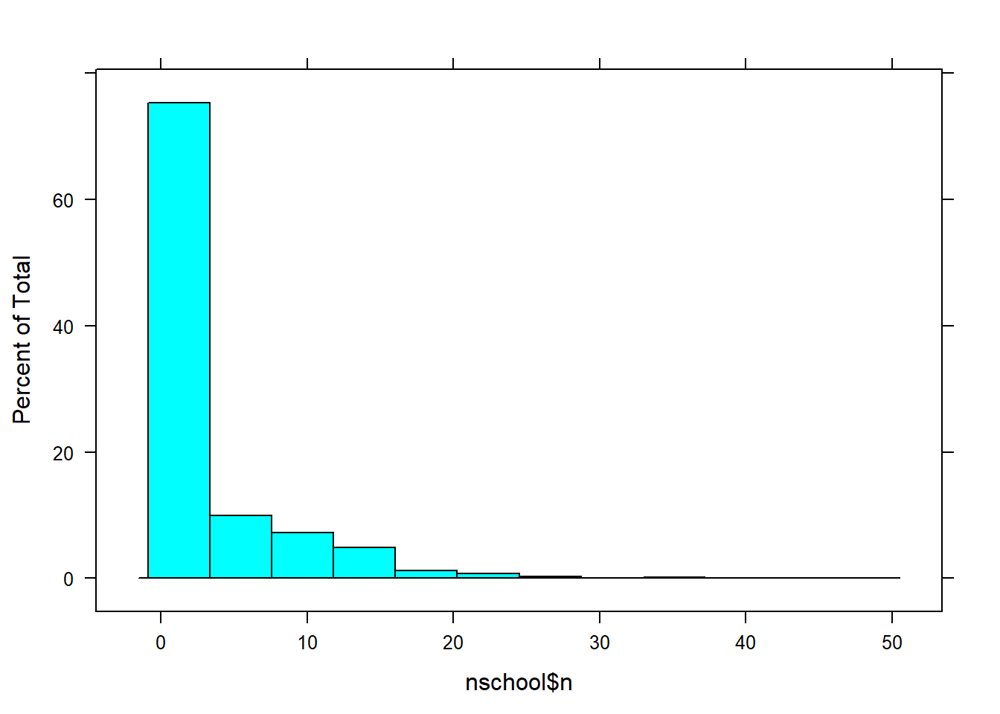

This post accompanies the article (this was originally submitted as an Issue Brief which is why the Discussion section and Introduction are so short):

<blockquote>

Huang, F. (2020). Prior problem behaviors do not account for the racial suspension gap. Educational Researcher. Advance online publication.

</blockquote>

<h2>Load required packages and dataset</h2>

NOTE: the dataset and manual are available at the following links (the syntax below uses the SPSS data file).

<ul>
<li><a href="https://nces.ed.gov/ecls/data/ECLSK_K8_Manual_part1.pdf" class="uri">https://nces.ed.gov/ecls/data/ECLSK_K8_Manual_part1.pdf</a></li>
<li>Download the original ECLS-k 1887-99 dataset from EDAT:
<a href="https://nces.ed.gov/OnlineCodebook" class="uri">https://nces.ed.gov/OnlineCodebook</a></li>
</ul>

The commented part loads the dataset and selects the variables of interest.

<pre class="r"><code>library(dplyr)
library(survey)
library(summarytools)
library(tableone)
library(jtools)
library(psych)
library(sjmisc)

setwd(&quot;C:/Users/huangf/Google Drive/Projects/wright_reanalysis&quot;)
dat &lt;- rio::import(&#39;d:/data/eclsk/eclsk_98_99_k8_child_v1_0.sav&#39;) 
takes a while since the file is big
names(dat) &lt;- tolower(names(dat))

sm &lt;- filter(dat, s7pupri == 1, race %in% c(1,2)) %&gt;% #black or white students only
   select(race, gender, p7fights, p7cheats, p7steals,
          p7suspnd, p7numsus, p7schgrd, w8pared, w8povrty,
          p7good, p7drugs, p7violnc, p7learng, s7blkpct, s7enrls,
          s7flch_i, s7rlch_i, s7_id,
          t1contro, t1interp, t1extern, t1learn,
          t4contro, t4interp, t4extern, t4learn,
          t5contro, t5interp, t5extern, t5learn,
          t6contro, t6interp, t6extern, t6learn,
          p1contro, p1social, p1impuls, p1learn,
          p4contro, p4social, p4impuls, p4learn,
          u6riep, s7rlch_i, j71race5, j72race5, c1_7fc0,
          j71t_id, j72t_id, j71class, j72class) #c1_7sc0 c1_7fc0 weight F7RIEP
 
 summarytools::dfSummary(sm) %&gt;% view()
 sm[sm &lt; 0] &lt;- NA #NAs to values &lt; 0
 save(sm, file = &#39;eclsk2_orig.rdata&#39;)

 rm(list = ls()) #clean workspace
load(&quot;C:/Users/huangf/Google Drive/Projects/wright_reanalysis/eclsk2_orig.rdata&quot;)</code></pre>

Create the scales and indices used for analyses:

<pre class="r"><code>sm &lt;- select(sm, -p7numsus) #remove number times suspended, not needed
sm &lt;- mutate(sm,
  race = factor(race, labels = c(&#39;w&#39;, &#39;b&#39;)),
  male = case_when(
   gender == 1 ~ 1,
   gender == 2 ~ 0
  ),
  poverty = case_when(
  w8povrty == 1 ~ 1, #below poverty
  w8povrty == 2 ~ 0
  ), 
  delin = (p7fights + p7cheats + p7steals) / 3,
  badschool = (p7good + (6 - p7drugs) + (6 - p7violnc) + p7learng) / 4,
  sus = case_when(
  p7suspnd == 1 ~ 1,
  p7suspnd == 2 ~ 0),
  pared = 10 - w8pared, #reverse coding
  iep = case_when(
   u6riep == 1 ~ 1,
   TRUE ~ 0),
  tm = case_when( #teacher race missing / just in case
   is.na(j72race5) &amp; is.na(j71race5) ~ 1,
   TRUE ~ 0),
  pp.parent = ((5 - p1contro) + (5 - p1social) + p1impuls + ## Parent-reported PPB
   (5 - p4contro) + (5 - p4social) + p4impuls)   / 2, ## divided by 2 years
  prob = ((5 - t5contro) + (5 - t5interp) + t5extern + (5 - t5learn) + ##PPB
   (5 - t4contro) + (5 - t4interp) + t4extern + (5 - t4learn) +
   (5 - t1contro) + (5 - t1interp) + t1extern + (5 - t1learn)) / 3, # divided by 3 years
  probred = ((5 - t5contro) + (5 - t5interp) + t5extern +  ##PPB w/out ATL
   (5 - t4contro) + (5 - t4interp) + t4extern + 
   (5 - t1contro) + (5 - t1interp) + t1extern)  / 3,
  prob2 = (5 - t6contro) + (5 - t6interp) + t6extern , ## PPB in spring 5th grade
  extern = (t1extern + t4extern + t5extern) / 3 ## Externalizing as PPB
   )

sm2 &lt;- select(sm, -p7suspnd, -gender, -p7fights, -p7cheats, -p7steals, -w8pared,
   -w8povrty, -p7good, -p7drugs, -p7violnc, -p7learng, -u6riep, -s7rlch_i,
   -j72race5, -j71race5, -starts_with(&quot;p1&quot;), -starts_with(&quot;p4&quot;),
   -starts_with(&quot;t1&quot;), -starts_with(&#39;t5&#39;), -starts_with(&#39;t6&#39;),
   -starts_with(&#39;t4&#39;),
   -j71class, -j72class, -j71t_id, -j72t_id #if not using orig
   ) #teacher ids

sm2$c1_7fc0[is.na(sm2$c1_7fc0)] &lt;- 0 #missing weight, make it zero / not using it</code></pre>

Conduct some prior investigation prior to analyses:

<pre class="r"><code>### FOR MODEL 1:::

sm3 &lt;- select(sm2, -starts_with(&quot;prob&quot;), -pp.parent, -extern, prob, probred)
#mice::md.pattern(sm3, rotate.names = T, plot = F)
#sm3 &lt;- na.omit(sm3)

How many students per school and how many schools?
nschool &lt;- sm3 %&gt;%
  group_by(s7_id) %&gt;%
  summarise(n = n()) %&gt;% arrange(desc(n))</code></pre>
<pre><code>## `summarise()` ungrouping output (override with `.groups` argument)</code></pre>
<pre class="r"><code>lattice::histogram(nschool$n) #1591 schools originally</code></pre>

<pre class="r"><code>### investigating weights

sum(sm3$c1_7fc0 == 0) #901</code></pre>
<pre><code>## [1] 901</code></pre>
<pre class="r"><code>nrow(sm3) #5481</code></pre>
<pre><code>## [1] 5481</code></pre>
<pre class="r"><code>5481 - 901 #number with nonzero weights</code></pre>
<pre><code>## [1] 4580</code></pre>
<pre class="r"><code>tmp &lt;- filter(sm3, c1_7fc0 != 0)
# mice::md.pattern(tmp, rotate.names = T) #missing data patterns</code></pre>

Were weights used? Based on this, weights were not used in Wright et al. Numbers will not add up, additional checks conducted (not shown).

<pre class="r"><code>sm3 &lt;- filter(sm3, !is.na(s7enrls), !is.na(poverty),
    !is.na(pared), !is.na(sus), !is.na(delin),
    !is.na(badschool), !is.na(p7schgrd),
    !is.na(s7blkpct))

vars = c(&#39;sus&#39;, &#39;race&#39;, &#39;male&#39;, &#39;iep&#39;, &#39;p7schgrd&#39;, &#39;pared&#39;, &#39;poverty&#39;,
         &#39;s7blkpct&#39;, &#39;s7enrls&#39;, &#39;badschool&#39;, &#39;delin&#39;, &#39;s7flch_i&#39;)

NOTE: there are 29 students (&lt; 1% of sample) that had 
schools that did not give grades
TABLE 1 creation

t1 &lt;- CreateTableOne(data = sm3, vars = vars, 
    factorVars = c(&#39;sus&#39;, &#39;poverty&#39;, &#39;male&#39;, &#39;iep&#39;))
res &lt;- print(t1, contDigits = 3, showAllLevels = T, minMax = T)</code></pre>
<pre><code>##                        
##                         level Overall        
##   n                             4360         
##   sus (%)               0       3729 (85.5)  
##                         1        631 (14.5)  
##   race (%)              w       3789 (86.9)  
##                         b        571 (13.1)  
##   male (%)              0       2143 (49.2)  
##                         1       2217 (50.8)  
##   iep (%)               0       3884 (89.1)  
##                         1        476 (10.9)  
##   p7schgrd (mean (SD))         1.695 (0.862) 
##   pared (mean (SD))            4.678 (1.800) 
##   poverty (%)           0       3832 (87.9)  
##                         1        528 (12.1)  
##   s7blkpct (mean (SD))         2.936 (1.250) 
##   s7enrls (mean (SD))          3.945 (1.065) 
##   badschool (mean (SD))        1.794 (0.581) 
##   delin (mean (SD))            1.077 (0.217) 
##   s7flch_i (mean (SD))        28.580 (21.136)</code></pre>
<pre class="r"><code>#write.csv(res, file = &#39;output/t1_2.csv&#39;)
table(sm3$s7_id) %&gt;% length() #1270 schools</code></pre>
<pre><code>## [1] 1270</code></pre>
<pre class="r"><code>#4360/1270 = 3.43 students per school

# not weighted // used for cluster robust SEs
des &lt;- svydesign(ids = ~s7_id, data = sm3, weights = ~1)
# testing out multiway clustering using teachers, not shown
#des.t &lt;- svydesign(ids = ~j71t_id + j72t_id, data = sm3, weights = ~1)

### // Table below is testing to see if weights were used
### NOT used for actual analysis

des.w &lt;- svydesign(data = sm3, ids = ~s7_id, weights = ~c1_7fc0)
t2 &lt;- svyCreateTableOne(data = des.w, vars = vars, 
  factorVars = c(&#39;sus&#39;, &#39;poverty&#39;, &#39;male&#39;, &#39;iep&#39;))
print(t2)</code></pre>
<pre><code>##                        
##                         Overall           
##   n                      1923843.5        
##   sus = 1 (%)             358314.6 (18.6) 
##   race = b (%)            383126.3 (19.9) 
##   male = 1 (%)            995846.0 (51.8) 
##   iep = 1 (%)             222004.6 (11.5) 
##   p7schgrd (mean (SD))        1.76 (0.91) 
##   pared (mean (SD))           4.76 (1.81) 
##   poverty = 1 (%)         274879.5 (14.3) 
##   s7blkpct (mean (SD))        3.16 (1.30) 
##   s7enrls (mean (SD))         4.09 (0.99) 
##   badschool (mean (SD))       1.83 (0.60) 
##   delin (mean (SD))           1.10 (0.25) 
##   s7flch_i (mean (SD))       29.93 (22.78)</code></pre>

Does not match Wright’s paper in terms of race breakdown (19.9% vs. 14.5% Black). Does not look like weights were used and no mention in original paper.

<h2>Results</h2>

Percent of Black vs. White suspended without covariates: 32.9 vs 11.7– 21.2 percentage point difference.

<pre class="r"><code>  ctable(sm3$race, sm3$sus)</code></pre>
<pre><code>## Cross-Tabulation, Row Proportions  
## race * sus  
## Data Frame: sm3  
## 
## ------- ----- -------------- ------------- ---------------
##           sus              0             1           Total
##    race                                                   
##       w         3346 (88.3%)   443 (11.7%)   3789 (100.0%)
##       b          383 (67.1%)   188 (32.9%)    571 (100.0%)
##   Total         3729 (85.5%)   631 (14.5%)   4360 (100.0%)
## ------- ----- -------------- ------------- ---------------</code></pre>
<pre class="r"><code>  test1 &lt;- lm(sus ~ race, data = sm3) 
  summary(test1) #testing LPM</code></pre>
<pre><code>## 
## Call:
## lm(formula = sus ~ race, data = sm3)
## 
## Residuals:
##     Min      1Q  Median      3Q     Max 
## -0.3292 -0.1169 -0.1169 -0.1169  0.8831 
## 
## Coefficients:
##             Estimate Std. Error t value Pr(&gt;|t|)    
## (Intercept) 0.116917   0.005597   20.89   &lt;2e-16 ***
## raceb       0.212330   0.015467   13.73   &lt;2e-16 ***
## ---
## Signif. codes:  0 &#39;***&#39; 0.001 &#39;**&#39; 0.01 &#39;*&#39; 0.05 &#39;.&#39; 0.1 &#39; &#39; 1
## 
## Residual standard error: 0.3445 on 4358 degrees of freedom
## Multiple R-squared:  0.04145,    Adjusted R-squared:  0.04123 
## F-statistic: 188.5 on 1 and 4358 DF,  p-value: &lt; 2.2e-16</code></pre>
<pre class="r"><code>  nobs(test1) #4360</code></pre>
<pre><code>## [1] 4360</code></pre>
<pre class="r"><code>  #(4360 - 4101) / 4360 #6% more</code></pre>

<h2>Model results: Replication</h2>
<pre class="r"><code>m0 &lt;- svyglm(sus ~ race, family = &#39;binomial&#39;, design = des)
nobs(m0)</code></pre>
<pre><code>## [1] 4360</code></pre>
<pre class="r"><code>summ(m0, exp = T, digits = 2, confint = T)</code></pre>
<table class="table table-striped table-hover table-condensed table-responsive" style="width: auto !important; margin-left: auto; margin-right: auto;">
<tbody>
<tr>
<td style="text-align:left;font-weight: bold;">
Observations
</td>
<td style="text-align:right;">
4360
</td>
</tr>
<tr>
<td style="text-align:left;font-weight: bold;">
Dependent variable
</td>
<td style="text-align:right;">
sus
</td>
</tr>
<tr>
<td style="text-align:left;font-weight: bold;">
Type
</td>
<td style="text-align:right;">
Survey-weighted generalized linear model
</td>
</tr>
<tr>
<td style="text-align:left;font-weight: bold;">
Family
</td>
<td style="text-align:right;">
binomial
</td>
</tr>
<tr>
<td style="text-align:left;font-weight: bold;">
Link
</td>
<td style="text-align:right;">
logit
</td>
</tr>
</tbody>
</table>
<table class="table table-striped table-hover table-condensed table-responsive" style="width: auto !important; margin-left: auto; margin-right: auto;">
<tbody>
<tr>
<td style="text-align:left;font-weight: bold;">
Pseudo-R² (Cragg-Uhler)
</td>
<td style="text-align:right;">
0.02
</td>
</tr>
<tr>
<td style="text-align:left;font-weight: bold;">
Pseudo-R² (McFadden)
</td>
<td style="text-align:right;">
0.04
</td>
</tr>
<tr>
<td style="text-align:left;font-weight: bold;">
AIC
</td>
<td style="text-align:right;">
3461.29
</td>
</tr>
</tbody>
</table>
<table class="table table-striped table-hover table-condensed table-responsive" style="width: auto !important; margin-left: auto; margin-right: auto;">
<thead>
<tr>
<th style="text-align:left;">
</th>
<th style="text-align:right;">
exp(Est.)
</th>
<th style="text-align:right;">
2.5%
</th>
<th style="text-align:right;">
97.5%
</th>
<th style="text-align:right;">
t val.
</th>
<th style="text-align:right;">
p
</th>
</tr>
</thead>
<tbody>
<tr>
<td style="text-align:left;font-weight: bold;">
(Intercept)
</td>
<td style="text-align:right;">
0.13
</td>
<td style="text-align:right;">
0.12
</td>
<td style="text-align:right;">
0.15
</td>
<td style="text-align:right;">
-33.73
</td>
<td style="text-align:right;">
0.00
</td>
</tr>
<tr>
<td style="text-align:left;font-weight: bold;">
raceb
</td>
<td style="text-align:right;">
3.71
</td>
<td style="text-align:right;">
2.99
</td>
<td style="text-align:right;">
4.59
</td>
<td style="text-align:right;">
12.03
</td>
<td style="text-align:right;">
0.00
</td>
</tr>
</tbody>
<tfoot>
<tr>
<td style="padding: 0; border: 0;" colspan="100%">
 Standard errors: Robust
</td>
</tr>
</tfoot>
</table>
<pre class="r"><code>#base odds ratio:: not reported in tables, only in text

m1 &lt;- svyglm(sus ~ race + male + p7schgrd + iep + pared + poverty +
               s7enrls +  s7flch_i + badschool + s7blkpct + delin,
             family = &#39;binomial&#39;, design = des)
m2 &lt;- update(m1, . ~ . + prob)

### only use those without missing data
nomiss &lt;- na.omit(sm3) #for models 3 and 4
des.red &lt;- svydesign(ids = ~s7_id, data = nomiss, weights = ~1)
m3 &lt;- update(m1, . ~ ., design = des.red)
m4 &lt;- update(m3, . ~ . - prob + probred)

mean(nomiss$probred)</code></pre>
<pre><code>## [1] 5.291927</code></pre>
<pre class="r"><code>sd(nomiss$probred)</code></pre>
<pre><code>## [1] 1.355125</code></pre>
<pre class="r"><code>## TABLE 2

export_summs(m1, m2, m3, m4, exp = T, confint = T,
  error_format = &quot;({conf.low}, {conf.high})&quot;)</code></pre>
<table class="huxtable" style="border-collapse: collapse; margin-bottom: 2em; margin-top: 2em; width: 50%; margin-left: auto; margin-right: auto;  ">
<col><col><col><col><col><tr>
<td style="vertical-align: top; text-align: center; white-space: nowrap; border-style: solid solid solid solid; border-width: 0.8pt 0pt 0pt 0pt; padding: 4pt 4pt 4pt 4pt;"></td>
<td style="vertical-align: top; text-align: center; white-space: nowrap; border-style: solid solid solid solid; border-width: 0.8pt 0pt 0.4pt 0pt; padding: 4pt 4pt 4pt 4pt;">Model 1</td>
<td style="vertical-align: top; text-align: center; white-space: nowrap; border-style: solid solid solid solid; border-width: 0.8pt 0pt 0.4pt 0pt; padding: 4pt 4pt 4pt 4pt;">Model 2</td>
<td style="vertical-align: top; text-align: center; white-space: nowrap; border-style: solid solid solid solid; border-width: 0.8pt 0pt 0.4pt 0pt; padding: 4pt 4pt 4pt 4pt;">Model 3</td>
<td style="vertical-align: top; text-align: center; white-space: nowrap; border-style: solid solid solid solid; border-width: 0.8pt 0pt 0.4pt 0pt; padding: 4pt 4pt 4pt 4pt;">Model 4</td>
</tr>
<tr>
<td style="vertical-align: top; text-align: left; white-space: nowrap; padding: 4pt 4pt 4pt 4pt;">(Intercept)</td>
<td style="vertical-align: top; text-align: right; white-space: nowrap; padding: 4pt 4pt 4pt 4pt;">0.00 ***</td>
<td style="vertical-align: top; text-align: right; white-space: nowrap; padding: 4pt 4pt 4pt 4pt;">0.00 ***</td>
<td style="vertical-align: top; text-align: right; white-space: nowrap; padding: 4pt 4pt 4pt 4pt;">0.00 ***</td>
<td style="vertical-align: top; text-align: right; white-space: nowrap; padding: 4pt 4pt 4pt 4pt;">0.00 ***</td>
</tr>
<tr>
<td style="vertical-align: top; text-align: left; white-space: nowrap; padding: 4pt 4pt 4pt 4pt;"></td>
<td style="vertical-align: top; text-align: right; white-space: nowrap; padding: 4pt 4pt 4pt 4pt;">(0.00, 0.00)&nbsp;&nbsp;&nbsp;</td>
<td style="vertical-align: top; text-align: right; white-space: nowrap; padding: 4pt 4pt 4pt 4pt;">(0.00, 0.00)&nbsp;&nbsp;&nbsp;</td>
<td style="vertical-align: top; text-align: right; white-space: nowrap; padding: 4pt 4pt 4pt 4pt;">(0.00, 0.00)&nbsp;&nbsp;&nbsp;</td>
<td style="vertical-align: top; text-align: right; white-space: nowrap; padding: 4pt 4pt 4pt 4pt;">(0.00, 0.00)&nbsp;&nbsp;&nbsp;</td>
</tr>
<tr>
<td style="vertical-align: top; text-align: left; white-space: nowrap; padding: 4pt 4pt 4pt 4pt;">raceb</td>
<td style="vertical-align: top; text-align: right; white-space: nowrap; padding: 4pt 4pt 4pt 4pt;">1.92 ***</td>
<td style="vertical-align: top; text-align: right; white-space: nowrap; padding: 4pt 4pt 4pt 4pt;">1.18&nbsp;&nbsp;&nbsp;&nbsp;</td>
<td style="vertical-align: top; text-align: right; white-space: nowrap; padding: 4pt 4pt 4pt 4pt;">1.40&nbsp;&nbsp;&nbsp;&nbsp;</td>
<td style="vertical-align: top; text-align: right; white-space: nowrap; padding: 4pt 4pt 4pt 4pt;">1.16&nbsp;&nbsp;&nbsp;&nbsp;</td>
</tr>
<tr>
<td style="vertical-align: top; text-align: left; white-space: nowrap; padding: 4pt 4pt 4pt 4pt;"></td>
<td style="vertical-align: top; text-align: right; white-space: nowrap; padding: 4pt 4pt 4pt 4pt;">(1.38, 2.69)&nbsp;&nbsp;&nbsp;</td>
<td style="vertical-align: top; text-align: right; white-space: nowrap; padding: 4pt 4pt 4pt 4pt;">(0.74, 1.85)&nbsp;&nbsp;&nbsp;</td>
<td style="vertical-align: top; text-align: right; white-space: nowrap; padding: 4pt 4pt 4pt 4pt;">(0.90, 2.17)&nbsp;&nbsp;&nbsp;</td>
<td style="vertical-align: top; text-align: right; white-space: nowrap; padding: 4pt 4pt 4pt 4pt;">(0.73, 1.83)&nbsp;&nbsp;&nbsp;</td>
</tr>
<tr>
<td style="vertical-align: top; text-align: left; white-space: nowrap; padding: 4pt 4pt 4pt 4pt;">male</td>
<td style="vertical-align: top; text-align: right; white-space: nowrap; padding: 4pt 4pt 4pt 4pt;">2.72 ***</td>
<td style="vertical-align: top; text-align: right; white-space: nowrap; padding: 4pt 4pt 4pt 4pt;">2.08 ***</td>
<td style="vertical-align: top; text-align: right; white-space: nowrap; padding: 4pt 4pt 4pt 4pt;">2.52 ***</td>
<td style="vertical-align: top; text-align: right; white-space: nowrap; padding: 4pt 4pt 4pt 4pt;">2.10 ***</td>
</tr>
<tr>
<td style="vertical-align: top; text-align: left; white-space: nowrap; padding: 4pt 4pt 4pt 4pt;"></td>
<td style="vertical-align: top; text-align: right; white-space: nowrap; padding: 4pt 4pt 4pt 4pt;">(2.21, 3.35)&nbsp;&nbsp;&nbsp;</td>
<td style="vertical-align: top; text-align: right; white-space: nowrap; padding: 4pt 4pt 4pt 4pt;">(1.59, 2.73)&nbsp;&nbsp;&nbsp;</td>
<td style="vertical-align: top; text-align: right; white-space: nowrap; padding: 4pt 4pt 4pt 4pt;">(1.94, 3.28)&nbsp;&nbsp;&nbsp;</td>
<td style="vertical-align: top; text-align: right; white-space: nowrap; padding: 4pt 4pt 4pt 4pt;">(1.61, 2.75)&nbsp;&nbsp;&nbsp;</td>
</tr>
<tr>
<td style="vertical-align: top; text-align: left; white-space: nowrap; padding: 4pt 4pt 4pt 4pt;">p7schgrd</td>
<td style="vertical-align: top; text-align: right; white-space: nowrap; padding: 4pt 4pt 4pt 4pt;">1.53 ***</td>
<td style="vertical-align: top; text-align: right; white-space: nowrap; padding: 4pt 4pt 4pt 4pt;">1.42 ***</td>
<td style="vertical-align: top; text-align: right; white-space: nowrap; padding: 4pt 4pt 4pt 4pt;">1.56 ***</td>
<td style="vertical-align: top; text-align: right; white-space: nowrap; padding: 4pt 4pt 4pt 4pt;">1.46 ***</td>
</tr>
<tr>
<td style="vertical-align: top; text-align: left; white-space: nowrap; padding: 4pt 4pt 4pt 4pt;"></td>
<td style="vertical-align: top; text-align: right; white-space: nowrap; padding: 4pt 4pt 4pt 4pt;">(1.38, 1.70)&nbsp;&nbsp;&nbsp;</td>
<td style="vertical-align: top; text-align: right; white-space: nowrap; padding: 4pt 4pt 4pt 4pt;">(1.23, 1.64)&nbsp;&nbsp;&nbsp;</td>
<td style="vertical-align: top; text-align: right; white-space: nowrap; padding: 4pt 4pt 4pt 4pt;">(1.36, 1.79)&nbsp;&nbsp;&nbsp;</td>
<td style="vertical-align: top; text-align: right; white-space: nowrap; padding: 4pt 4pt 4pt 4pt;">(1.27, 1.68)&nbsp;&nbsp;&nbsp;</td>
</tr>
<tr>
<td style="vertical-align: top; text-align: left; white-space: nowrap; padding: 4pt 4pt 4pt 4pt;">iep</td>
<td style="vertical-align: top; text-align: right; white-space: nowrap; padding: 4pt 4pt 4pt 4pt;">1.07&nbsp;&nbsp;&nbsp;&nbsp;</td>
<td style="vertical-align: top; text-align: right; white-space: nowrap; padding: 4pt 4pt 4pt 4pt;">0.90&nbsp;&nbsp;&nbsp;&nbsp;</td>
<td style="vertical-align: top; text-align: right; white-space: nowrap; padding: 4pt 4pt 4pt 4pt;">1.17&nbsp;&nbsp;&nbsp;&nbsp;</td>
<td style="vertical-align: top; text-align: right; white-space: nowrap; padding: 4pt 4pt 4pt 4pt;">0.93&nbsp;&nbsp;&nbsp;&nbsp;</td>
</tr>
<tr>
<td style="vertical-align: top; text-align: left; white-space: nowrap; padding: 4pt 4pt 4pt 4pt;"></td>
<td style="vertical-align: top; text-align: right; white-space: nowrap; padding: 4pt 4pt 4pt 4pt;">(0.81, 1.41)&nbsp;&nbsp;&nbsp;</td>
<td style="vertical-align: top; text-align: right; white-space: nowrap; padding: 4pt 4pt 4pt 4pt;">(0.64, 1.28)&nbsp;&nbsp;&nbsp;</td>
<td style="vertical-align: top; text-align: right; white-space: nowrap; padding: 4pt 4pt 4pt 4pt;">(0.83, 1.65)&nbsp;&nbsp;&nbsp;</td>
<td style="vertical-align: top; text-align: right; white-space: nowrap; padding: 4pt 4pt 4pt 4pt;">(0.66, 1.32)&nbsp;&nbsp;&nbsp;</td>
</tr>
<tr>
<td style="vertical-align: top; text-align: left; white-space: nowrap; padding: 4pt 4pt 4pt 4pt;">pared</td>
<td style="vertical-align: top; text-align: right; white-space: nowrap; padding: 4pt 4pt 4pt 4pt;">1.07 *&nbsp;&nbsp;</td>
<td style="vertical-align: top; text-align: right; white-space: nowrap; padding: 4pt 4pt 4pt 4pt;">1.10 *&nbsp;&nbsp;</td>
<td style="vertical-align: top; text-align: right; white-space: nowrap; padding: 4pt 4pt 4pt 4pt;">1.13 **&nbsp;</td>
<td style="vertical-align: top; text-align: right; white-space: nowrap; padding: 4pt 4pt 4pt 4pt;">1.10 *&nbsp;&nbsp;</td>
</tr>
<tr>
<td style="vertical-align: top; text-align: left; white-space: nowrap; padding: 4pt 4pt 4pt 4pt;"></td>
<td style="vertical-align: top; text-align: right; white-space: nowrap; padding: 4pt 4pt 4pt 4pt;">(1.00, 1.14)&nbsp;&nbsp;&nbsp;</td>
<td style="vertical-align: top; text-align: right; white-space: nowrap; padding: 4pt 4pt 4pt 4pt;">(1.01, 1.19)&nbsp;&nbsp;&nbsp;</td>
<td style="vertical-align: top; text-align: right; white-space: nowrap; padding: 4pt 4pt 4pt 4pt;">(1.04, 1.22)&nbsp;&nbsp;&nbsp;</td>
<td style="vertical-align: top; text-align: right; white-space: nowrap; padding: 4pt 4pt 4pt 4pt;">(1.01, 1.19)&nbsp;&nbsp;&nbsp;</td>
</tr>
<tr>
<td style="vertical-align: top; text-align: left; white-space: nowrap; padding: 4pt 4pt 4pt 4pt;">poverty</td>
<td style="vertical-align: top; text-align: right; white-space: nowrap; padding: 4pt 4pt 4pt 4pt;">0.98&nbsp;&nbsp;&nbsp;&nbsp;</td>
<td style="vertical-align: top; text-align: right; white-space: nowrap; padding: 4pt 4pt 4pt 4pt;">0.85&nbsp;&nbsp;&nbsp;&nbsp;</td>
<td style="vertical-align: top; text-align: right; white-space: nowrap; padding: 4pt 4pt 4pt 4pt;">0.92&nbsp;&nbsp;&nbsp;&nbsp;</td>
<td style="vertical-align: top; text-align: right; white-space: nowrap; padding: 4pt 4pt 4pt 4pt;">0.86&nbsp;&nbsp;&nbsp;&nbsp;</td>
</tr>
<tr>
<td style="vertical-align: top; text-align: left; white-space: nowrap; padding: 4pt 4pt 4pt 4pt;"></td>
<td style="vertical-align: top; text-align: right; white-space: nowrap; padding: 4pt 4pt 4pt 4pt;">(0.73, 1.31)&nbsp;&nbsp;&nbsp;</td>
<td style="vertical-align: top; text-align: right; white-space: nowrap; padding: 4pt 4pt 4pt 4pt;">(0.57, 1.26)&nbsp;&nbsp;&nbsp;</td>
<td style="vertical-align: top; text-align: right; white-space: nowrap; padding: 4pt 4pt 4pt 4pt;">(0.61, 1.37)&nbsp;&nbsp;&nbsp;</td>
<td style="vertical-align: top; text-align: right; white-space: nowrap; padding: 4pt 4pt 4pt 4pt;">(0.58, 1.28)&nbsp;&nbsp;&nbsp;</td>
</tr>
<tr>
<td style="vertical-align: top; text-align: left; white-space: nowrap; padding: 4pt 4pt 4pt 4pt;">s7enrls</td>
<td style="vertical-align: top; text-align: right; white-space: nowrap; padding: 4pt 4pt 4pt 4pt;">1.08&nbsp;&nbsp;&nbsp;&nbsp;</td>
<td style="vertical-align: top; text-align: right; white-space: nowrap; padding: 4pt 4pt 4pt 4pt;">1.16 *&nbsp;&nbsp;</td>
<td style="vertical-align: top; text-align: right; white-space: nowrap; padding: 4pt 4pt 4pt 4pt;">1.13&nbsp;&nbsp;&nbsp;&nbsp;</td>
<td style="vertical-align: top; text-align: right; white-space: nowrap; padding: 4pt 4pt 4pt 4pt;">1.16 *&nbsp;&nbsp;</td>
</tr>
<tr>
<td style="vertical-align: top; text-align: left; white-space: nowrap; padding: 4pt 4pt 4pt 4pt;"></td>
<td style="vertical-align: top; text-align: right; white-space: nowrap; padding: 4pt 4pt 4pt 4pt;">(0.97, 1.21)&nbsp;&nbsp;&nbsp;</td>
<td style="vertical-align: top; text-align: right; white-space: nowrap; padding: 4pt 4pt 4pt 4pt;">(1.00, 1.35)&nbsp;&nbsp;&nbsp;</td>
<td style="vertical-align: top; text-align: right; white-space: nowrap; padding: 4pt 4pt 4pt 4pt;">(0.98, 1.31)&nbsp;&nbsp;&nbsp;</td>
<td style="vertical-align: top; text-align: right; white-space: nowrap; padding: 4pt 4pt 4pt 4pt;">(1.01, 1.35)&nbsp;&nbsp;&nbsp;</td>
</tr>
<tr>
<td style="vertical-align: top; text-align: left; white-space: nowrap; padding: 4pt 4pt 4pt 4pt;">s7flch_i</td>
<td style="vertical-align: top; text-align: right; white-space: nowrap; padding: 4pt 4pt 4pt 4pt;">1.01 *&nbsp;&nbsp;</td>
<td style="vertical-align: top; text-align: right; white-space: nowrap; padding: 4pt 4pt 4pt 4pt;">1.00&nbsp;&nbsp;&nbsp;&nbsp;</td>
<td style="vertical-align: top; text-align: right; white-space: nowrap; padding: 4pt 4pt 4pt 4pt;">1.00&nbsp;&nbsp;&nbsp;&nbsp;</td>
<td style="vertical-align: top; text-align: right; white-space: nowrap; padding: 4pt 4pt 4pt 4pt;">1.00&nbsp;&nbsp;&nbsp;&nbsp;</td>
</tr>
<tr>
<td style="vertical-align: top; text-align: left; white-space: nowrap; padding: 4pt 4pt 4pt 4pt;"></td>
<td style="vertical-align: top; text-align: right; white-space: nowrap; padding: 4pt 4pt 4pt 4pt;">(1.00, 1.01)&nbsp;&nbsp;&nbsp;</td>
<td style="vertical-align: top; text-align: right; white-space: nowrap; padding: 4pt 4pt 4pt 4pt;">(0.99, 1.01)&nbsp;&nbsp;&nbsp;</td>
<td style="vertical-align: top; text-align: right; white-space: nowrap; padding: 4pt 4pt 4pt 4pt;">(1.00, 1.01)&nbsp;&nbsp;&nbsp;</td>
<td style="vertical-align: top; text-align: right; white-space: nowrap; padding: 4pt 4pt 4pt 4pt;">(0.99, 1.01)&nbsp;&nbsp;&nbsp;</td>
</tr>
<tr>
<td style="vertical-align: top; text-align: left; white-space: nowrap; padding: 4pt 4pt 4pt 4pt;">badschool</td>
<td style="vertical-align: top; text-align: right; white-space: nowrap; padding: 4pt 4pt 4pt 4pt;">1.56 ***</td>
<td style="vertical-align: top; text-align: right; white-space: nowrap; padding: 4pt 4pt 4pt 4pt;">1.73 ***</td>
<td style="vertical-align: top; text-align: right; white-space: nowrap; padding: 4pt 4pt 4pt 4pt;">1.68 ***</td>
<td style="vertical-align: top; text-align: right; white-space: nowrap; padding: 4pt 4pt 4pt 4pt;">1.73 ***</td>
</tr>
<tr>
<td style="vertical-align: top; text-align: left; white-space: nowrap; padding: 4pt 4pt 4pt 4pt;"></td>
<td style="vertical-align: top; text-align: right; white-space: nowrap; padding: 4pt 4pt 4pt 4pt;">(1.32, 1.83)&nbsp;&nbsp;&nbsp;</td>
<td style="vertical-align: top; text-align: right; white-space: nowrap; padding: 4pt 4pt 4pt 4pt;">(1.41, 2.12)&nbsp;&nbsp;&nbsp;</td>
<td style="vertical-align: top; text-align: right; white-space: nowrap; padding: 4pt 4pt 4pt 4pt;">(1.37, 2.07)&nbsp;&nbsp;&nbsp;</td>
<td style="vertical-align: top; text-align: right; white-space: nowrap; padding: 4pt 4pt 4pt 4pt;">(1.42, 2.13)&nbsp;&nbsp;&nbsp;</td>
</tr>
<tr>
<td style="vertical-align: top; text-align: left; white-space: nowrap; padding: 4pt 4pt 4pt 4pt;">s7blkpct</td>
<td style="vertical-align: top; text-align: right; white-space: nowrap; padding: 4pt 4pt 4pt 4pt;">1.17 **&nbsp;</td>
<td style="vertical-align: top; text-align: right; white-space: nowrap; padding: 4pt 4pt 4pt 4pt;">1.27 ***</td>
<td style="vertical-align: top; text-align: right; white-space: nowrap; padding: 4pt 4pt 4pt 4pt;">1.25 **&nbsp;</td>
<td style="vertical-align: top; text-align: right; white-space: nowrap; padding: 4pt 4pt 4pt 4pt;">1.27 ***</td>
</tr>
<tr>
<td style="vertical-align: top; text-align: left; white-space: nowrap; padding: 4pt 4pt 4pt 4pt;"></td>
<td style="vertical-align: top; text-align: right; white-space: nowrap; padding: 4pt 4pt 4pt 4pt;">(1.05, 1.30)&nbsp;&nbsp;&nbsp;</td>
<td style="vertical-align: top; text-align: right; white-space: nowrap; padding: 4pt 4pt 4pt 4pt;">(1.11, 1.45)&nbsp;&nbsp;&nbsp;</td>
<td style="vertical-align: top; text-align: right; white-space: nowrap; padding: 4pt 4pt 4pt 4pt;">(1.09, 1.42)&nbsp;&nbsp;&nbsp;</td>
<td style="vertical-align: top; text-align: right; white-space: nowrap; padding: 4pt 4pt 4pt 4pt;">(1.11, 1.45)&nbsp;&nbsp;&nbsp;</td>
</tr>
<tr>
<td style="vertical-align: top; text-align: left; white-space: nowrap; padding: 4pt 4pt 4pt 4pt;">delin</td>
<td style="vertical-align: top; text-align: right; white-space: nowrap; padding: 4pt 4pt 4pt 4pt;">7.28 ***</td>
<td style="vertical-align: top; text-align: right; white-space: nowrap; padding: 4pt 4pt 4pt 4pt;">7.26 ***</td>
<td style="vertical-align: top; text-align: right; white-space: nowrap; padding: 4pt 4pt 4pt 4pt;">10.16 ***</td>
<td style="vertical-align: top; text-align: right; white-space: nowrap; padding: 4pt 4pt 4pt 4pt;">7.13 ***</td>
</tr>
<tr>
<td style="vertical-align: top; text-align: left; white-space: nowrap; padding: 4pt 4pt 4pt 4pt;"></td>
<td style="vertical-align: top; text-align: right; white-space: nowrap; padding: 4pt 4pt 4pt 4pt;">(4.77, 11.11)&nbsp;&nbsp;&nbsp;</td>
<td style="vertical-align: top; text-align: right; white-space: nowrap; padding: 4pt 4pt 4pt 4pt;">(3.97, 13.29)&nbsp;&nbsp;&nbsp;</td>
<td style="vertical-align: top; text-align: right; white-space: nowrap; padding: 4pt 4pt 4pt 4pt;">(5.63, 18.32)&nbsp;&nbsp;&nbsp;</td>
<td style="vertical-align: top; text-align: right; white-space: nowrap; padding: 4pt 4pt 4pt 4pt;">(3.90, 13.03)&nbsp;&nbsp;&nbsp;</td>
</tr>
<tr>
<td style="vertical-align: top; text-align: left; white-space: nowrap; padding: 4pt 4pt 4pt 4pt;">prob</td>
<td style="vertical-align: top; text-align: right; white-space: nowrap; padding: 4pt 4pt 4pt 4pt;">&nbsp;&nbsp;&nbsp;&nbsp;&nbsp;&nbsp;&nbsp;</td>
<td style="vertical-align: top; text-align: right; white-space: nowrap; padding: 4pt 4pt 4pt 4pt;">1.31 ***</td>
<td style="vertical-align: top; text-align: right; white-space: nowrap; padding: 4pt 4pt 4pt 4pt;">&nbsp;&nbsp;&nbsp;&nbsp;&nbsp;&nbsp;&nbsp;</td>
<td style="vertical-align: top; text-align: right; white-space: nowrap; padding: 4pt 4pt 4pt 4pt;">&nbsp;&nbsp;&nbsp;&nbsp;&nbsp;&nbsp;&nbsp;</td>
</tr>
<tr>
<td style="vertical-align: top; text-align: left; white-space: nowrap; padding: 4pt 4pt 4pt 4pt;"></td>
<td style="vertical-align: top; text-align: right; white-space: nowrap; padding: 4pt 4pt 4pt 4pt;">&nbsp;&nbsp;&nbsp;&nbsp;&nbsp;&nbsp;&nbsp;</td>
<td style="vertical-align: top; text-align: right; white-space: nowrap; padding: 4pt 4pt 4pt 4pt;">(1.21, 1.41)&nbsp;&nbsp;&nbsp;</td>
<td style="vertical-align: top; text-align: right; white-space: nowrap; padding: 4pt 4pt 4pt 4pt;">&nbsp;&nbsp;&nbsp;&nbsp;&nbsp;&nbsp;&nbsp;</td>
<td style="vertical-align: top; text-align: right; white-space: nowrap; padding: 4pt 4pt 4pt 4pt;">&nbsp;&nbsp;&nbsp;&nbsp;&nbsp;&nbsp;&nbsp;</td>
</tr>
<tr>
<td style="vertical-align: top; text-align: left; white-space: nowrap; padding: 4pt 4pt 4pt 4pt;">probred</td>
<td style="vertical-align: top; text-align: right; white-space: nowrap; padding: 4pt 4pt 4pt 4pt;">&nbsp;&nbsp;&nbsp;&nbsp;&nbsp;&nbsp;&nbsp;</td>
<td style="vertical-align: top; text-align: right; white-space: nowrap; padding: 4pt 4pt 4pt 4pt;">&nbsp;&nbsp;&nbsp;&nbsp;&nbsp;&nbsp;&nbsp;</td>
<td style="vertical-align: top; text-align: right; white-space: nowrap; padding: 4pt 4pt 4pt 4pt;">&nbsp;&nbsp;&nbsp;&nbsp;&nbsp;&nbsp;&nbsp;</td>
<td style="vertical-align: top; text-align: right; white-space: nowrap; padding: 4pt 4pt 4pt 4pt;">1.44 ***</td>
</tr>
<tr>
<td style="vertical-align: top; text-align: left; white-space: nowrap; padding: 4pt 4pt 4pt 4pt;"></td>
<td style="vertical-align: top; text-align: right; white-space: nowrap; border-style: solid solid solid solid; border-width: 0pt 0pt 0.4pt 0pt; padding: 4pt 4pt 4pt 4pt;">&nbsp;&nbsp;&nbsp;&nbsp;&nbsp;&nbsp;&nbsp;</td>
<td style="vertical-align: top; text-align: right; white-space: nowrap; border-style: solid solid solid solid; border-width: 0pt 0pt 0.4pt 0pt; padding: 4pt 4pt 4pt 4pt;">&nbsp;&nbsp;&nbsp;&nbsp;&nbsp;&nbsp;&nbsp;</td>
<td style="vertical-align: top; text-align: right; white-space: nowrap; border-style: solid solid solid solid; border-width: 0pt 0pt 0.4pt 0pt; padding: 4pt 4pt 4pt 4pt;">&nbsp;&nbsp;&nbsp;&nbsp;&nbsp;&nbsp;&nbsp;</td>
<td style="vertical-align: top; text-align: right; white-space: nowrap; border-style: solid solid solid solid; border-width: 0pt 0pt 0.4pt 0pt; padding: 4pt 4pt 4pt 4pt;">(1.31, 1.58)&nbsp;&nbsp;&nbsp;</td>
</tr>
<tr>
<td style="vertical-align: top; text-align: left; white-space: nowrap; padding: 4pt 4pt 4pt 4pt;">N</td>
<td style="vertical-align: top; text-align: right; white-space: nowrap; padding: 4pt 4pt 4pt 4pt;">4360&nbsp;&nbsp;&nbsp;&nbsp;&nbsp;&nbsp;&nbsp;</td>
<td style="vertical-align: top; text-align: right; white-space: nowrap; padding: 4pt 4pt 4pt 4pt;">2892&nbsp;&nbsp;&nbsp;&nbsp;&nbsp;&nbsp;&nbsp;</td>
<td style="vertical-align: top; text-align: right; white-space: nowrap; padding: 4pt 4pt 4pt 4pt;">2892&nbsp;&nbsp;&nbsp;&nbsp;&nbsp;&nbsp;&nbsp;</td>
<td style="vertical-align: top; text-align: right; white-space: nowrap; padding: 4pt 4pt 4pt 4pt;">2892&nbsp;&nbsp;&nbsp;&nbsp;&nbsp;&nbsp;&nbsp;</td>
</tr>
<tr>
<td style="vertical-align: top; text-align: left; white-space: nowrap; border-style: solid solid solid solid; border-width: 0pt 0pt 0.8pt 0pt; padding: 4pt 4pt 4pt 4pt;">R2</td>
<td style="vertical-align: top; text-align: right; white-space: nowrap; border-style: solid solid solid solid; border-width: 0pt 0pt 0.8pt 0pt; padding: 4pt 4pt 4pt 4pt;">&nbsp;&nbsp;&nbsp;&nbsp;&nbsp;&nbsp;&nbsp;</td>
<td style="vertical-align: top; text-align: right; white-space: nowrap; border-style: solid solid solid solid; border-width: 0pt 0pt 0.8pt 0pt; padding: 4pt 4pt 4pt 4pt;">&nbsp;&nbsp;&nbsp;&nbsp;&nbsp;&nbsp;&nbsp;</td>
<td style="vertical-align: top; text-align: right; white-space: nowrap; border-style: solid solid solid solid; border-width: 0pt 0pt 0.8pt 0pt; padding: 4pt 4pt 4pt 4pt;">&nbsp;&nbsp;&nbsp;&nbsp;&nbsp;&nbsp;&nbsp;</td>
<td style="vertical-align: top; text-align: right; white-space: nowrap; border-style: solid solid solid solid; border-width: 0pt 0pt 0.8pt 0pt; padding: 4pt 4pt 4pt 4pt;">&nbsp;&nbsp;&nbsp;&nbsp;&nbsp;&nbsp;&nbsp;</td>
</tr>
<tr>
<td colspan="5" style="vertical-align: top; text-align: left; white-space: normal; padding: 4pt 4pt 4pt 4pt;"> *** p &lt; 0.001;  ** p &lt; 0.01;  * p &lt; 0.05.</td>
</tr>
</table>

The following table notes the differences in the original and the current reanalyses for the odds ratios (ORs) for Black students:

<table>
<thead>
<tr class="header">
<th>Model</th>
<th>Original</th>
<th>Replication</th>
</tr>
</thead>
<tbody>
<tr class="odd">
<td>No covariates</td>
<td>3.78</td>
<td>3.71</td>
</tr>
<tr class="even">
<td>w/added covariates</td>
<td>1.89</td>
<td>1.92</td>
</tr>
<tr class="odd">
<td>w/added problem behavior</td>
<td>1.20</td>
<td>1.18</td>
</tr>
</tbody>
</table>

<h2>In the appendix (using linear probability models)</h2>
<pre class="r"><code>## Using a linear probability model, for appendix
m1.lpm &lt;- update(m1, family = &#39;gaussian&#39;)
m2.lpm &lt;- update(m2, family = &#39;gaussian&#39;)
m3.lpm &lt;- update(m3, family = &#39;gaussian&#39;)
m4.lpm &lt;- update(m4, family = &#39;gaussian&#39;)
export_summs(m1.lpm, m2.lpm, m3.lpm, m4.lpm,
             model.names = c(&#39;LPM1&#39;, &#39;LPM2&#39;, &#39;LPM3&#39; ,&#39;LPM4&#39;))</code></pre>
<table class="huxtable" style="border-collapse: collapse; margin-bottom: 2em; margin-top: 2em; width: 50%; margin-left: auto; margin-right: auto;  ">
<col><col><col><col><col><tr>
<td style="vertical-align: top; text-align: center; white-space: nowrap; border-style: solid solid solid solid; border-width: 0.8pt 0pt 0pt 0pt; padding: 4pt 4pt 4pt 4pt;"></td>
<td style="vertical-align: top; text-align: center; white-space: nowrap; border-style: solid solid solid solid; border-width: 0.8pt 0pt 0.4pt 0pt; padding: 4pt 4pt 4pt 4pt;">LPM1</td>
<td style="vertical-align: top; text-align: center; white-space: nowrap; border-style: solid solid solid solid; border-width: 0.8pt 0pt 0.4pt 0pt; padding: 4pt 4pt 4pt 4pt;">LPM2</td>
<td style="vertical-align: top; text-align: center; white-space: nowrap; border-style: solid solid solid solid; border-width: 0.8pt 0pt 0.4pt 0pt; padding: 4pt 4pt 4pt 4pt;">LPM3</td>
<td style="vertical-align: top; text-align: center; white-space: nowrap; border-style: solid solid solid solid; border-width: 0.8pt 0pt 0.4pt 0pt; padding: 4pt 4pt 4pt 4pt;">LPM4</td>
</tr>
<tr>
<td style="vertical-align: top; text-align: left; white-space: nowrap; padding: 4pt 4pt 4pt 4pt;">(Intercept)</td>
<td style="vertical-align: top; text-align: right; white-space: nowrap; padding: 4pt 4pt 4pt 4pt;">-0.60 ***</td>
<td style="vertical-align: top; text-align: right; white-space: nowrap; padding: 4pt 4pt 4pt 4pt;">-0.78 ***</td>
<td style="vertical-align: top; text-align: right; white-space: nowrap; padding: 4pt 4pt 4pt 4pt;">-0.67 ***</td>
<td style="vertical-align: top; text-align: right; white-space: nowrap; padding: 4pt 4pt 4pt 4pt;">-0.79 ***</td>
</tr>
<tr>
<td style="vertical-align: top; text-align: left; white-space: nowrap; padding: 4pt 4pt 4pt 4pt;"></td>
<td style="vertical-align: top; text-align: right; white-space: nowrap; padding: 4pt 4pt 4pt 4pt;">(0.04)&nbsp;&nbsp;&nbsp;</td>
<td style="vertical-align: top; text-align: right; white-space: nowrap; padding: 4pt 4pt 4pt 4pt;">(0.05)&nbsp;&nbsp;&nbsp;</td>
<td style="vertical-align: top; text-align: right; white-space: nowrap; padding: 4pt 4pt 4pt 4pt;">(0.05)&nbsp;&nbsp;&nbsp;</td>
<td style="vertical-align: top; text-align: right; white-space: nowrap; padding: 4pt 4pt 4pt 4pt;">(0.05)&nbsp;&nbsp;&nbsp;</td>
</tr>
<tr>
<td style="vertical-align: top; text-align: left; white-space: nowrap; padding: 4pt 4pt 4pt 4pt;">raceb</td>
<td style="vertical-align: top; text-align: right; white-space: nowrap; padding: 4pt 4pt 4pt 4pt;">0.10 ***</td>
<td style="vertical-align: top; text-align: right; white-space: nowrap; padding: 4pt 4pt 4pt 4pt;">0.04&nbsp;&nbsp;&nbsp;&nbsp;</td>
<td style="vertical-align: top; text-align: right; white-space: nowrap; padding: 4pt 4pt 4pt 4pt;">0.05&nbsp;&nbsp;&nbsp;&nbsp;</td>
<td style="vertical-align: top; text-align: right; white-space: nowrap; padding: 4pt 4pt 4pt 4pt;">0.04&nbsp;&nbsp;&nbsp;&nbsp;</td>
</tr>
<tr>
<td style="vertical-align: top; text-align: left; white-space: nowrap; padding: 4pt 4pt 4pt 4pt;"></td>
<td style="vertical-align: top; text-align: right; white-space: nowrap; padding: 4pt 4pt 4pt 4pt;">(0.02)&nbsp;&nbsp;&nbsp;</td>
<td style="vertical-align: top; text-align: right; white-space: nowrap; padding: 4pt 4pt 4pt 4pt;">(0.03)&nbsp;&nbsp;&nbsp;</td>
<td style="vertical-align: top; text-align: right; white-space: nowrap; padding: 4pt 4pt 4pt 4pt;">(0.03)&nbsp;&nbsp;&nbsp;</td>
<td style="vertical-align: top; text-align: right; white-space: nowrap; padding: 4pt 4pt 4pt 4pt;">(0.03)&nbsp;&nbsp;&nbsp;</td>
</tr>
<tr>
<td style="vertical-align: top; text-align: left; white-space: nowrap; padding: 4pt 4pt 4pt 4pt;">male</td>
<td style="vertical-align: top; text-align: right; white-space: nowrap; padding: 4pt 4pt 4pt 4pt;">0.09 ***</td>
<td style="vertical-align: top; text-align: right; white-space: nowrap; padding: 4pt 4pt 4pt 4pt;">0.06 ***</td>
<td style="vertical-align: top; text-align: right; white-space: nowrap; padding: 4pt 4pt 4pt 4pt;">0.08 ***</td>
<td style="vertical-align: top; text-align: right; white-space: nowrap; padding: 4pt 4pt 4pt 4pt;">0.06 ***</td>
</tr>
<tr>
<td style="vertical-align: top; text-align: left; white-space: nowrap; padding: 4pt 4pt 4pt 4pt;"></td>
<td style="vertical-align: top; text-align: right; white-space: nowrap; padding: 4pt 4pt 4pt 4pt;">(0.01)&nbsp;&nbsp;&nbsp;</td>
<td style="vertical-align: top; text-align: right; white-space: nowrap; padding: 4pt 4pt 4pt 4pt;">(0.01)&nbsp;&nbsp;&nbsp;</td>
<td style="vertical-align: top; text-align: right; white-space: nowrap; padding: 4pt 4pt 4pt 4pt;">(0.01)&nbsp;&nbsp;&nbsp;</td>
<td style="vertical-align: top; text-align: right; white-space: nowrap; padding: 4pt 4pt 4pt 4pt;">(0.01)&nbsp;&nbsp;&nbsp;</td>
</tr>
<tr>
<td style="vertical-align: top; text-align: left; white-space: nowrap; padding: 4pt 4pt 4pt 4pt;">p7schgrd</td>
<td style="vertical-align: top; text-align: right; white-space: nowrap; padding: 4pt 4pt 4pt 4pt;">0.05 ***</td>
<td style="vertical-align: top; text-align: right; white-space: nowrap; padding: 4pt 4pt 4pt 4pt;">0.04 ***</td>
<td style="vertical-align: top; text-align: right; white-space: nowrap; padding: 4pt 4pt 4pt 4pt;">0.05 ***</td>
<td style="vertical-align: top; text-align: right; white-space: nowrap; padding: 4pt 4pt 4pt 4pt;">0.04 ***</td>
</tr>
<tr>
<td style="vertical-align: top; text-align: left; white-space: nowrap; padding: 4pt 4pt 4pt 4pt;"></td>
<td style="vertical-align: top; text-align: right; white-space: nowrap; padding: 4pt 4pt 4pt 4pt;">(0.01)&nbsp;&nbsp;&nbsp;</td>
<td style="vertical-align: top; text-align: right; white-space: nowrap; padding: 4pt 4pt 4pt 4pt;">(0.01)&nbsp;&nbsp;&nbsp;</td>
<td style="vertical-align: top; text-align: right; white-space: nowrap; padding: 4pt 4pt 4pt 4pt;">(0.01)&nbsp;&nbsp;&nbsp;</td>
<td style="vertical-align: top; text-align: right; white-space: nowrap; padding: 4pt 4pt 4pt 4pt;">(0.01)&nbsp;&nbsp;&nbsp;</td>
</tr>
<tr>
<td style="vertical-align: top; text-align: left; white-space: nowrap; padding: 4pt 4pt 4pt 4pt;">iep</td>
<td style="vertical-align: top; text-align: right; white-space: nowrap; padding: 4pt 4pt 4pt 4pt;">0.01&nbsp;&nbsp;&nbsp;&nbsp;</td>
<td style="vertical-align: top; text-align: right; white-space: nowrap; padding: 4pt 4pt 4pt 4pt;">-0.01&nbsp;&nbsp;&nbsp;&nbsp;</td>
<td style="vertical-align: top; text-align: right; white-space: nowrap; padding: 4pt 4pt 4pt 4pt;">0.02&nbsp;&nbsp;&nbsp;&nbsp;</td>
<td style="vertical-align: top; text-align: right; white-space: nowrap; padding: 4pt 4pt 4pt 4pt;">-0.01&nbsp;&nbsp;&nbsp;&nbsp;</td>
</tr>
<tr>
<td style="vertical-align: top; text-align: left; white-space: nowrap; padding: 4pt 4pt 4pt 4pt;"></td>
<td style="vertical-align: top; text-align: right; white-space: nowrap; padding: 4pt 4pt 4pt 4pt;">(0.02)&nbsp;&nbsp;&nbsp;</td>
<td style="vertical-align: top; text-align: right; white-space: nowrap; padding: 4pt 4pt 4pt 4pt;">(0.02)&nbsp;&nbsp;&nbsp;</td>
<td style="vertical-align: top; text-align: right; white-space: nowrap; padding: 4pt 4pt 4pt 4pt;">(0.02)&nbsp;&nbsp;&nbsp;</td>
<td style="vertical-align: top; text-align: right; white-space: nowrap; padding: 4pt 4pt 4pt 4pt;">(0.02)&nbsp;&nbsp;&nbsp;</td>
</tr>
<tr>
<td style="vertical-align: top; text-align: left; white-space: nowrap; padding: 4pt 4pt 4pt 4pt;">pared</td>
<td style="vertical-align: top; text-align: right; white-space: nowrap; padding: 4pt 4pt 4pt 4pt;">0.00&nbsp;&nbsp;&nbsp;&nbsp;</td>
<td style="vertical-align: top; text-align: right; white-space: nowrap; padding: 4pt 4pt 4pt 4pt;">0.01&nbsp;&nbsp;&nbsp;&nbsp;</td>
<td style="vertical-align: top; text-align: right; white-space: nowrap; padding: 4pt 4pt 4pt 4pt;">0.01 **&nbsp;</td>
<td style="vertical-align: top; text-align: right; white-space: nowrap; padding: 4pt 4pt 4pt 4pt;">0.01 *&nbsp;&nbsp;</td>
</tr>
<tr>
<td style="vertical-align: top; text-align: left; white-space: nowrap; padding: 4pt 4pt 4pt 4pt;"></td>
<td style="vertical-align: top; text-align: right; white-space: nowrap; padding: 4pt 4pt 4pt 4pt;">(0.00)&nbsp;&nbsp;&nbsp;</td>
<td style="vertical-align: top; text-align: right; white-space: nowrap; padding: 4pt 4pt 4pt 4pt;">(0.00)&nbsp;&nbsp;&nbsp;</td>
<td style="vertical-align: top; text-align: right; white-space: nowrap; padding: 4pt 4pt 4pt 4pt;">(0.00)&nbsp;&nbsp;&nbsp;</td>
<td style="vertical-align: top; text-align: right; white-space: nowrap; padding: 4pt 4pt 4pt 4pt;">(0.00)&nbsp;&nbsp;&nbsp;</td>
</tr>
<tr>
<td style="vertical-align: top; text-align: left; white-space: nowrap; padding: 4pt 4pt 4pt 4pt;">poverty</td>
<td style="vertical-align: top; text-align: right; white-space: nowrap; padding: 4pt 4pt 4pt 4pt;">-0.00&nbsp;&nbsp;&nbsp;&nbsp;</td>
<td style="vertical-align: top; text-align: right; white-space: nowrap; padding: 4pt 4pt 4pt 4pt;">-0.02&nbsp;&nbsp;&nbsp;&nbsp;</td>
<td style="vertical-align: top; text-align: right; white-space: nowrap; padding: 4pt 4pt 4pt 4pt;">-0.01&nbsp;&nbsp;&nbsp;&nbsp;</td>
<td style="vertical-align: top; text-align: right; white-space: nowrap; padding: 4pt 4pt 4pt 4pt;">-0.01&nbsp;&nbsp;&nbsp;&nbsp;</td>
</tr>
<tr>
<td style="vertical-align: top; text-align: left; white-space: nowrap; padding: 4pt 4pt 4pt 4pt;"></td>
<td style="vertical-align: top; text-align: right; white-space: nowrap; padding: 4pt 4pt 4pt 4pt;">(0.02)&nbsp;&nbsp;&nbsp;</td>
<td style="vertical-align: top; text-align: right; white-space: nowrap; padding: 4pt 4pt 4pt 4pt;">(0.02)&nbsp;&nbsp;&nbsp;</td>
<td style="vertical-align: top; text-align: right; white-space: nowrap; padding: 4pt 4pt 4pt 4pt;">(0.02)&nbsp;&nbsp;&nbsp;</td>
<td style="vertical-align: top; text-align: right; white-space: nowrap; padding: 4pt 4pt 4pt 4pt;">(0.02)&nbsp;&nbsp;&nbsp;</td>
</tr>
<tr>
<td style="vertical-align: top; text-align: left; white-space: nowrap; padding: 4pt 4pt 4pt 4pt;">s7enrls</td>
<td style="vertical-align: top; text-align: right; white-space: nowrap; padding: 4pt 4pt 4pt 4pt;">0.01&nbsp;&nbsp;&nbsp;&nbsp;</td>
<td style="vertical-align: top; text-align: right; white-space: nowrap; padding: 4pt 4pt 4pt 4pt;">0.01&nbsp;&nbsp;&nbsp;&nbsp;</td>
<td style="vertical-align: top; text-align: right; white-space: nowrap; padding: 4pt 4pt 4pt 4pt;">0.01&nbsp;&nbsp;&nbsp;&nbsp;</td>
<td style="vertical-align: top; text-align: right; white-space: nowrap; padding: 4pt 4pt 4pt 4pt;">0.01&nbsp;&nbsp;&nbsp;&nbsp;</td>
</tr>
<tr>
<td style="vertical-align: top; text-align: left; white-space: nowrap; padding: 4pt 4pt 4pt 4pt;"></td>
<td style="vertical-align: top; text-align: right; white-space: nowrap; padding: 4pt 4pt 4pt 4pt;">(0.01)&nbsp;&nbsp;&nbsp;</td>
<td style="vertical-align: top; text-align: right; white-space: nowrap; padding: 4pt 4pt 4pt 4pt;">(0.01)&nbsp;&nbsp;&nbsp;</td>
<td style="vertical-align: top; text-align: right; white-space: nowrap; padding: 4pt 4pt 4pt 4pt;">(0.01)&nbsp;&nbsp;&nbsp;</td>
<td style="vertical-align: top; text-align: right; white-space: nowrap; padding: 4pt 4pt 4pt 4pt;">(0.01)&nbsp;&nbsp;&nbsp;</td>
</tr>
<tr>
<td style="vertical-align: top; text-align: left; white-space: nowrap; padding: 4pt 4pt 4pt 4pt;">s7flch_i</td>
<td style="vertical-align: top; text-align: right; white-space: nowrap; padding: 4pt 4pt 4pt 4pt;">0.00 *&nbsp;&nbsp;</td>
<td style="vertical-align: top; text-align: right; white-space: nowrap; padding: 4pt 4pt 4pt 4pt;">0.00&nbsp;&nbsp;&nbsp;&nbsp;</td>
<td style="vertical-align: top; text-align: right; white-space: nowrap; padding: 4pt 4pt 4pt 4pt;">0.00&nbsp;&nbsp;&nbsp;&nbsp;</td>
<td style="vertical-align: top; text-align: right; white-space: nowrap; padding: 4pt 4pt 4pt 4pt;">0.00&nbsp;&nbsp;&nbsp;&nbsp;</td>
</tr>
<tr>
<td style="vertical-align: top; text-align: left; white-space: nowrap; padding: 4pt 4pt 4pt 4pt;"></td>
<td style="vertical-align: top; text-align: right; white-space: nowrap; padding: 4pt 4pt 4pt 4pt;">(0.00)&nbsp;&nbsp;&nbsp;</td>
<td style="vertical-align: top; text-align: right; white-space: nowrap; padding: 4pt 4pt 4pt 4pt;">(0.00)&nbsp;&nbsp;&nbsp;</td>
<td style="vertical-align: top; text-align: right; white-space: nowrap; padding: 4pt 4pt 4pt 4pt;">(0.00)&nbsp;&nbsp;&nbsp;</td>
<td style="vertical-align: top; text-align: right; white-space: nowrap; padding: 4pt 4pt 4pt 4pt;">(0.00)&nbsp;&nbsp;&nbsp;</td>
</tr>
<tr>
<td style="vertical-align: top; text-align: left; white-space: nowrap; padding: 4pt 4pt 4pt 4pt;">badschool</td>
<td style="vertical-align: top; text-align: right; white-space: nowrap; padding: 4pt 4pt 4pt 4pt;">0.05 ***</td>
<td style="vertical-align: top; text-align: right; white-space: nowrap; padding: 4pt 4pt 4pt 4pt;">0.05 ***</td>
<td style="vertical-align: top; text-align: right; white-space: nowrap; padding: 4pt 4pt 4pt 4pt;">0.05 ***</td>
<td style="vertical-align: top; text-align: right; white-space: nowrap; padding: 4pt 4pt 4pt 4pt;">0.05 ***</td>
</tr>
<tr>
<td style="vertical-align: top; text-align: left; white-space: nowrap; padding: 4pt 4pt 4pt 4pt;"></td>
<td style="vertical-align: top; text-align: right; white-space: nowrap; padding: 4pt 4pt 4pt 4pt;">(0.01)&nbsp;&nbsp;&nbsp;</td>
<td style="vertical-align: top; text-align: right; white-space: nowrap; padding: 4pt 4pt 4pt 4pt;">(0.01)&nbsp;&nbsp;&nbsp;</td>
<td style="vertical-align: top; text-align: right; white-space: nowrap; padding: 4pt 4pt 4pt 4pt;">(0.01)&nbsp;&nbsp;&nbsp;</td>
<td style="vertical-align: top; text-align: right; white-space: nowrap; padding: 4pt 4pt 4pt 4pt;">(0.01)&nbsp;&nbsp;&nbsp;</td>
</tr>
<tr>
<td style="vertical-align: top; text-align: left; white-space: nowrap; padding: 4pt 4pt 4pt 4pt;">s7blkpct</td>
<td style="vertical-align: top; text-align: right; white-space: nowrap; padding: 4pt 4pt 4pt 4pt;">0.02 *&nbsp;&nbsp;</td>
<td style="vertical-align: top; text-align: right; white-space: nowrap; padding: 4pt 4pt 4pt 4pt;">0.02 **&nbsp;</td>
<td style="vertical-align: top; text-align: right; white-space: nowrap; padding: 4pt 4pt 4pt 4pt;">0.02 **&nbsp;</td>
<td style="vertical-align: top; text-align: right; white-space: nowrap; padding: 4pt 4pt 4pt 4pt;">0.02 **&nbsp;</td>
</tr>
<tr>
<td style="vertical-align: top; text-align: left; white-space: nowrap; padding: 4pt 4pt 4pt 4pt;"></td>
<td style="vertical-align: top; text-align: right; white-space: nowrap; padding: 4pt 4pt 4pt 4pt;">(0.01)&nbsp;&nbsp;&nbsp;</td>
<td style="vertical-align: top; text-align: right; white-space: nowrap; padding: 4pt 4pt 4pt 4pt;">(0.01)&nbsp;&nbsp;&nbsp;</td>
<td style="vertical-align: top; text-align: right; white-space: nowrap; padding: 4pt 4pt 4pt 4pt;">(0.01)&nbsp;&nbsp;&nbsp;</td>
<td style="vertical-align: top; text-align: right; white-space: nowrap; padding: 4pt 4pt 4pt 4pt;">(0.01)&nbsp;&nbsp;&nbsp;</td>
</tr>
<tr>
<td style="vertical-align: top; text-align: left; white-space: nowrap; padding: 4pt 4pt 4pt 4pt;">delin</td>
<td style="vertical-align: top; text-align: right; white-space: nowrap; padding: 4pt 4pt 4pt 4pt;">0.35 ***</td>
<td style="vertical-align: top; text-align: right; white-space: nowrap; padding: 4pt 4pt 4pt 4pt;">0.36 ***</td>
<td style="vertical-align: top; text-align: right; white-space: nowrap; padding: 4pt 4pt 4pt 4pt;">0.39 ***</td>
<td style="vertical-align: top; text-align: right; white-space: nowrap; padding: 4pt 4pt 4pt 4pt;">0.35 ***</td>
</tr>
<tr>
<td style="vertical-align: top; text-align: left; white-space: nowrap; padding: 4pt 4pt 4pt 4pt;"></td>
<td style="vertical-align: top; text-align: right; white-space: nowrap; padding: 4pt 4pt 4pt 4pt;">(0.03)&nbsp;&nbsp;&nbsp;</td>
<td style="vertical-align: top; text-align: right; white-space: nowrap; padding: 4pt 4pt 4pt 4pt;">(0.04)&nbsp;&nbsp;&nbsp;</td>
<td style="vertical-align: top; text-align: right; white-space: nowrap; padding: 4pt 4pt 4pt 4pt;">(0.04)&nbsp;&nbsp;&nbsp;</td>
<td style="vertical-align: top; text-align: right; white-space: nowrap; padding: 4pt 4pt 4pt 4pt;">(0.04)&nbsp;&nbsp;&nbsp;</td>
</tr>
<tr>
<td style="vertical-align: top; text-align: left; white-space: nowrap; padding: 4pt 4pt 4pt 4pt;">prob</td>
<td style="vertical-align: top; text-align: right; white-space: nowrap; padding: 4pt 4pt 4pt 4pt;">&nbsp;&nbsp;&nbsp;&nbsp;&nbsp;&nbsp;&nbsp;</td>
<td style="vertical-align: top; text-align: right; white-space: nowrap; padding: 4pt 4pt 4pt 4pt;">0.03 ***</td>
<td style="vertical-align: top; text-align: right; white-space: nowrap; padding: 4pt 4pt 4pt 4pt;">&nbsp;&nbsp;&nbsp;&nbsp;&nbsp;&nbsp;&nbsp;</td>
<td style="vertical-align: top; text-align: right; white-space: nowrap; padding: 4pt 4pt 4pt 4pt;">&nbsp;&nbsp;&nbsp;&nbsp;&nbsp;&nbsp;&nbsp;</td>
</tr>
<tr>
<td style="vertical-align: top; text-align: left; white-space: nowrap; padding: 4pt 4pt 4pt 4pt;"></td>
<td style="vertical-align: top; text-align: right; white-space: nowrap; padding: 4pt 4pt 4pt 4pt;">&nbsp;&nbsp;&nbsp;&nbsp;&nbsp;&nbsp;&nbsp;</td>
<td style="vertical-align: top; text-align: right; white-space: nowrap; padding: 4pt 4pt 4pt 4pt;">(0.00)&nbsp;&nbsp;&nbsp;</td>
<td style="vertical-align: top; text-align: right; white-space: nowrap; padding: 4pt 4pt 4pt 4pt;">&nbsp;&nbsp;&nbsp;&nbsp;&nbsp;&nbsp;&nbsp;</td>
<td style="vertical-align: top; text-align: right; white-space: nowrap; padding: 4pt 4pt 4pt 4pt;">&nbsp;&nbsp;&nbsp;&nbsp;&nbsp;&nbsp;&nbsp;</td>
</tr>
<tr>
<td style="vertical-align: top; text-align: left; white-space: nowrap; padding: 4pt 4pt 4pt 4pt;">probred</td>
<td style="vertical-align: top; text-align: right; white-space: nowrap; padding: 4pt 4pt 4pt 4pt;">&nbsp;&nbsp;&nbsp;&nbsp;&nbsp;&nbsp;&nbsp;</td>
<td style="vertical-align: top; text-align: right; white-space: nowrap; padding: 4pt 4pt 4pt 4pt;">&nbsp;&nbsp;&nbsp;&nbsp;&nbsp;&nbsp;&nbsp;</td>
<td style="vertical-align: top; text-align: right; white-space: nowrap; padding: 4pt 4pt 4pt 4pt;">&nbsp;&nbsp;&nbsp;&nbsp;&nbsp;&nbsp;&nbsp;</td>
<td style="vertical-align: top; text-align: right; white-space: nowrap; padding: 4pt 4pt 4pt 4pt;">0.04 ***</td>
</tr>
<tr>
<td style="vertical-align: top; text-align: left; white-space: nowrap; padding: 4pt 4pt 4pt 4pt;"></td>
<td style="vertical-align: top; text-align: right; white-space: nowrap; border-style: solid solid solid solid; border-width: 0pt 0pt 0.4pt 0pt; padding: 4pt 4pt 4pt 4pt;">&nbsp;&nbsp;&nbsp;&nbsp;&nbsp;&nbsp;&nbsp;</td>
<td style="vertical-align: top; text-align: right; white-space: nowrap; border-style: solid solid solid solid; border-width: 0pt 0pt 0.4pt 0pt; padding: 4pt 4pt 4pt 4pt;">&nbsp;&nbsp;&nbsp;&nbsp;&nbsp;&nbsp;&nbsp;</td>
<td style="vertical-align: top; text-align: right; white-space: nowrap; border-style: solid solid solid solid; border-width: 0pt 0pt 0.4pt 0pt; padding: 4pt 4pt 4pt 4pt;">&nbsp;&nbsp;&nbsp;&nbsp;&nbsp;&nbsp;&nbsp;</td>
<td style="vertical-align: top; text-align: right; white-space: nowrap; border-style: solid solid solid solid; border-width: 0pt 0pt 0.4pt 0pt; padding: 4pt 4pt 4pt 4pt;">(0.01)&nbsp;&nbsp;&nbsp;</td>
</tr>
<tr>
<td style="vertical-align: top; text-align: left; white-space: nowrap; padding: 4pt 4pt 4pt 4pt;">N</td>
<td style="vertical-align: top; text-align: right; white-space: nowrap; padding: 4pt 4pt 4pt 4pt;">4360&nbsp;&nbsp;&nbsp;&nbsp;&nbsp;&nbsp;&nbsp;</td>
<td style="vertical-align: top; text-align: right; white-space: nowrap; padding: 4pt 4pt 4pt 4pt;">2892&nbsp;&nbsp;&nbsp;&nbsp;&nbsp;&nbsp;&nbsp;</td>
<td style="vertical-align: top; text-align: right; white-space: nowrap; padding: 4pt 4pt 4pt 4pt;">2892&nbsp;&nbsp;&nbsp;&nbsp;&nbsp;&nbsp;&nbsp;</td>
<td style="vertical-align: top; text-align: right; white-space: nowrap; padding: 4pt 4pt 4pt 4pt;">2892&nbsp;&nbsp;&nbsp;&nbsp;&nbsp;&nbsp;&nbsp;</td>
</tr>
<tr>
<td style="vertical-align: top; text-align: left; white-space: nowrap; border-style: solid solid solid solid; border-width: 0pt 0pt 0.8pt 0pt; padding: 4pt 4pt 4pt 4pt;">R2</td>
<td style="vertical-align: top; text-align: right; white-space: nowrap; border-style: solid solid solid solid; border-width: 0pt 0pt 0.8pt 0pt; padding: 4pt 4pt 4pt 4pt;">0.18&nbsp;&nbsp;&nbsp;&nbsp;</td>
<td style="vertical-align: top; text-align: right; white-space: nowrap; border-style: solid solid solid solid; border-width: 0pt 0pt 0.8pt 0pt; padding: 4pt 4pt 4pt 4pt;">0.19&nbsp;&nbsp;&nbsp;&nbsp;</td>
<td style="vertical-align: top; text-align: right; white-space: nowrap; border-style: solid solid solid solid; border-width: 0pt 0pt 0.8pt 0pt; padding: 4pt 4pt 4pt 4pt;">0.18&nbsp;&nbsp;&nbsp;&nbsp;</td>
<td style="vertical-align: top; text-align: right; white-space: nowrap; border-style: solid solid solid solid; border-width: 0pt 0pt 0.8pt 0pt; padding: 4pt 4pt 4pt 4pt;">0.20&nbsp;&nbsp;&nbsp;&nbsp;</td>
</tr>
<tr>
<td colspan="5" style="vertical-align: top; text-align: left; white-space: normal; padding: 4pt 4pt 4pt 4pt;"> *** p &lt; 0.001;  ** p &lt; 0.01;  * p &lt; 0.05.</td>
</tr>
</table>

NOTE: the result of this is that without PPB, the difference of Black vs. White students is 5 percentage points. Once PPB is included, the coefficient reduces to 4 percentage points. If model 1 and 3 are compared, the difference reduces from 10 percentage points to 5 percentage points- <strong>just by excluding students from the analyses; not as a result of including other variables.</strong> Although I refer to the results as statistically significant or not in the manuscript, I do not place a large emphasis on this considering the difference of 5 to 4 percentage points.

<h3>Testing just using base R</h3>
<pre class="r"><code>base.1 &lt;- glm(sus ~ race + male + p7schgrd + iep + pared + poverty +
               s7enrls +  s7flch_i + badschool + s7blkpct + delin,
             family = &#39;binomial&#39;, data = sm3)
base.2 &lt;- update(base.1, . ~ . + prob)
base.3 &lt;- update(base.1, data = nomiss)
base.4 &lt;- update(base.3, . ~ . - prob + probred)

can use the above for logistic reg models too (w/out CRSE)

lpm.1 &lt;- update(base.1, family = &#39;gaussian&#39;)
lpm.2 &lt;- update(base.2, family = &#39;gaussian&#39;)
lpm.3 &lt;- update(base.3, family = &#39;gaussian&#39;)
lpm.4 &lt;- update(base.4, family = &#39;gaussian&#39;)

crobust &lt;- function(x, cluster){
  require(sandwich)
  require(lmtest)
  vc &lt;- vcovCL(x, cluster)
  print(coeftest(x, vc, type = &#39;HC3&#39;))
  print(nobs(x))
}

## Appendix results:::

crobust(lpm.1, sm3$s7_id)</code></pre>
<pre><code>## 
## z test of coefficients:
## 
##                Estimate  Std. Error  z value  Pr(&gt;|z|)    
## (Intercept) -0.60029463  0.04348118 -13.8058 &lt; 2.2e-16 ***
## raceb        0.10495737  0.02472167   4.2456 2.180e-05 ***
## male         0.09325706  0.00983488   9.4823 &lt; 2.2e-16 ***
## p7schgrd     0.05412020  0.00724559   7.4694 8.056e-14 ***
## iep          0.00904895  0.01751388   0.5167   0.60538    
## pared        0.00487380  0.00309680   1.5738   0.11553    
## poverty     -0.00064021  0.01941967  -0.0330   0.97370    
## s7enrls      0.00824881  0.00564689   1.4608   0.14408    
## s7flch_i     0.00092579  0.00040120   2.3075   0.02103 *  
## badschool    0.05011285  0.01015244   4.9360 7.972e-07 ***
## s7blkpct     0.01539202  0.00605994   2.5400   0.01109 *  
## delin        0.34750308  0.03220616  10.7900 &lt; 2.2e-16 ***
## ---
## Signif. codes:  0 &#39;***&#39; 0.001 &#39;**&#39; 0.01 &#39;*&#39; 0.05 &#39;.&#39; 0.1 &#39; &#39; 1
## 
## [1] 4360</code></pre>
<pre class="r"><code>crobust(lpm.2, sm3$s7_id)</code></pre>
<pre><code>## 
## z test of coefficients:
## 
##                Estimate  Std. Error  z value  Pr(&gt;|z|)    
## (Intercept) -0.77680759  0.05464652 -14.2151 &lt; 2.2e-16 ***
## raceb        0.04051014  0.02900649   1.3966  0.162537    
## male         0.05725491  0.01110664   5.1550 2.536e-07 ***
## p7schgrd     0.03875112  0.00878865   4.4092 1.037e-05 ***
## iep         -0.00867224  0.02042098  -0.4247  0.671075    
## pared        0.00673572  0.00345587   1.9491  0.051288 .  
## poverty     -0.01565528  0.02419323  -0.6471  0.517572    
## s7enrls      0.01128357  0.00622456   1.8127  0.069871 .  
## s7flch_i     0.00025979  0.00040928   0.6348  0.525588    
## badschool    0.05238607  0.01205695   4.3449 1.393e-05 ***
## s7blkpct     0.02152153  0.00663358   3.2443  0.001177 ** 
## delin        0.35750107  0.04310882   8.2930 &lt; 2.2e-16 ***
## prob         0.02591989  0.00428678   6.0465 1.480e-09 ***
## ---
## Signif. codes:  0 &#39;***&#39; 0.001 &#39;**&#39; 0.01 &#39;*&#39; 0.05 &#39;.&#39; 0.1 &#39; &#39; 1
## 
## [1] 2892</code></pre>
<pre class="r"><code>crobust(lpm.3, nomiss$s7_id)</code></pre>
<pre><code>## 
## z test of coefficients:
## 
##                Estimate  Std. Error  z value  Pr(&gt;|z|)    
## (Intercept) -0.67076437  0.05179495 -12.9504 &lt; 2.2e-16 ***
## raceb        0.05454780  0.02924385   1.8653  0.062143 .  
## male         0.07688549  0.01104251   6.9627 3.339e-12 ***
## p7schgrd     0.05057229  0.00880463   5.7438 9.256e-09 ***
## iep          0.01589712  0.02091340   0.7601  0.447171    
## pared        0.00932337  0.00346048   2.6942  0.007055 ** 
## poverty     -0.00616123  0.02471882  -0.2493  0.803165    
## s7enrls      0.00998599  0.00630012   1.5850  0.112955    
## s7flch_i     0.00028935  0.00041578   0.6959  0.486480    
## badschool    0.05249989  0.01228170   4.2746 1.914e-05 ***
## s7blkpct     0.02093809  0.00670406   3.1232  0.001789 ** 
## delin        0.39425958  0.04261961   9.2507 &lt; 2.2e-16 ***
## ---
## Signif. codes:  0 &#39;***&#39; 0.001 &#39;**&#39; 0.01 &#39;*&#39; 0.05 &#39;.&#39; 0.1 &#39; &#39; 1
## 
## [1] 2892</code></pre>
<pre class="r"><code>crobust(lpm.4, nomiss$s7_id)</code></pre>
<pre><code>## 
## z test of coefficients:
## 
##                Estimate  Std. Error  z value  Pr(&gt;|z|)    
## (Intercept) -0.78514134  0.05452074 -14.4008 &lt; 2.2e-16 ***
## raceb        0.03890813  0.02888829   1.3468  0.178029    
## male         0.05749608  0.01099448   5.2295 1.699e-07 ***
## p7schgrd     0.04108124  0.00872305   4.7095 2.483e-06 ***
## iep         -0.00552547  0.02020899  -0.2734  0.784533    
## pared        0.00679853  0.00345221   1.9693  0.048915 *  
## poverty     -0.01452303  0.02408642  -0.6030  0.546539    
## s7enrls      0.01157692  0.00621205   1.8636  0.062375 .  
## s7flch_i     0.00026374  0.00040560   0.6502  0.515538    
## badschool    0.05244704  0.01200611   4.3684 1.252e-05 ***
## s7blkpct     0.02129766  0.00661100   3.2215  0.001275 ** 
## delin        0.35273985  0.04302005   8.1994 2.415e-16 ***
## probred      0.03670807  0.00553206   6.6355 3.234e-11 ***
## ---
## Signif. codes:  0 &#39;***&#39; 0.001 &#39;**&#39; 0.01 &#39;*&#39; 0.05 &#39;.&#39; 0.1 &#39; &#39; 1
## 
## [1] 2892</code></pre>

Back to the manuscript…

<h2>Difference of stayers vs. leavers</h2>
<pre class="r"><code>m.dat &lt;- sm2
m.dat$mss &lt;- rowSums(is.na(select(sm2, race:iep)))
m.dat$mss2 &lt;- rowSums(is.na(select(sm2, prob)))

m.dat2 &lt;- dplyr::filter(m.dat, mss == 0) %&gt;%
  select(race:iep, prob, mss2) #no missing vars, exc prob

vars &lt;- names(select(m.dat2, race:iep, -c1_7fc0, -s7_id))
stay &lt;- svydesign(ids = ~s7_id, weights = ~1, data = m.dat2)
c1 &lt;- svyCreateTableOne(data = stay, vars = vars)
c2 &lt;- svyCreateTableOne(data = stay, vars = vars, 
                        strata = &#39;mss2&#39;)
comp1 &lt;- print(c1, contDigits = 3, showAllLevels = T)</code></pre>
<pre><code>##                        
##                         level Overall          
##   n                             4360.0         
##   race (%)              w       3789.0 (86.9)  
##                         b        571.0 (13.1)  
##   p7schgrd (mean (SD))           1.695 (0.862) 
##   s7blkpct (mean (SD))           2.936 (1.250) 
##   s7enrls (mean (SD))            3.945 (1.065) 
##   s7flch_i (mean (SD))          28.580 (21.136)
##   male (mean (SD))               0.508 (0.500) 
##   poverty (mean (SD))            0.121 (0.326) 
##   delin (mean (SD))              1.077 (0.217) 
##   badschool (mean (SD))          1.794 (0.581) 
##   sus (mean (SD))                0.145 (0.352) 
##   pared (mean (SD))              4.678 (1.800) 
##   iep (mean (SD))                0.109 (0.312)</code></pre>
<pre class="r"><code>## TABLE 3
comp2 &lt;- print(c2, contDigits = 3, showAllLevels = T, smd =T)</code></pre>
<pre><code>##                        Stratified by mss2
##                         level 0                 1                 p      test
##   n                             2892.0            1468.0                     
##   race (%)              w       2581.0 (89.2)     1208.0 (82.3)   &lt;0.001     
##                         b        311.0 (10.8)      260.0 (17.7)              
##   p7schgrd (mean (SD))           1.658 (0.844)     1.768 (0.893)   0.001     
##   s7blkpct (mean (SD))           2.841 (1.228)     3.125 (1.272)  &lt;0.001     
##   s7enrls (mean (SD))            3.928 (1.070)     3.979 (1.053)   0.470     
##   s7flch_i (mean (SD))          27.784 (20.495)   30.149 (22.269)  0.057     
##   male (mean (SD))               0.497 (0.500)     0.532 (0.499)   0.023     
##   poverty (mean (SD))            0.101 (0.301)     0.161 (0.367)  &lt;0.001     
##   delin (mean (SD))              1.072 (0.205)     1.087 (0.238)   0.035     
##   badschool (mean (SD))          1.796 (0.573)     1.790 (0.595)   0.790     
##   sus (mean (SD))                0.125 (0.331)     0.183 (0.387)  &lt;0.001     
##   pared (mean (SD))              4.653 (1.772)     4.728 (1.853)   0.318     
##   iep (mean (SD))                0.103 (0.304)     0.122 (0.327)   0.068     
##                        Stratified by mss2
##                         SMD   
##   n                           
##   race (%)               0.200
##                               
##   p7schgrd (mean (SD))   0.126
##   s7blkpct (mean (SD))   0.227
##   s7enrls (mean (SD))    0.048
##   s7flch_i (mean (SD))   0.110
##   male (mean (SD))       0.071
##   poverty (mean (SD))    0.178
##   delin (mean (SD))      0.070
##   badschool (mean (SD))  0.010
##   sus (mean (SD))        0.161
##   pared (mean (SD))      0.042
##   iep (mean (SD))        0.061</code></pre>

See paper for discussion of differences of stayers and leavers.

<h2>Testing alternative models</h2>

NOTE: Models 5 &amp; 6 (using multiple imputation) are at
the end of the syntax.

<h4>MODELS 7 &amp; 8: Using grade 5 PPB</h4>
<pre class="r"><code>tmp &lt;- select(sm2, -pp.parent, -prob, -probred, -extern)
g5 &lt;- na.omit(tmp)#3946

des3 &lt;- svydesign(ids = ~s7_id, data = g5, weights = ~1)
m8 &lt;- update(m2, . ~ . + prob2 - prob, design = des3) #with parent reported
m7 &lt;- update(m8, . ~ . - prob2) #baseline
summ(m7, exp = T, confint = T, digits = 4) #model 7
summ(m8, exp = T, confint = T, digits = 4) #model 8

export_summs(m7, m8, confint = T, exp = T, digits = 2,
             error_format = &quot;({conf.low}, {conf.high})&quot;,
             model.names = c(&#39;Model 7&#39;, &#39;Model 8&#39;))</code></pre>
<table class="huxtable" style="border-collapse: collapse; margin-bottom: 2em; margin-top: 2em; width: 50%; margin-left: auto; margin-right: auto;  ">
<col><col><col><tr>
<td style="vertical-align: top; text-align: center; white-space: nowrap; border-style: solid solid solid solid; border-width: 0.8pt 0pt 0pt 0pt; padding: 4pt 4pt 4pt 4pt;"></td>
<td style="vertical-align: top; text-align: center; white-space: nowrap; border-style: solid solid solid solid; border-width: 0.8pt 0pt 0.4pt 0pt; padding: 4pt 4pt 4pt 4pt;">Model 7</td>
<td style="vertical-align: top; text-align: center; white-space: nowrap; border-style: solid solid solid solid; border-width: 0.8pt 0pt 0.4pt 0pt; padding: 4pt 4pt 4pt 4pt;">Model 8</td>
</tr>
<tr>
<td style="vertical-align: top; text-align: left; white-space: nowrap; padding: 4pt 4pt 4pt 4pt;">(Intercept)</td>
<td style="vertical-align: top; text-align: right; white-space: nowrap; padding: 4pt 4pt 4pt 4pt;">0.00 ***</td>
<td style="vertical-align: top; text-align: right; white-space: nowrap; padding: 4pt 4pt 4pt 4pt;">0.00 ***</td>
</tr>
<tr>
<td style="vertical-align: top; text-align: left; white-space: nowrap; padding: 4pt 4pt 4pt 4pt;"></td>
<td style="vertical-align: top; text-align: right; white-space: nowrap; padding: 4pt 4pt 4pt 4pt;">(0.00, 0.00)&nbsp;&nbsp;&nbsp;</td>
<td style="vertical-align: top; text-align: right; white-space: nowrap; padding: 4pt 4pt 4pt 4pt;">(0.00, 0.00)&nbsp;&nbsp;&nbsp;</td>
</tr>
<tr>
<td style="vertical-align: top; text-align: left; white-space: nowrap; padding: 4pt 4pt 4pt 4pt;">raceb</td>
<td style="vertical-align: top; text-align: right; white-space: nowrap; padding: 4pt 4pt 4pt 4pt;">1.86 ***</td>
<td style="vertical-align: top; text-align: right; white-space: nowrap; padding: 4pt 4pt 4pt 4pt;">1.67 **&nbsp;</td>
</tr>
<tr>
<td style="vertical-align: top; text-align: left; white-space: nowrap; padding: 4pt 4pt 4pt 4pt;"></td>
<td style="vertical-align: top; text-align: right; white-space: nowrap; padding: 4pt 4pt 4pt 4pt;">(1.30, 2.67)&nbsp;&nbsp;&nbsp;</td>
<td style="vertical-align: top; text-align: right; white-space: nowrap; padding: 4pt 4pt 4pt 4pt;">(1.16, 2.42)&nbsp;&nbsp;&nbsp;</td>
</tr>
<tr>
<td style="vertical-align: top; text-align: left; white-space: nowrap; padding: 4pt 4pt 4pt 4pt;">male</td>
<td style="vertical-align: top; text-align: right; white-space: nowrap; padding: 4pt 4pt 4pt 4pt;">2.75 ***</td>
<td style="vertical-align: top; text-align: right; white-space: nowrap; padding: 4pt 4pt 4pt 4pt;">2.18 ***</td>
</tr>
<tr>
<td style="vertical-align: top; text-align: left; white-space: nowrap; padding: 4pt 4pt 4pt 4pt;"></td>
<td style="vertical-align: top; text-align: right; white-space: nowrap; padding: 4pt 4pt 4pt 4pt;">(2.21, 3.42)&nbsp;&nbsp;&nbsp;</td>
<td style="vertical-align: top; text-align: right; white-space: nowrap; padding: 4pt 4pt 4pt 4pt;">(1.74, 2.72)&nbsp;&nbsp;&nbsp;</td>
</tr>
<tr>
<td style="vertical-align: top; text-align: left; white-space: nowrap; padding: 4pt 4pt 4pt 4pt;">p7schgrd</td>
<td style="vertical-align: top; text-align: right; white-space: nowrap; padding: 4pt 4pt 4pt 4pt;">1.55 ***</td>
<td style="vertical-align: top; text-align: right; white-space: nowrap; padding: 4pt 4pt 4pt 4pt;">1.41 ***</td>
</tr>
<tr>
<td style="vertical-align: top; text-align: left; white-space: nowrap; padding: 4pt 4pt 4pt 4pt;"></td>
<td style="vertical-align: top; text-align: right; white-space: nowrap; padding: 4pt 4pt 4pt 4pt;">(1.38, 1.73)&nbsp;&nbsp;&nbsp;</td>
<td style="vertical-align: top; text-align: right; white-space: nowrap; padding: 4pt 4pt 4pt 4pt;">(1.26, 1.58)&nbsp;&nbsp;&nbsp;</td>
</tr>
<tr>
<td style="vertical-align: top; text-align: left; white-space: nowrap; padding: 4pt 4pt 4pt 4pt;">iep</td>
<td style="vertical-align: top; text-align: right; white-space: nowrap; padding: 4pt 4pt 4pt 4pt;">1.09&nbsp;&nbsp;&nbsp;&nbsp;</td>
<td style="vertical-align: top; text-align: right; white-space: nowrap; padding: 4pt 4pt 4pt 4pt;">0.95&nbsp;&nbsp;&nbsp;&nbsp;</td>
</tr>
<tr>
<td style="vertical-align: top; text-align: left; white-space: nowrap; padding: 4pt 4pt 4pt 4pt;"></td>
<td style="vertical-align: top; text-align: right; white-space: nowrap; padding: 4pt 4pt 4pt 4pt;">(0.82, 1.44)&nbsp;&nbsp;&nbsp;</td>
<td style="vertical-align: top; text-align: right; white-space: nowrap; padding: 4pt 4pt 4pt 4pt;">(0.71, 1.26)&nbsp;&nbsp;&nbsp;</td>
</tr>
<tr>
<td style="vertical-align: top; text-align: left; white-space: nowrap; padding: 4pt 4pt 4pt 4pt;">pared</td>
<td style="vertical-align: top; text-align: right; white-space: nowrap; padding: 4pt 4pt 4pt 4pt;">1.10 **&nbsp;</td>
<td style="vertical-align: top; text-align: right; white-space: nowrap; padding: 4pt 4pt 4pt 4pt;">1.08 *&nbsp;&nbsp;</td>
</tr>
<tr>
<td style="vertical-align: top; text-align: left; white-space: nowrap; padding: 4pt 4pt 4pt 4pt;"></td>
<td style="vertical-align: top; text-align: right; white-space: nowrap; padding: 4pt 4pt 4pt 4pt;">(1.03, 1.18)&nbsp;&nbsp;&nbsp;</td>
<td style="vertical-align: top; text-align: right; white-space: nowrap; padding: 4pt 4pt 4pt 4pt;">(1.00, 1.15)&nbsp;&nbsp;&nbsp;</td>
</tr>
<tr>
<td style="vertical-align: top; text-align: left; white-space: nowrap; padding: 4pt 4pt 4pt 4pt;">poverty</td>
<td style="vertical-align: top; text-align: right; white-space: nowrap; padding: 4pt 4pt 4pt 4pt;">0.86&nbsp;&nbsp;&nbsp;&nbsp;</td>
<td style="vertical-align: top; text-align: right; white-space: nowrap; padding: 4pt 4pt 4pt 4pt;">0.85&nbsp;&nbsp;&nbsp;&nbsp;</td>
</tr>
<tr>
<td style="vertical-align: top; text-align: left; white-space: nowrap; padding: 4pt 4pt 4pt 4pt;"></td>
<td style="vertical-align: top; text-align: right; white-space: nowrap; padding: 4pt 4pt 4pt 4pt;">(0.63, 1.17)&nbsp;&nbsp;&nbsp;</td>
<td style="vertical-align: top; text-align: right; white-space: nowrap; padding: 4pt 4pt 4pt 4pt;">(0.62, 1.16)&nbsp;&nbsp;&nbsp;</td>
</tr>
<tr>
<td style="vertical-align: top; text-align: left; white-space: nowrap; padding: 4pt 4pt 4pt 4pt;">s7enrls</td>
<td style="vertical-align: top; text-align: right; white-space: nowrap; padding: 4pt 4pt 4pt 4pt;">1.10&nbsp;&nbsp;&nbsp;&nbsp;</td>
<td style="vertical-align: top; text-align: right; white-space: nowrap; padding: 4pt 4pt 4pt 4pt;">1.12&nbsp;&nbsp;&nbsp;&nbsp;</td>
</tr>
<tr>
<td style="vertical-align: top; text-align: left; white-space: nowrap; padding: 4pt 4pt 4pt 4pt;"></td>
<td style="vertical-align: top; text-align: right; white-space: nowrap; padding: 4pt 4pt 4pt 4pt;">(0.98, 1.24)&nbsp;&nbsp;&nbsp;</td>
<td style="vertical-align: top; text-align: right; white-space: nowrap; padding: 4pt 4pt 4pt 4pt;">(0.99, 1.26)&nbsp;&nbsp;&nbsp;</td>
</tr>
<tr>
<td style="vertical-align: top; text-align: left; white-space: nowrap; padding: 4pt 4pt 4pt 4pt;">s7flch_i</td>
<td style="vertical-align: top; text-align: right; white-space: nowrap; padding: 4pt 4pt 4pt 4pt;">1.01&nbsp;&nbsp;&nbsp;&nbsp;</td>
<td style="vertical-align: top; text-align: right; white-space: nowrap; padding: 4pt 4pt 4pt 4pt;">1.01&nbsp;&nbsp;&nbsp;&nbsp;</td>
</tr>
<tr>
<td style="vertical-align: top; text-align: left; white-space: nowrap; padding: 4pt 4pt 4pt 4pt;"></td>
<td style="vertical-align: top; text-align: right; white-space: nowrap; padding: 4pt 4pt 4pt 4pt;">(1.00, 1.01)&nbsp;&nbsp;&nbsp;</td>
<td style="vertical-align: top; text-align: right; white-space: nowrap; padding: 4pt 4pt 4pt 4pt;">(1.00, 1.01)&nbsp;&nbsp;&nbsp;</td>
</tr>
<tr>
<td style="vertical-align: top; text-align: left; white-space: nowrap; padding: 4pt 4pt 4pt 4pt;">badschool</td>
<td style="vertical-align: top; text-align: right; white-space: nowrap; padding: 4pt 4pt 4pt 4pt;">1.53 ***</td>
<td style="vertical-align: top; text-align: right; white-space: nowrap; padding: 4pt 4pt 4pt 4pt;">1.52 ***</td>
</tr>
<tr>
<td style="vertical-align: top; text-align: left; white-space: nowrap; padding: 4pt 4pt 4pt 4pt;"></td>
<td style="vertical-align: top; text-align: right; white-space: nowrap; padding: 4pt 4pt 4pt 4pt;">(1.29, 1.81)&nbsp;&nbsp;&nbsp;</td>
<td style="vertical-align: top; text-align: right; white-space: nowrap; padding: 4pt 4pt 4pt 4pt;">(1.28, 1.80)&nbsp;&nbsp;&nbsp;</td>
</tr>
<tr>
<td style="vertical-align: top; text-align: left; white-space: nowrap; padding: 4pt 4pt 4pt 4pt;">s7blkpct</td>
<td style="vertical-align: top; text-align: right; white-space: nowrap; padding: 4pt 4pt 4pt 4pt;">1.20 **&nbsp;</td>
<td style="vertical-align: top; text-align: right; white-space: nowrap; padding: 4pt 4pt 4pt 4pt;">1.21 **&nbsp;</td>
</tr>
<tr>
<td style="vertical-align: top; text-align: left; white-space: nowrap; padding: 4pt 4pt 4pt 4pt;"></td>
<td style="vertical-align: top; text-align: right; white-space: nowrap; padding: 4pt 4pt 4pt 4pt;">(1.07, 1.34)&nbsp;&nbsp;&nbsp;</td>
<td style="vertical-align: top; text-align: right; white-space: nowrap; padding: 4pt 4pt 4pt 4pt;">(1.07, 1.36)&nbsp;&nbsp;&nbsp;</td>
</tr>
<tr>
<td style="vertical-align: top; text-align: left; white-space: nowrap; padding: 4pt 4pt 4pt 4pt;">delin</td>
<td style="vertical-align: top; text-align: right; white-space: nowrap; padding: 4pt 4pt 4pt 4pt;">6.76 ***</td>
<td style="vertical-align: top; text-align: right; white-space: nowrap; padding: 4pt 4pt 4pt 4pt;">4.24 ***</td>
</tr>
<tr>
<td style="vertical-align: top; text-align: left; white-space: nowrap; padding: 4pt 4pt 4pt 4pt;"></td>
<td style="vertical-align: top; text-align: right; white-space: nowrap; padding: 4pt 4pt 4pt 4pt;">(4.33, 10.55)&nbsp;&nbsp;&nbsp;</td>
<td style="vertical-align: top; text-align: right; white-space: nowrap; padding: 4pt 4pt 4pt 4pt;">(2.74, 6.58)&nbsp;&nbsp;&nbsp;</td>
</tr>
<tr>
<td style="vertical-align: top; text-align: left; white-space: nowrap; padding: 4pt 4pt 4pt 4pt;">prob2</td>
<td style="vertical-align: top; text-align: right; white-space: nowrap; padding: 4pt 4pt 4pt 4pt;">&nbsp;&nbsp;&nbsp;&nbsp;&nbsp;&nbsp;&nbsp;</td>
<td style="vertical-align: top; text-align: right; white-space: nowrap; padding: 4pt 4pt 4pt 4pt;">1.44 ***</td>
</tr>
<tr>
<td style="vertical-align: top; text-align: left; white-space: nowrap; padding: 4pt 4pt 4pt 4pt;"></td>
<td style="vertical-align: top; text-align: right; white-space: nowrap; border-style: solid solid solid solid; border-width: 0pt 0pt 0.4pt 0pt; padding: 4pt 4pt 4pt 4pt;">&nbsp;&nbsp;&nbsp;&nbsp;&nbsp;&nbsp;&nbsp;</td>
<td style="vertical-align: top; text-align: right; white-space: nowrap; border-style: solid solid solid solid; border-width: 0pt 0pt 0.4pt 0pt; padding: 4pt 4pt 4pt 4pt;">(1.35, 1.54)&nbsp;&nbsp;&nbsp;</td>
</tr>
<tr>
<td style="vertical-align: top; text-align: left; white-space: nowrap; padding: 4pt 4pt 4pt 4pt;">N</td>
<td style="vertical-align: top; text-align: right; white-space: nowrap; padding: 4pt 4pt 4pt 4pt;">3946&nbsp;&nbsp;&nbsp;&nbsp;&nbsp;&nbsp;&nbsp;</td>
<td style="vertical-align: top; text-align: right; white-space: nowrap; padding: 4pt 4pt 4pt 4pt;">3946&nbsp;&nbsp;&nbsp;&nbsp;&nbsp;&nbsp;&nbsp;</td>
</tr>
<tr>
<td style="vertical-align: top; text-align: left; white-space: nowrap; border-style: solid solid solid solid; border-width: 0pt 0pt 0.8pt 0pt; padding: 4pt 4pt 4pt 4pt;">R2</td>
<td style="vertical-align: top; text-align: right; white-space: nowrap; border-style: solid solid solid solid; border-width: 0pt 0pt 0.8pt 0pt; padding: 4pt 4pt 4pt 4pt;">&nbsp;&nbsp;&nbsp;&nbsp;&nbsp;&nbsp;&nbsp;</td>
<td style="vertical-align: top; text-align: right; white-space: nowrap; border-style: solid solid solid solid; border-width: 0pt 0pt 0.8pt 0pt; padding: 4pt 4pt 4pt 4pt;">&nbsp;&nbsp;&nbsp;&nbsp;&nbsp;&nbsp;&nbsp;</td>
</tr>
<tr>
<td colspan="3" style="vertical-align: top; text-align: left; white-space: normal; padding: 4pt 4pt 4pt 4pt;"> *** p &lt; 0.001;  ** p &lt; 0.01;  * p &lt; 0.05.</td>
</tr>
</table>

<pre class="r"><code>mean(g5$prob2)</code></pre>
<pre><code>## [1] 5.306467</code></pre>
<pre class="r"><code>sd(g5$prob2)</code></pre>
<pre><code>## [1] 1.625656</code></pre>

<h4>MODELS 9 &amp; 10: Using parent-reported PPB</h4>
<pre class="r"><code>tmp2 &lt;- select(sm2, -prob, -prob2, -probred, -extern)
parent.3 &lt;- na.omit(tmp2)
p.des &lt;- svydesign(ids = ~s7_id, data = parent.3, weights = ~1)
m9 &lt;- svyglm(sus ~ race + male + iep + p7schgrd + pared + 
  poverty + s7enrls + s7flch_i + badschool + 
  s7blkpct + s7enrls + delin, family = &#39;binomial&#39;, 
  design = p.des)
m10 &lt;- update(m9, . ~ . + pp.parent)
# summ(m9, exp = T, confint = T) #model 9
# summ(m10, exp = T, confint = T) #model 10

mean(parent.3$pp.parent)</code></pre>
<pre><code>## [1] 5.529882</code></pre>
<pre class="r"><code>sd(parent.3$pp.parent)</code></pre>
<pre><code>## [1] 1.012398</code></pre>

<h4>MODELS 11 &amp; 12: Using externalizing behavior as PPB</h4>
<pre class="r"><code>ext &lt;- select(sm2, s7_id, sus, race, male , p7schgrd,
      iep, pared, poverty, s7enrls, s7flch_i, badschool, 
      s7blkpct, delin, extern)
ext2 &lt;- na.omit(ext) #n = 3128
des.ext &lt;- svydesign(ids = ~s7_id, data = ext2, weights = ~1)

m12 &lt;- update(m2, . ~ . + extern - prob, design = des.ext) 
m11 &lt;- update(m12, . ~ . - extern) #baseline

m11 &lt;- svyglm(sus ~ race + male + iep + p7schgrd + pared + poverty +
 s7enrls +  s7flch_i + badschool + s7blkpct + s7enrls + delin,
 family = &#39;binomial&#39;, design = des.ext)
m12 &lt;- update(m11, . ~ . + extern)

summ(m11, exp = T, confint = T, digits = 4) #model 11
summ(m12, exp = T, confint = T, digits = 4) #model 12

mean(ext2$extern)</code></pre>
<pre><code>## [1] 1.615575</code></pre>
<pre class="r"><code>sd(ext2$extern)</code></pre>
<pre><code>## [1] 0.5010824</code></pre>
<pre class="r"><code>export_summs(m9, m10, m11, m12, confint = T, exp = T,
             error_format = &quot;({conf.low}, {conf.high})&quot;,
             model.names = c(&#39;Model 9&#39;, &#39;Model 10&#39;, &#39;Model 11&#39;,
                             &#39;Model 12&#39;))</code></pre>
<table class="huxtable" style="border-collapse: collapse; margin-bottom: 2em; margin-top: 2em; width: 50%; margin-left: auto; margin-right: auto;  ">
<col><col><col><col><col><tr>
<td style="vertical-align: top; text-align: center; white-space: nowrap; border-style: solid solid solid solid; border-width: 0.8pt 0pt 0pt 0pt; padding: 4pt 4pt 4pt 4pt;"></td>
<td style="vertical-align: top; text-align: center; white-space: nowrap; border-style: solid solid solid solid; border-width: 0.8pt 0pt 0.4pt 0pt; padding: 4pt 4pt 4pt 4pt;">Model 9</td>
<td style="vertical-align: top; text-align: center; white-space: nowrap; border-style: solid solid solid solid; border-width: 0.8pt 0pt 0.4pt 0pt; padding: 4pt 4pt 4pt 4pt;">Model 10</td>
<td style="vertical-align: top; text-align: center; white-space: nowrap; border-style: solid solid solid solid; border-width: 0.8pt 0pt 0.4pt 0pt; padding: 4pt 4pt 4pt 4pt;">Model 11</td>
<td style="vertical-align: top; text-align: center; white-space: nowrap; border-style: solid solid solid solid; border-width: 0.8pt 0pt 0.4pt 0pt; padding: 4pt 4pt 4pt 4pt;">Model 12</td>
</tr>
<tr>
<td style="vertical-align: top; text-align: left; white-space: nowrap; padding: 4pt 4pt 4pt 4pt;">(Intercept)</td>
<td style="vertical-align: top; text-align: right; white-space: nowrap; padding: 4pt 4pt 4pt 4pt;">0.00 ***</td>
<td style="vertical-align: top; text-align: right; white-space: nowrap; padding: 4pt 4pt 4pt 4pt;">0.00 ***</td>
<td style="vertical-align: top; text-align: right; white-space: nowrap; padding: 4pt 4pt 4pt 4pt;">0.00 ***</td>
<td style="vertical-align: top; text-align: right; white-space: nowrap; padding: 4pt 4pt 4pt 4pt;">0.00 ***</td>
</tr>
<tr>
<td style="vertical-align: top; text-align: left; white-space: nowrap; padding: 4pt 4pt 4pt 4pt;"></td>
<td style="vertical-align: top; text-align: right; white-space: nowrap; padding: 4pt 4pt 4pt 4pt;">(0.00, 0.00)&nbsp;&nbsp;&nbsp;</td>
<td style="vertical-align: top; text-align: right; white-space: nowrap; padding: 4pt 4pt 4pt 4pt;">(0.00, 0.00)&nbsp;&nbsp;&nbsp;</td>
<td style="vertical-align: top; text-align: right; white-space: nowrap; padding: 4pt 4pt 4pt 4pt;">(0.00, 0.00)&nbsp;&nbsp;&nbsp;</td>
<td style="vertical-align: top; text-align: right; white-space: nowrap; padding: 4pt 4pt 4pt 4pt;">(0.00, 0.00)&nbsp;&nbsp;&nbsp;</td>
</tr>
<tr>
<td style="vertical-align: top; text-align: left; white-space: nowrap; padding: 4pt 4pt 4pt 4pt;">raceb</td>
<td style="vertical-align: top; text-align: right; white-space: nowrap; padding: 4pt 4pt 4pt 4pt;">1.91 ***</td>
<td style="vertical-align: top; text-align: right; white-space: nowrap; padding: 4pt 4pt 4pt 4pt;">1.90 **&nbsp;</td>
<td style="vertical-align: top; text-align: right; white-space: nowrap; padding: 4pt 4pt 4pt 4pt;">1.52&nbsp;&nbsp;&nbsp;&nbsp;</td>
<td style="vertical-align: top; text-align: right; white-space: nowrap; padding: 4pt 4pt 4pt 4pt;">1.28&nbsp;&nbsp;&nbsp;&nbsp;</td>
</tr>
<tr>
<td style="vertical-align: top; text-align: left; white-space: nowrap; padding: 4pt 4pt 4pt 4pt;"></td>
<td style="vertical-align: top; text-align: right; white-space: nowrap; padding: 4pt 4pt 4pt 4pt;">(1.31, 2.80)&nbsp;&nbsp;&nbsp;</td>
<td style="vertical-align: top; text-align: right; white-space: nowrap; padding: 4pt 4pt 4pt 4pt;">(1.29, 2.78)&nbsp;&nbsp;&nbsp;</td>
<td style="vertical-align: top; text-align: right; white-space: nowrap; padding: 4pt 4pt 4pt 4pt;">(0.98, 2.35)&nbsp;&nbsp;&nbsp;</td>
<td style="vertical-align: top; text-align: right; white-space: nowrap; padding: 4pt 4pt 4pt 4pt;">(0.81, 2.01)&nbsp;&nbsp;&nbsp;</td>
</tr>
<tr>
<td style="vertical-align: top; text-align: left; white-space: nowrap; padding: 4pt 4pt 4pt 4pt;">male</td>
<td style="vertical-align: top; text-align: right; white-space: nowrap; padding: 4pt 4pt 4pt 4pt;">2.79 ***</td>
<td style="vertical-align: top; text-align: right; white-space: nowrap; padding: 4pt 4pt 4pt 4pt;">2.69 ***</td>
<td style="vertical-align: top; text-align: right; white-space: nowrap; padding: 4pt 4pt 4pt 4pt;">2.64 ***</td>
<td style="vertical-align: top; text-align: right; white-space: nowrap; padding: 4pt 4pt 4pt 4pt;">2.18 ***</td>
</tr>
<tr>
<td style="vertical-align: top; text-align: left; white-space: nowrap; padding: 4pt 4pt 4pt 4pt;"></td>
<td style="vertical-align: top; text-align: right; white-space: nowrap; padding: 4pt 4pt 4pt 4pt;">(2.20, 3.53)&nbsp;&nbsp;&nbsp;</td>
<td style="vertical-align: top; text-align: right; white-space: nowrap; padding: 4pt 4pt 4pt 4pt;">(2.12, 3.40)&nbsp;&nbsp;&nbsp;</td>
<td style="vertical-align: top; text-align: right; white-space: nowrap; padding: 4pt 4pt 4pt 4pt;">(2.05, 3.40)&nbsp;&nbsp;&nbsp;</td>
<td style="vertical-align: top; text-align: right; white-space: nowrap; padding: 4pt 4pt 4pt 4pt;">(1.68, 2.82)&nbsp;&nbsp;&nbsp;</td>
</tr>
<tr>
<td style="vertical-align: top; text-align: left; white-space: nowrap; padding: 4pt 4pt 4pt 4pt;">iep</td>
<td style="vertical-align: top; text-align: right; white-space: nowrap; padding: 4pt 4pt 4pt 4pt;">1.11&nbsp;&nbsp;&nbsp;&nbsp;</td>
<td style="vertical-align: top; text-align: right; white-space: nowrap; padding: 4pt 4pt 4pt 4pt;">1.03&nbsp;&nbsp;&nbsp;&nbsp;</td>
<td style="vertical-align: top; text-align: right; white-space: nowrap; padding: 4pt 4pt 4pt 4pt;">1.21&nbsp;&nbsp;&nbsp;&nbsp;</td>
<td style="vertical-align: top; text-align: right; white-space: nowrap; padding: 4pt 4pt 4pt 4pt;">0.98&nbsp;&nbsp;&nbsp;&nbsp;</td>
</tr>
<tr>
<td style="vertical-align: top; text-align: left; white-space: nowrap; padding: 4pt 4pt 4pt 4pt;"></td>
<td style="vertical-align: top; text-align: right; white-space: nowrap; padding: 4pt 4pt 4pt 4pt;">(0.82, 1.51)&nbsp;&nbsp;&nbsp;</td>
<td style="vertical-align: top; text-align: right; white-space: nowrap; padding: 4pt 4pt 4pt 4pt;">(0.76, 1.41)&nbsp;&nbsp;&nbsp;</td>
<td style="vertical-align: top; text-align: right; white-space: nowrap; padding: 4pt 4pt 4pt 4pt;">(0.88, 1.67)&nbsp;&nbsp;&nbsp;</td>
<td style="vertical-align: top; text-align: right; white-space: nowrap; padding: 4pt 4pt 4pt 4pt;">(0.70, 1.37)&nbsp;&nbsp;&nbsp;</td>
</tr>
<tr>
<td style="vertical-align: top; text-align: left; white-space: nowrap; padding: 4pt 4pt 4pt 4pt;">p7schgrd</td>
<td style="vertical-align: top; text-align: right; white-space: nowrap; padding: 4pt 4pt 4pt 4pt;">1.55 ***</td>
<td style="vertical-align: top; text-align: right; white-space: nowrap; padding: 4pt 4pt 4pt 4pt;">1.52 ***</td>
<td style="vertical-align: top; text-align: right; white-space: nowrap; padding: 4pt 4pt 4pt 4pt;">1.53 ***</td>
<td style="vertical-align: top; text-align: right; white-space: nowrap; padding: 4pt 4pt 4pt 4pt;">1.45 ***</td>
</tr>
<tr>
<td style="vertical-align: top; text-align: left; white-space: nowrap; padding: 4pt 4pt 4pt 4pt;"></td>
<td style="vertical-align: top; text-align: right; white-space: nowrap; padding: 4pt 4pt 4pt 4pt;">(1.38, 1.73)&nbsp;&nbsp;&nbsp;</td>
<td style="vertical-align: top; text-align: right; white-space: nowrap; padding: 4pt 4pt 4pt 4pt;">(1.36, 1.71)&nbsp;&nbsp;&nbsp;</td>
<td style="vertical-align: top; text-align: right; white-space: nowrap; padding: 4pt 4pt 4pt 4pt;">(1.34, 1.74)&nbsp;&nbsp;&nbsp;</td>
<td style="vertical-align: top; text-align: right; white-space: nowrap; padding: 4pt 4pt 4pt 4pt;">(1.27, 1.65)&nbsp;&nbsp;&nbsp;</td>
</tr>
<tr>
<td style="vertical-align: top; text-align: left; white-space: nowrap; padding: 4pt 4pt 4pt 4pt;">pared</td>
<td style="vertical-align: top; text-align: right; white-space: nowrap; padding: 4pt 4pt 4pt 4pt;">1.05&nbsp;&nbsp;&nbsp;&nbsp;</td>
<td style="vertical-align: top; text-align: right; white-space: nowrap; padding: 4pt 4pt 4pt 4pt;">1.04&nbsp;&nbsp;&nbsp;&nbsp;</td>
<td style="vertical-align: top; text-align: right; white-space: nowrap; padding: 4pt 4pt 4pt 4pt;">1.10 *&nbsp;&nbsp;</td>
<td style="vertical-align: top; text-align: right; white-space: nowrap; padding: 4pt 4pt 4pt 4pt;">1.08&nbsp;&nbsp;&nbsp;&nbsp;</td>
</tr>
<tr>
<td style="vertical-align: top; text-align: left; white-space: nowrap; padding: 4pt 4pt 4pt 4pt;"></td>
<td style="vertical-align: top; text-align: right; white-space: nowrap; padding: 4pt 4pt 4pt 4pt;">(0.98, 1.13)&nbsp;&nbsp;&nbsp;</td>
<td style="vertical-align: top; text-align: right; white-space: nowrap; padding: 4pt 4pt 4pt 4pt;">(0.97, 1.11)&nbsp;&nbsp;&nbsp;</td>
<td style="vertical-align: top; text-align: right; white-space: nowrap; padding: 4pt 4pt 4pt 4pt;">(1.02, 1.19)&nbsp;&nbsp;&nbsp;</td>
<td style="vertical-align: top; text-align: right; white-space: nowrap; padding: 4pt 4pt 4pt 4pt;">(0.99, 1.17)&nbsp;&nbsp;&nbsp;</td>
</tr>
<tr>
<td style="vertical-align: top; text-align: left; white-space: nowrap; padding: 4pt 4pt 4pt 4pt;">poverty</td>
<td style="vertical-align: top; text-align: right; white-space: nowrap; padding: 4pt 4pt 4pt 4pt;">0.93&nbsp;&nbsp;&nbsp;&nbsp;</td>
<td style="vertical-align: top; text-align: right; white-space: nowrap; padding: 4pt 4pt 4pt 4pt;">0.91&nbsp;&nbsp;&nbsp;&nbsp;</td>
<td style="vertical-align: top; text-align: right; white-space: nowrap; padding: 4pt 4pt 4pt 4pt;">0.88&nbsp;&nbsp;&nbsp;&nbsp;</td>
<td style="vertical-align: top; text-align: right; white-space: nowrap; padding: 4pt 4pt 4pt 4pt;">0.85&nbsp;&nbsp;&nbsp;&nbsp;</td>
</tr>
<tr>
<td style="vertical-align: top; text-align: left; white-space: nowrap; padding: 4pt 4pt 4pt 4pt;"></td>
<td style="vertical-align: top; text-align: right; white-space: nowrap; padding: 4pt 4pt 4pt 4pt;">(0.66, 1.30)&nbsp;&nbsp;&nbsp;</td>
<td style="vertical-align: top; text-align: right; white-space: nowrap; padding: 4pt 4pt 4pt 4pt;">(0.65, 1.27)&nbsp;&nbsp;&nbsp;</td>
<td style="vertical-align: top; text-align: right; white-space: nowrap; padding: 4pt 4pt 4pt 4pt;">(0.60, 1.30)&nbsp;&nbsp;&nbsp;</td>
<td style="vertical-align: top; text-align: right; white-space: nowrap; padding: 4pt 4pt 4pt 4pt;">(0.58, 1.25)&nbsp;&nbsp;&nbsp;</td>
</tr>
<tr>
<td style="vertical-align: top; text-align: left; white-space: nowrap; padding: 4pt 4pt 4pt 4pt;">s7enrls</td>
<td style="vertical-align: top; text-align: right; white-space: nowrap; padding: 4pt 4pt 4pt 4pt;">1.10&nbsp;&nbsp;&nbsp;&nbsp;</td>
<td style="vertical-align: top; text-align: right; white-space: nowrap; padding: 4pt 4pt 4pt 4pt;">1.11&nbsp;&nbsp;&nbsp;&nbsp;</td>
<td style="vertical-align: top; text-align: right; white-space: nowrap; padding: 4pt 4pt 4pt 4pt;">1.14&nbsp;&nbsp;&nbsp;&nbsp;</td>
<td style="vertical-align: top; text-align: right; white-space: nowrap; padding: 4pt 4pt 4pt 4pt;">1.17 *&nbsp;&nbsp;</td>
</tr>
<tr>
<td style="vertical-align: top; text-align: left; white-space: nowrap; padding: 4pt 4pt 4pt 4pt;"></td>
<td style="vertical-align: top; text-align: right; white-space: nowrap; padding: 4pt 4pt 4pt 4pt;">(0.97, 1.26)&nbsp;&nbsp;&nbsp;</td>
<td style="vertical-align: top; text-align: right; white-space: nowrap; padding: 4pt 4pt 4pt 4pt;">(0.97, 1.26)&nbsp;&nbsp;&nbsp;</td>
<td style="vertical-align: top; text-align: right; white-space: nowrap; padding: 4pt 4pt 4pt 4pt;">(0.99, 1.31)&nbsp;&nbsp;&nbsp;</td>
<td style="vertical-align: top; text-align: right; white-space: nowrap; padding: 4pt 4pt 4pt 4pt;">(1.01, 1.35)&nbsp;&nbsp;&nbsp;</td>
</tr>
<tr>
<td style="vertical-align: top; text-align: left; white-space: nowrap; padding: 4pt 4pt 4pt 4pt;">s7flch_i</td>
<td style="vertical-align: top; text-align: right; white-space: nowrap; padding: 4pt 4pt 4pt 4pt;">1.01 *&nbsp;&nbsp;</td>
<td style="vertical-align: top; text-align: right; white-space: nowrap; padding: 4pt 4pt 4pt 4pt;">1.01 *&nbsp;&nbsp;</td>
<td style="vertical-align: top; text-align: right; white-space: nowrap; padding: 4pt 4pt 4pt 4pt;">1.01&nbsp;&nbsp;&nbsp;&nbsp;</td>
<td style="vertical-align: top; text-align: right; white-space: nowrap; padding: 4pt 4pt 4pt 4pt;">1.00&nbsp;&nbsp;&nbsp;&nbsp;</td>
</tr>
<tr>
<td style="vertical-align: top; text-align: left; white-space: nowrap; padding: 4pt 4pt 4pt 4pt;"></td>
<td style="vertical-align: top; text-align: right; white-space: nowrap; padding: 4pt 4pt 4pt 4pt;">(1.00, 1.02)&nbsp;&nbsp;&nbsp;</td>
<td style="vertical-align: top; text-align: right; white-space: nowrap; padding: 4pt 4pt 4pt 4pt;">(1.00, 1.01)&nbsp;&nbsp;&nbsp;</td>
<td style="vertical-align: top; text-align: right; white-space: nowrap; padding: 4pt 4pt 4pt 4pt;">(1.00, 1.01)&nbsp;&nbsp;&nbsp;</td>
<td style="vertical-align: top; text-align: right; white-space: nowrap; padding: 4pt 4pt 4pt 4pt;">(1.00, 1.01)&nbsp;&nbsp;&nbsp;</td>
</tr>
<tr>
<td style="vertical-align: top; text-align: left; white-space: nowrap; padding: 4pt 4pt 4pt 4pt;">badschool</td>
<td style="vertical-align: top; text-align: right; white-space: nowrap; padding: 4pt 4pt 4pt 4pt;">1.50 ***</td>
<td style="vertical-align: top; text-align: right; white-space: nowrap; padding: 4pt 4pt 4pt 4pt;">1.49 ***</td>
<td style="vertical-align: top; text-align: right; white-space: nowrap; padding: 4pt 4pt 4pt 4pt;">1.63 ***</td>
<td style="vertical-align: top; text-align: right; white-space: nowrap; padding: 4pt 4pt 4pt 4pt;">1.71 ***</td>
</tr>
<tr>
<td style="vertical-align: top; text-align: left; white-space: nowrap; padding: 4pt 4pt 4pt 4pt;"></td>
<td style="vertical-align: top; text-align: right; white-space: nowrap; padding: 4pt 4pt 4pt 4pt;">(1.24, 1.81)&nbsp;&nbsp;&nbsp;</td>
<td style="vertical-align: top; text-align: right; white-space: nowrap; padding: 4pt 4pt 4pt 4pt;">(1.23, 1.80)&nbsp;&nbsp;&nbsp;</td>
<td style="vertical-align: top; text-align: right; white-space: nowrap; padding: 4pt 4pt 4pt 4pt;">(1.34, 1.97)&nbsp;&nbsp;&nbsp;</td>
<td style="vertical-align: top; text-align: right; white-space: nowrap; padding: 4pt 4pt 4pt 4pt;">(1.41, 2.07)&nbsp;&nbsp;&nbsp;</td>
</tr>
<tr>
<td style="vertical-align: top; text-align: left; white-space: nowrap; padding: 4pt 4pt 4pt 4pt;">s7blkpct</td>
<td style="vertical-align: top; text-align: right; white-space: nowrap; padding: 4pt 4pt 4pt 4pt;">1.21 **&nbsp;</td>
<td style="vertical-align: top; text-align: right; white-space: nowrap; padding: 4pt 4pt 4pt 4pt;">1.21 **&nbsp;</td>
<td style="vertical-align: top; text-align: right; white-space: nowrap; padding: 4pt 4pt 4pt 4pt;">1.20 **&nbsp;</td>
<td style="vertical-align: top; text-align: right; white-space: nowrap; padding: 4pt 4pt 4pt 4pt;">1.22 **&nbsp;</td>
</tr>
<tr>
<td style="vertical-align: top; text-align: left; white-space: nowrap; padding: 4pt 4pt 4pt 4pt;"></td>
<td style="vertical-align: top; text-align: right; white-space: nowrap; padding: 4pt 4pt 4pt 4pt;">(1.07, 1.36)&nbsp;&nbsp;&nbsp;</td>
<td style="vertical-align: top; text-align: right; white-space: nowrap; padding: 4pt 4pt 4pt 4pt;">(1.07, 1.36)&nbsp;&nbsp;&nbsp;</td>
<td style="vertical-align: top; text-align: right; white-space: nowrap; padding: 4pt 4pt 4pt 4pt;">(1.06, 1.37)&nbsp;&nbsp;&nbsp;</td>
<td style="vertical-align: top; text-align: right; white-space: nowrap; padding: 4pt 4pt 4pt 4pt;">(1.07, 1.39)&nbsp;&nbsp;&nbsp;</td>
</tr>
<tr>
<td style="vertical-align: top; text-align: left; white-space: nowrap; padding: 4pt 4pt 4pt 4pt;">delin</td>
<td style="vertical-align: top; text-align: right; white-space: nowrap; padding: 4pt 4pt 4pt 4pt;">8.45 ***</td>
<td style="vertical-align: top; text-align: right; white-space: nowrap; padding: 4pt 4pt 4pt 4pt;">6.94 ***</td>
<td style="vertical-align: top; text-align: right; white-space: nowrap; padding: 4pt 4pt 4pt 4pt;">10.66 ***</td>
<td style="vertical-align: top; text-align: right; white-space: nowrap; padding: 4pt 4pt 4pt 4pt;">7.54 ***</td>
</tr>
<tr>
<td style="vertical-align: top; text-align: left; white-space: nowrap; padding: 4pt 4pt 4pt 4pt;"></td>
<td style="vertical-align: top; text-align: right; white-space: nowrap; padding: 4pt 4pt 4pt 4pt;">(5.41, 13.20)&nbsp;&nbsp;&nbsp;</td>
<td style="vertical-align: top; text-align: right; white-space: nowrap; padding: 4pt 4pt 4pt 4pt;">(4.44, 10.86)&nbsp;&nbsp;&nbsp;</td>
<td style="vertical-align: top; text-align: right; white-space: nowrap; padding: 4pt 4pt 4pt 4pt;">(6.22, 18.28)&nbsp;&nbsp;&nbsp;</td>
<td style="vertical-align: top; text-align: right; white-space: nowrap; padding: 4pt 4pt 4pt 4pt;">(4.33, 13.12)&nbsp;&nbsp;&nbsp;</td>
</tr>
<tr>
<td style="vertical-align: top; text-align: left; white-space: nowrap; padding: 4pt 4pt 4pt 4pt;">pp.parent</td>
<td style="vertical-align: top; text-align: right; white-space: nowrap; padding: 4pt 4pt 4pt 4pt;">&nbsp;&nbsp;&nbsp;&nbsp;&nbsp;&nbsp;&nbsp;</td>
<td style="vertical-align: top; text-align: right; white-space: nowrap; padding: 4pt 4pt 4pt 4pt;">1.22 ***</td>
<td style="vertical-align: top; text-align: right; white-space: nowrap; padding: 4pt 4pt 4pt 4pt;">&nbsp;&nbsp;&nbsp;&nbsp;&nbsp;&nbsp;&nbsp;</td>
<td style="vertical-align: top; text-align: right; white-space: nowrap; padding: 4pt 4pt 4pt 4pt;">&nbsp;&nbsp;&nbsp;&nbsp;&nbsp;&nbsp;&nbsp;</td>
</tr>
<tr>
<td style="vertical-align: top; text-align: left; white-space: nowrap; padding: 4pt 4pt 4pt 4pt;"></td>
<td style="vertical-align: top; text-align: right; white-space: nowrap; padding: 4pt 4pt 4pt 4pt;">&nbsp;&nbsp;&nbsp;&nbsp;&nbsp;&nbsp;&nbsp;</td>
<td style="vertical-align: top; text-align: right; white-space: nowrap; padding: 4pt 4pt 4pt 4pt;">(1.10, 1.35)&nbsp;&nbsp;&nbsp;</td>
<td style="vertical-align: top; text-align: right; white-space: nowrap; padding: 4pt 4pt 4pt 4pt;">&nbsp;&nbsp;&nbsp;&nbsp;&nbsp;&nbsp;&nbsp;</td>
<td style="vertical-align: top; text-align: right; white-space: nowrap; padding: 4pt 4pt 4pt 4pt;">&nbsp;&nbsp;&nbsp;&nbsp;&nbsp;&nbsp;&nbsp;</td>
</tr>
<tr>
<td style="vertical-align: top; text-align: left; white-space: nowrap; padding: 4pt 4pt 4pt 4pt;">extern</td>
<td style="vertical-align: top; text-align: right; white-space: nowrap; padding: 4pt 4pt 4pt 4pt;">&nbsp;&nbsp;&nbsp;&nbsp;&nbsp;&nbsp;&nbsp;</td>
<td style="vertical-align: top; text-align: right; white-space: nowrap; padding: 4pt 4pt 4pt 4pt;">&nbsp;&nbsp;&nbsp;&nbsp;&nbsp;&nbsp;&nbsp;</td>
<td style="vertical-align: top; text-align: right; white-space: nowrap; padding: 4pt 4pt 4pt 4pt;">&nbsp;&nbsp;&nbsp;&nbsp;&nbsp;&nbsp;&nbsp;</td>
<td style="vertical-align: top; text-align: right; white-space: nowrap; padding: 4pt 4pt 4pt 4pt;">2.75 ***</td>
</tr>
<tr>
<td style="vertical-align: top; text-align: left; white-space: nowrap; padding: 4pt 4pt 4pt 4pt;"></td>
<td style="vertical-align: top; text-align: right; white-space: nowrap; border-style: solid solid solid solid; border-width: 0pt 0pt 0.4pt 0pt; padding: 4pt 4pt 4pt 4pt;">&nbsp;&nbsp;&nbsp;&nbsp;&nbsp;&nbsp;&nbsp;</td>
<td style="vertical-align: top; text-align: right; white-space: nowrap; border-style: solid solid solid solid; border-width: 0pt 0pt 0.4pt 0pt; padding: 4pt 4pt 4pt 4pt;">&nbsp;&nbsp;&nbsp;&nbsp;&nbsp;&nbsp;&nbsp;</td>
<td style="vertical-align: top; text-align: right; white-space: nowrap; border-style: solid solid solid solid; border-width: 0pt 0pt 0.4pt 0pt; padding: 4pt 4pt 4pt 4pt;">&nbsp;&nbsp;&nbsp;&nbsp;&nbsp;&nbsp;&nbsp;</td>
<td style="vertical-align: top; text-align: right; white-space: nowrap; border-style: solid solid solid solid; border-width: 0pt 0pt 0.4pt 0pt; padding: 4pt 4pt 4pt 4pt;">(2.21, 3.43)&nbsp;&nbsp;&nbsp;</td>
</tr>
<tr>
<td style="vertical-align: top; text-align: left; white-space: nowrap; padding: 4pt 4pt 4pt 4pt;">N</td>
<td style="vertical-align: top; text-align: right; white-space: nowrap; padding: 4pt 4pt 4pt 4pt;">3773&nbsp;&nbsp;&nbsp;&nbsp;&nbsp;&nbsp;&nbsp;</td>
<td style="vertical-align: top; text-align: right; white-space: nowrap; padding: 4pt 4pt 4pt 4pt;">3773&nbsp;&nbsp;&nbsp;&nbsp;&nbsp;&nbsp;&nbsp;</td>
<td style="vertical-align: top; text-align: right; white-space: nowrap; padding: 4pt 4pt 4pt 4pt;">3128&nbsp;&nbsp;&nbsp;&nbsp;&nbsp;&nbsp;&nbsp;</td>
<td style="vertical-align: top; text-align: right; white-space: nowrap; padding: 4pt 4pt 4pt 4pt;">3128&nbsp;&nbsp;&nbsp;&nbsp;&nbsp;&nbsp;&nbsp;</td>
</tr>
<tr>
<td style="vertical-align: top; text-align: left; white-space: nowrap; border-style: solid solid solid solid; border-width: 0pt 0pt 0.8pt 0pt; padding: 4pt 4pt 4pt 4pt;">R2</td>
<td style="vertical-align: top; text-align: right; white-space: nowrap; border-style: solid solid solid solid; border-width: 0pt 0pt 0.8pt 0pt; padding: 4pt 4pt 4pt 4pt;">&nbsp;&nbsp;&nbsp;&nbsp;&nbsp;&nbsp;&nbsp;</td>
<td style="vertical-align: top; text-align: right; white-space: nowrap; border-style: solid solid solid solid; border-width: 0pt 0pt 0.8pt 0pt; padding: 4pt 4pt 4pt 4pt;">&nbsp;&nbsp;&nbsp;&nbsp;&nbsp;&nbsp;&nbsp;</td>
<td style="vertical-align: top; text-align: right; white-space: nowrap; border-style: solid solid solid solid; border-width: 0pt 0pt 0.8pt 0pt; padding: 4pt 4pt 4pt 4pt;">&nbsp;&nbsp;&nbsp;&nbsp;&nbsp;&nbsp;&nbsp;</td>
<td style="vertical-align: top; text-align: right; white-space: nowrap; border-style: solid solid solid solid; border-width: 0pt 0pt 0.8pt 0pt; padding: 4pt 4pt 4pt 4pt;">&nbsp;&nbsp;&nbsp;&nbsp;&nbsp;&nbsp;&nbsp;</td>
</tr>
<tr>
<td colspan="5" style="vertical-align: top; text-align: left; white-space: normal; padding: 4pt 4pt 4pt 4pt;"> *** p &lt; 0.001;  ** p &lt; 0.01;  * p &lt; 0.05.</td>
</tr>
</table>

<h2>Using multiple imputation</h2>
<pre class="r"><code>library(mice)

Removing scales so they can be created after imputation:: MODELS 5 &amp; 6

mitest &lt;- filter(sm, !is.na(sus)) #removing missing outcome
mitest &lt;- select(mitest, -gender, -p7suspnd, -prob, -probred, -prob2, -w8povrty, 
  -delin, -u6riep, -pp.parent, -badschool, -w8pared,
  -starts_with(&#39;t6&#39;), -extern)

md.pattern(mitest, rotate.names = T, plot = F)
change into factors so will be imputed properly

mitest$male &lt;- factor(mitest$male)
mitest$sus &lt;- factor(mitest$sus)
mitest$poverty &lt;- factor(mitest$poverty)
mitest$iep &lt;- factor(mitest$iep)

n = 4918</code></pre>

Using JOMO (joing modeling) to perform the imputations:

<pre class="r"><code>### using parent reports and T6 as auxilliary variables
library(mitml)</code></pre>
<pre><code>## *** This is beta software. Please report any bugs!
## *** See the NEWS file for recent changes.</code></pre>
<pre class="r"><code>library(miceadds)</code></pre>
<pre><code>## * miceadds 3.9-14 (2020-05-09 11:27:27)</code></pre>
<pre class="r"><code>mitest$id &lt;- factor(mitest$s7_id) #no character variables

l1 &lt;- list(
    sus + race + male + p7schgrd + iep + poverty + 
    t1contro + t4contro + t5contro + 
    t1extern + t4extern + t5extern +
    t1interp + t4interp + t5interp + 
    t1learn + t4learn + t5learn +
    p7fights + p7cheats + p7steals +
    p7good + p7drugs + p7violnc + p7learng ~ 1 + (1|id),
    s7enrls + s7flch_i + s7blkpct ~ 1)

Line below runs the imputation: takes a while...
imp &lt;- jomoImpute(mitest, formula = l1, n.burn = 100, n.iter = 100, m = 2, seed = 123)
save(imp, file = &#39;imp.rdata&#39;)

load(file = &#39;C:/Users/huangf/Google Drive/Projects/wright_reanalysis/imp.rdata&#39;)
loads imputed datasets
# summary(imp)

imp2 &lt;- mitmlComplete(imp, &#39;all&#39;)
imp2a &lt;- within(imp2,{
    delin = (p7fights + p7cheats + p7steals) / 3
    badschool = (p7good + (6 - p7drugs) + (6 - p7violnc) + p7learng) / 4
    prob = ((5 - t5contro) + (5 - t5interp) + t5extern + (5 - t5learn) +
              (5 - t4contro) + (5 - t4interp) + t4extern + (5 - t4learn) +
              (5 - t1contro) + (5 - t1interp) + t1extern + (5 - t1learn)) / 3
  } 
)</code></pre>

After the imputation, create the scales. Then place them in a list to be able to perform the analysis:

<h2>IMPUTATION ANALYSIS</h2>

These are models 5 and 6.

<pre class="r"><code>library(mitools)
imp3a &lt;- imputationList(imp2a)
des.imp &lt;- svydesign(ids = ~s7_id, weights = ~1, data = imp3a)
m1.imp &lt;- with(des.imp, svyglm(sus ~ race + male + p7schgrd + iep + pared + poverty +
          s7enrls +  s7flch_i + badschool + s7blkpct + delin,
          family = &#39;binomial&#39;))
m2.imp &lt;- with(des.imp, svyglm(sus ~ race + male + p7schgrd + iep + pared + poverty + 
          s7enrls +  s7flch_i + badschool + s7blkpct + delin + prob,
          family = &#39;binomial&#39;))</code></pre>

Results using multiple imputation (in logits, exponentiate to get odds ratios). Results show without PPB, OR = 1.82. With PPB, OR = 1.57.

<pre class="r"><code>MIcombine(m1.imp) %&gt;% summary() </code></pre>
<pre><code>## Multiple imputation results:
##       with(des.imp, svyglm(sus ~ race + male + p7schgrd + iep + pared + 
##     poverty + s7enrls + s7flch_i + badschool + s7blkpct + delin, 
##     family = &quot;binomial&quot;))
##       MIcombine.default(m1.imp)
##                  results          se       (lower       upper) missInfo
## (Intercept) -7.472758993 0.409959551 -8.276302007 -6.669215979      4 %
## raceb        0.599478267 0.160135132  0.285614850  0.913341684      2 %
## male1        1.012626528 0.098627085  0.819320991  1.205932066      0 %
## p7schgrd     0.424098043 0.049492123  0.327094878  0.521101208      1 %
## iep1         0.116673098 0.127728919 -0.133671013  0.367017209      0 %
## pared        0.094740826 0.029580283  0.036764525  0.152717126      0 %
## poverty1     0.006235416 0.135132042 -0.258618545  0.271089377      0 %
## s7enrls      0.066130862 0.057563281 -0.046722941  0.178984664     10 %
## s7flch_i     0.004247477 0.002928228 -0.001491804  0.009986757      2 %
## badschool    0.377847577 0.078689711  0.223618446  0.532076708      1 %
## s7blkpct     0.134802609 0.056312655  0.024393156  0.245212063     11 %
## delin        1.932387111 0.190440736  1.559129884  2.305644338      0 %</code></pre>
<pre class="r"><code>exp(.60) #without PPB odds ratio for Black students using imputations</code></pre>
<pre><code>## [1] 1.822119</code></pre>
<pre class="r"><code>MIcombine(m2.imp) %&gt;% summary() </code></pre>
<pre><code>## Multiple imputation results:
##       with(des.imp, svyglm(sus ~ race + male + p7schgrd + iep + pared + 
##     poverty + s7enrls + s7flch_i + badschool + s7blkpct + delin + 
##     prob, family = &quot;binomial&quot;))
##       MIcombine.default(m2.imp)
##                  results          se       (lower      upper) missInfo
## (Intercept) -8.710949930 0.441663414 -9.576687297 -7.84521256      6 %
## raceb        0.446817851 0.164483128  0.124431362  0.76920434      2 %
## male1        0.833847157 0.101304833  0.635293100  1.03240121      1 %
## p7schgrd     0.329923711 0.051870465  0.228258735  0.43158869      2 %
## iep1        -0.136866185 0.131148311 -0.393912474  0.12018010      1 %
## pared        0.072314659 0.030105365  0.013309192  0.13132013      0 %
## poverty1    -0.061141641 0.133379456 -0.322560682  0.20027740      0 %
## s7enrls      0.074901652 0.058675962 -0.040143117  0.18994642     11 %
## s7flch_i     0.004432674 0.002990521 -0.001428721  0.01029407      2 %
## badschool    0.395802183 0.078450099  0.242042669  0.54956170      1 %
## s7blkpct     0.147003022 0.057451884  0.034362449  0.25964360     10 %
## delin        1.626820731 0.191594811  1.251301061  2.00234040      1 %
## prob         0.248969232 0.028512935  0.193070744  0.30486772      9 %</code></pre>
<pre class="r"><code>exp(.45) #with PPB odds ratio for Black students using imputations</code></pre>
<pre><code>## [1] 1.568312</code></pre>
<pre class="r"><code>nrow(imp2a[[1]]) #nobs</code></pre>
<pre><code>## [1] 4918</code></pre>
<pre class="r"><code>with(des.imp, svymean(~prob)) %&gt;% unlist %&gt;% mean</code></pre>
<pre><code>## [1] 7.284339</code></pre>
<pre class="r"><code>with(des.imp, svyvar(~prob)) %&gt;% unlist %&gt;% mean %&gt;% sqrt()</code></pre>
<pre><code>## [1] 1.820266</code></pre>

<h2>Bonus analyses!</h2>

1a. Running this without the 29 students who had no GPA

<pre class="r"><code>extra &lt;- filter(sm3, p7schgrd != 6) #less 29 students who did not have grades
nomiss2 &lt;- na.omit(extra)
# model with no covariates
nocov &lt;- glm(sus ~ race, family = &#39;binomial&#39;, data = extra) 
# model without PPB
orig &lt;- glm(sus ~ race + male + p7schgrd + iep + pared + poverty +
 s7enrls +  s7flch_i + badschool + s7blkpct + delin,
 family = &#39;binomial&#39;, data = extra) #n = 4331
reduced &lt;- glm(sus ~ race + male + p7schgrd + iep + pared + poverty +
  s7enrls +  s7flch_i + badschool + s7blkpct + delin,
  family = &#39;binomial&#39;, data = nomiss2) #n = 2874
# model with PPB
full &lt;- update(reduced, . ~ . + prob)</code></pre>

1b. Trying this as well using the <code>khb</code> approach which accounts for unobserved heterogeneity of the outcome (to make the coefficients comparable):

<pre class="r"><code>library(khb) #Karlson, Holm, and Breen procedure for comparing nested models
### NOTE: both models use n = 2,874 only
compareModels(reduced, full, method = &#39;naive&#39;)</code></pre>
<pre><code>##             Reduced Full     perc   
## (Intercept) -8.8253 -10.1780 -15.327
## raceb        0.3360   0.1763  47.520
## male         0.8911   0.7173  19.502
## p7schgrd     0.5417   0.4228  21.951
## iep          0.1117  -0.1199 207.292
## pared        0.1132   0.0896  20.864
## poverty     -0.1056  -0.1823 -72.607
## s7enrls      0.1178   0.1460 -23.932
## s7flch_i     0.0028   0.0025   9.817
## badschool    0.5037   0.5371  -6.637
## s7blkpct     0.2191   0.2349  -7.236
## delin        2.3113   2.0132  12.898
## prob                  0.2549        
##                                     
## Pseudo R2   0.26826 0.29279         
## Dev.        1728    1684.2          
## Null        2168.6  2168.6          
## Chisq       440.56  484.42          
## Sig         ***     ***             
## Dl          11      12              
## BIC         1815.6  1779.7</code></pre>
<pre class="r"><code>compareModels(reduced, full, method = &#39;khb&#39;)</code></pre>
<pre><code>##             Reduced Full     perc    
## (Intercept) -9.1158 -10.1780  -11.652
## raceb        0.3104   0.1763   43.191
## male         0.9030   0.7173   20.563
## p7schgrd     0.5679   0.4228   25.547
## iep          0.1095  -0.1199  209.451
## pared        0.1126   0.0896   20.454
## poverty     -0.0908  -0.1823 -100.674
## s7enrls      0.1313   0.1460  -11.197
## s7flch_i     0.0028   0.0025    8.475
## badschool    0.5330   0.5371   -0.772
## s7blkpct     0.2280   0.2349   -3.054
## delin        2.3518   2.0132   14.397
## Resid(prob)  0.2549                  
## prob                  0.2549         
##                                      
## Pseudo R2   0.29279 0.29279          
## Dev.        1684.2  1684.2           
## Null        2168.6  2168.6           
## Chisq       484.42  484.42           
## Sig         ***     ***              
## Dl          12      12               
## BIC         1779.7  1779.7</code></pre>
<pre class="r"><code>exp(.31) ## equivalent to model 3 - OR = 1.36</code></pre>
<pre><code>## [1] 1.363425</code></pre>
<pre class="r"><code>exp(.18) ## equivalent to model 2 - OR = 1.20</code></pre>
<pre><code>## [1] 1.197217</code></pre>
<pre class="r"><code>coef(nocov)</code></pre>
<pre><code>## (Intercept)       raceb 
##   -2.021849    1.310158</code></pre>
<pre class="r"><code>exp(1.31) ## base: OR = 3.71</code></pre>
<pre><code>## [1] 3.706174</code></pre>
<pre class="r"><code>coef(orig)</code></pre>
<pre><code>##  (Intercept)        raceb         male     p7schgrd          iep        pared 
## -7.768306342  0.619767500  0.973924622  0.540096094  0.052807299  0.054806908 
##      poverty      s7enrls     s7flch_i    badschool     s7blkpct        delin 
## -0.003720891  0.069292572  0.007138119  0.431143515  0.162792914  1.960754471</code></pre>
<pre class="r"><code>exp(.62) ## for model 1 - OR = 1.86</code></pre>
<pre><code>## [1] 1.858928</code></pre>
<pre class="r"><code>k &lt;- khb(reduced, full)
print(k, type = &quot;models&quot;) #not cluster robust, just looking at estimates</code></pre>
<pre><code>##             Reduced     Adjusted    Full        
## (Intercept) -8.8253 *** -9.1158 *** -10.1780 ***
##             (0.51012)   (0.52400)   (0.57031)   
## raceb        0.3360 .    0.3104       0.1763    
##             (0.20020)   (0.20308)   (0.20432)   
## male         0.8911 ***  0.9030 ***   0.7173 ***
##             (0.13603)   (0.13761)   (0.13968)   
## p7schgrd     0.5417 ***  0.5679 ***   0.4228 ***
##             (0.07845)   (0.07933)   (0.08077)   
## iep          0.1117      0.1095      -0.1199    
##             (0.18495)   (0.18747)   (0.19096)   
## pared        0.1132 **   0.1126 **    0.0896 *  
##             (0.04067)   (0.04106)   (0.04119)   
## poverty     -0.1056     -0.0908      -0.1823    
##             (0.20197)   (0.20333)   (0.20375)   
## s7enrls      0.1178 .    0.1313 .     0.1460 *  
##             (0.06677)   (0.06785)   (0.06797)   
## s7flch_i     0.0028      0.0028       0.0025    
##             (0.00359)   (0.00364)   (0.00364)   
## badschool    0.5037 ***  0.5330 ***   0.5371 ***
##             (0.10342)   (0.10445)   (0.10450)   
## s7blkpct     0.2191 ***  0.2280 ***   0.2349 ***
##             (0.06066)   (0.06125)   (0.06129)   
## delin        2.3113 ***  2.3518 ***   2.0132 ***
##             (0.26396)   (0.26733)   (0.26915)   
## Resid(prob)              0.2549 ***             
##                         (0.03849)               
## prob                                  0.2549 ***
##                                     (0.03849)   
##                                                 
## Pseudo R2   0.26826     0.29279     0.29279     
## Dev.        1728        1684.2      1684.2      
## Null        2168.6      2168.6      2168.6      
## Chisq       440.56      484.42      484.42      
## Sig         ***         ***         ***         
## Dl          11          12          12          
## BIC         1815.6      1779.7      1779.7</code></pre>

