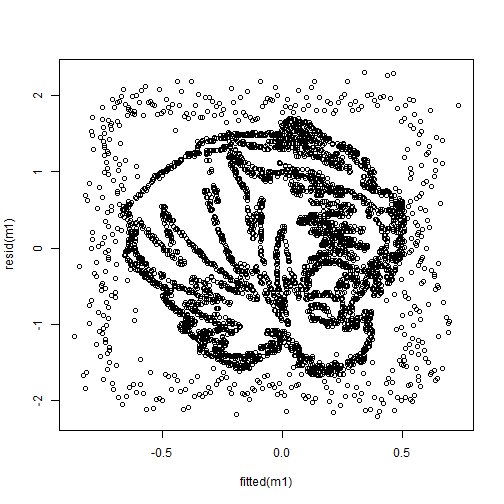

## Random stuff II: Plotting residuals

I was poking around my old teaching files and I found an old file and I wasn't sure what it was:


``` r
dat <- read.table("https://raw.githubusercontent.com/flh3/pubdata/main/Stefanski_2007/mizzo_1_data_yx1x5.txt")
head(dat)
```

```
##       V1       V2      V3       V4      V5       V6
## 1 -0.224  0.00546  0.3803  0.01351  0.2092  0.14671
## 2  0.844  0.10737 -0.0265  0.04586  0.0130 -0.02719
## 3  1.062  0.09112  0.1813  0.05017 -0.1887 -0.01208
## 4 -1.042  0.44049  0.2460  0.00542 -0.2129  0.10152
## 5  0.157 -0.17051  0.1476  0.08363 -0.0953 -0.00785
## 6 -0.135  0.06160 -0.8041 -0.02595  0.2917 -0.07838
```

``` r
dim(dat)
```

```
## [1] 3785    6
```

Turns out it was an old data file I had used in class discussing regression diagnostics. We often talk about the assumption of the homoskedasticity of residuals and we graphically depict that by plotting the fitted values on the X axis and the residuals on the y axis. If all is well, we are told that we should have any discernible pattern.

So this is a dataset of 3,785 observations and 6 variables. We can predict the first variable (`V1`) using all the other variables in the dataset (`V2` to `V6`).


``` r
m1 <- lm(V1 ~ ., data = dat)
```

If we plot the residuals, we get:


``` r
plot(fitted(m1), resid(m1))
```



Just thought that was neat. This is based on the work of: 

> Stefanski, L. A. (2007). Residual (sur)realism. The American Statistician, 61(2), 163-177. https://doi.org/10.1198/000313007X190079

I can't find the original website where this came from but definitely check out the paper!

Here's the original image:

<div class="figure">

<p class="caption">MU TIGERS</p>
</div>


-- END


