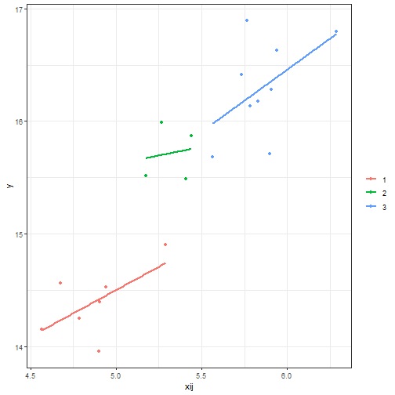
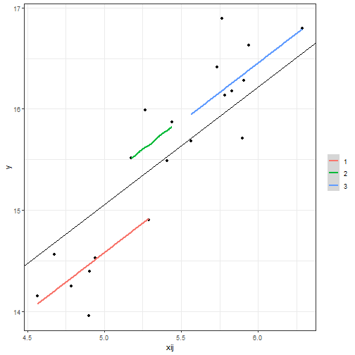

(MLM notes). Residuals are often used for model diagnostics or for spotting outliers in the data. For single-level models, these are merely the observed - predicted data (i.e., $y_i - \hat{y}_i$). However, for multilevel models, these are a bit more complicated to compute. Since we have two error terms (in this example), we will have two sets of residuals. For example, a multilevel model with a single predictor at level one can be written as:

$$y_{ij} = \gamma_{00} + \gamma_{01}x_{ij} + u_{0j} + r_{ij}$$
The $u_{0j}$ represent the estimated level-2 residuals and are assumed to be normally distributed with a mean of 0 and variance of $\tau_{00}$ or $\mathcal{N}\sim(0, \tau_{00})$.


## Read in and examine the data

A small three cluster dataset (`comb`) is used (so we can see and compare results of our computations done manually and automatically using functions). There are only 20 observations in the data nested within 3 clusters.


``` r
library(lme4)
library(MLMusingR)
library(ggplot2)

load(url("https://github.com/flh3/pubdata/raw/main/miscdata/three_groups.rda"))
comb <- three_group
names(comb)[2] <- "xij" #just renaming
ggplot(comb, aes(x = xij, y = y, group = gp, col = gp)) +
  geom_point() + 
  geom_smooth(method = 'lm', se = F) + theme_bw() +
  labs(col = '')
```



## Fit a random intercept model


``` r
m1 <- lmer(y ~ xij + (1|gp), data = comb)
summary(m1)
```

```
Linear mixed model fit by REML. t-tests use Satterthwaite's method [
lmerModLmerTest]
Formula: y ~ xij + (1 | gp)
   Data: comb

REML criterion at convergence: 18.9

Scaled residuals: 
    Min      1Q  Median      3Q     Max 
-1.9164 -0.2511 -0.0196  0.3605  2.1738 

Random effects:
 Groups   Name        Variance Std.Dev.
 gp       (Intercept) 0.214    0.463   
 Residual             0.107    0.327   
Number of obs: 20, groups:  gp, 3

Fixed effects:
            Estimate Std. Error     df t value Pr(>|t|)    
(Intercept)    9.239      1.849 12.207    5.00   0.0003 ***
xij            1.165      0.342 12.915    3.41   0.0047 ** 
---
Signif. codes:  0 '***' 0.001 '**' 0.01 '*' 0.05 '.' 0.1 ' ' 1

Correlation of Fixed Effects:
    (Intr)
xij -0.989
```

We will use the `m1` object in our computations. We can first begin by extracting our variance components of $\tau_{00}$ and $\sigma^2$ from the `merMod` object.


``` r
# extract and save variance components
T00 <- data.frame(VarCorr(m1))$vcov[1]
sig2 <- sigma(m1)^2
```

We also of course still need to get the predicted values. With MLMs, you can get the conditional predicted values (that include the random effects) and the marginal predicted values (only using the fixed effects). For this, we need the marginal values. We can compute this using some basic matrix algebra and compare it to the predicted values using the `predict` function (note the `re.form = NA` option).


``` r
X <- model.matrix(m1) # the design matrix
B <- fixef(m1) # the regression coefficients
(comb$yhat <- as.numeric(X %*% B))
```

```
 [1] 14.9 14.7 14.6 15.0 15.0 15.4 14.8 15.3 15.4 15.6 15.5 16.1 16.0 15.7
[15] 15.9 16.2 16.1 16.6 16.0 16.0
```

``` r
predict(m1, re.form = NA) # the same
```

```
   1    2    4    6    7    8    9   12   13   16   17   21   23   24   25 
14.9 14.7 14.6 15.0 15.0 15.4 14.8 15.3 15.4 15.6 15.5 16.1 16.0 15.7 15.9 
  26   27   28   29   30 
16.2 16.1 16.6 16.0 16.0 
```

From here, we can compute the residuals as in the single-level model ($y_{ij} - \hat{y}_{ij}$). We will use these in our computations of our level-specific residuals.


``` r
# computing raw residuals (obs - predicted)
comb$resid <- comb$y - comb$yhat
```

We also need the average residuals per group. These estimates will then be shrunken using a shrinkage factor (or the reliability). The depends on the random effect estimates and the number of observations within each cluster *j*. If the sample sizes were balanced, this would be the same for each cluster. The more observations in a cluster, the more reliable the estimate. 


``` r
# computing average raw residuals per group
comb$rj <- group_mean(comb$resid, comb$gp) #function is from MLMusingR
```

The shrinkage factor uses the reliability of the random effects (i.e., the intercept) per group ($\frac{\tau_{00}}{\tau_{00} + \sigma^2/n_j}$).


``` r
# how many in each cluster
(nj <- table(comb$gp))
```

```

1 2 3 
7 4 9 
```

``` r
# computing shrinkage factor
shrink <- T00 / (T00 + sig2/ nj) 
names(shrink) <- names(nj)
tmp <- data.frame(shrink)
names(tmp) <- c('gp', 'shrink')
tmp
```

```
  gp shrink
1  1  0.934
2  2  0.889
3  3  0.948
```

``` r
# merging shrinkage estimates to the dataset
comb <- merge(comb, tmp, by = 'gp')
```

The shrunken random effects are the average random effect per group (`rj`) $\times$ the shrinkage factor (or the reliability of the residuals). These residuals are referred to as precision weighted. 


``` r
comb$rj2 <- comb$rj * comb$shrink # shrunken
comb$rj2[!duplicated(comb$rj2)]
```

```
[1] -0.479  0.249  0.230
```

``` r
ranef(m1) # same as this if using a function
```

```
$gp
  (Intercept)
1      -0.479
2       0.249
3       0.230

with conditional variances for "gp" 
```

Now we can compute the residuals at level one as the residuals - the random effects associated with the cluster.


``` r
comb$residm <- as.numeric(comb$resid - comb$rj2) # computed manually
comb$residauto <- as.numeric(resid(m1)) # extracted using a function 
all.equal(comb$residm, comb$residauto)
```

```
[1] TRUE
```

``` r
comb
```

```
   gp    y  xij yhat   resid     rj shrink    rj2   residm residauto
1   1 14.0 4.90 14.9 -0.9901 -0.513  0.934 -0.479 -0.51100  -0.51100
2   1 14.6 4.67 14.7 -0.1206 -0.513  0.934 -0.479  0.35855   0.35855
3   1 14.2 4.56 14.6 -0.4036 -0.513  0.934 -0.479  0.07552   0.07552
4   1 14.5 4.94 15.0 -0.4626 -0.513  0.934 -0.479  0.01656   0.01656
5   1 14.4 4.91 15.0 -0.5546 -0.513  0.934 -0.479 -0.07547  -0.07547
6   1 14.9 5.29 15.4 -0.4938 -0.513  0.934 -0.479 -0.01464  -0.01464
7   1 14.2 4.79 14.8 -0.5673 -0.513  0.934 -0.479 -0.08814  -0.08814
8   2 15.5 5.17 15.3  0.2511  0.280  0.889  0.249  0.00181   0.00181
9   2 16.0 5.27 15.4  0.6168  0.280  0.889  0.249  0.36748   0.36748
10  2 15.9 5.44 15.6  0.2982  0.280  0.889  0.249  0.04887   0.04887
11  2 15.5 5.41 15.5 -0.0447  0.280  0.889  0.249 -0.29399  -0.29399
12  3 15.7 5.90 16.1 -0.3961  0.243  0.948  0.230 -0.62585  -0.62585
13  3 16.9 5.77 16.0  0.9397  0.243  0.948  0.230  0.70991   0.70991
14  3 15.7 5.56 15.7 -0.0373  0.243  0.948  0.230 -0.26705  -0.26705
15  3 16.4 5.73 15.9  0.4985  0.243  0.948  0.230  0.26874   0.26874
16  3 16.6 5.94 16.2  0.4741  0.243  0.948  0.230  0.24434   0.24434
17  3 16.3 5.91 16.1  0.1659  0.243  0.948  0.230 -0.06385  -0.06385
18  3 16.8 6.29 16.6  0.2324  0.243  0.948  0.230  0.00261   0.00261
19  3 16.1 5.79 16.0  0.1553  0.243  0.948  0.230 -0.07446  -0.07446
20  3 16.2 5.83 16.0  0.1498  0.243  0.948  0.230 -0.07996  -0.07996
```

## Side note: computing conditional predicted values

The conditional predicted value is $\hat{y}_{ij} = XB + Zu$.


``` r
z <- matrix(getME(m1, 'Z'), ncol = 3) # random effect design matrix
u <- ranef(m1)[[1]]$'(Intercept)' # random effects shrunken

# getting predicted values (manually)
as.numeric(X %*% B + z %*% u) # manual
```

```
 [1] 14.5 14.2 14.1 14.5 14.5 14.9 14.3 15.5 15.6 15.8 15.8 16.3 16.2 15.9
[15] 16.1 16.4 16.3 16.8 16.2 16.3
```

Can compare this using the function `fitted` or `predict`:


``` r
fitted(m1) # or predict(m1) (using a function)
```

```
   1    2    4    6    7    8    9   12   13   16   17   21   23   24   25 
14.5 14.2 14.1 14.5 14.5 14.9 14.3 15.5 15.6 15.8 15.8 16.3 16.2 15.9 16.1 
  26   27   28   29   30 
16.4 16.3 16.8 16.2 16.3 
```

``` r
comb$y - comb$residm # obs - residual
```

```
 [1] 14.5 14.2 14.1 14.5 14.5 14.9 14.3 15.5 15.6 15.8 15.8 16.3 16.2 15.9
[15] 16.1 16.4 16.3 16.8 16.2 16.3
```

``` r
# plotting per group
ggplot(comb, aes(x = xij, y = fitted(m1))) +
  geom_point(aes(x = xij, y = y)) + #observed
  #geom_smooth(method = 'lm', se = F, lty = 'dashed', alpha = .5, width = .5) + # overall
  geom_smooth(aes(x = xij, y = fitted(m1), col = factor(gp))) + # per cluster
  labs(col = '', y = 'y') +
  geom_abline(intercept = fixef(m1)[1], slope = fixef(m1)[2]) +
  theme_bw()
```



A good lecture to view can be found [here](https://www.bristol.ac.uk/cmm/learning/videos/residuals.html).


## Computing studentized (conditional) residuals

Studentized conditional residuals can be computed as:

$$r_{c, stud} = \frac{r_{cond}}{\sqrt{Var(r_c)}}$$

Computing $Var(r_c) = K(V-Q)K'$ where $Q = X(X'V^{-1}X)^{-1}X'$ and $K = I - ZGZ'V^{-1}$ (See Gregoire et al., 1995, p. 144 and the documentation of the `redres` [package](https://goodekat.github.io/redres/articles/redres-vignette.html)). (It took me a while finding these references!)


``` r
getV <- function(x){
  var.d <- crossprod(getME(x, "Lambdat"))
  Zt <- getME(x, "Zt")
  vr <- sigma(x)^2
  var.b <- vr * (t(Zt) %*% var.d %*% Zt)
  sI <- vr * Matrix::Diagonal(nobs(x)) #for a sparse matrix
  var.y <- var.b + sI
}

Vm <- getV(m1)
Qm <- X %*% solve(t(X) %*% solve(Vm) %*% X) %*% t(X)
```

The $G$ matrix here is the random effects matrix and $I$ is an identity matrix.


``` r
Gm <- diag(T00, 3) #this is for a random intercept model with 3 clusters
ns <- nobs(m1) #how many observations
Im <- diag(ns)
Km <- Im - z %*% Gm %*% t(z) %*% solve(Vm)
var_rcm <- diag(Km %*% (Vm - Qm) %*% t(Km))
resid(m1) / sqrt(var_rcm) # computing the studentized residuals
```

```
       1        2        4        6        7        8        9       12 
-1.68395  1.22106  0.26862  0.05464 -0.24871 -0.05374 -0.29279  0.00643 
      13       16       17       21       23       24       25       26 
 1.28655  0.17231 -1.03160 -2.03424  2.30656 -0.90587  0.87623  0.79787 
      27       28       29       30 
-0.20766  0.00981 -0.24161 -0.25913 
```

``` r
rstudent(m1) #automatic, using a function
```

```
       1        2        4        6        7        8        9       12 
-1.68395  1.22106  0.26862  0.05464 -0.24871 -0.05374 -0.29279  0.00643 
      13       16       17       21       23       24       25       26 
 1.28655  0.17231 -1.03160 -2.03424  2.30656 -0.90587  0.87623  0.79787 
      27       28       29       30 
-0.20766  0.00981 -0.24161 -0.25913 
```

**References**:

Gregoire, T. G., Schabenberger, O., & Barrett, J. P. (1995). Linear modelling of irregularly spaced, unbalanced, longitudinal data from permanent-plot measurements. *Canadian Journal of Forest Research, 25*(1), 137-156.


--- END


