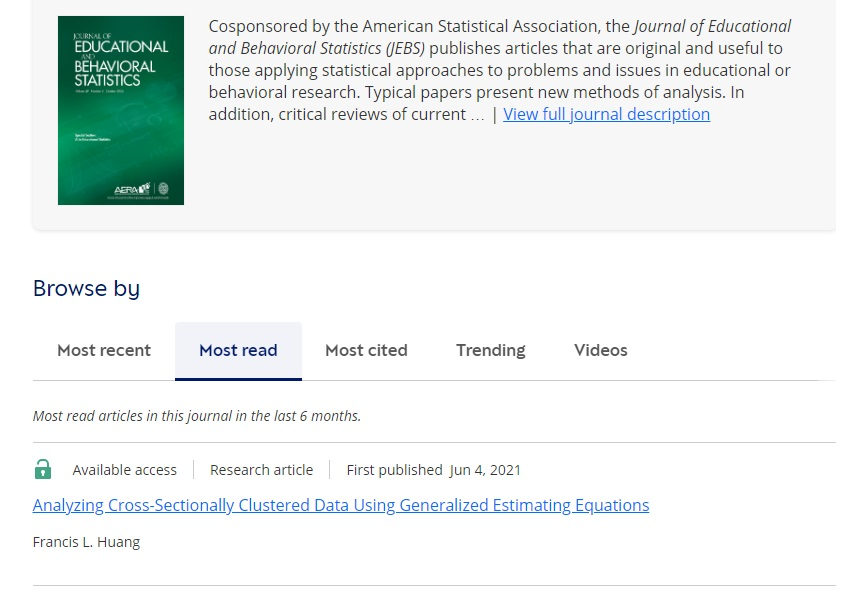

As of 2024.10.03, the most read article on JEBS (for the last 6 months)!

In the original paper draft, I had a section which showed how much more widely used mixed models (i.e., MLMs, HLMs) were compared to GEEs but was asked to remove that. I thought the usage was interesting so I am including it here:

- In psychology, mixed model studies are much more popular than studies using GEEs by a ratio of 15:1 (Bauer & Sterba, 2011). 

Citations in JEBS:

- In the Journal of Educational and Behavioral Statistics (JEBS): one article on how to use multilevel models by Singer (1998) has over 3,300 citations (as of 2020.06.11, Google Scholar)
- In the same journal, Ghisletta & Sini (2004) provided an introduction to GEEs. This article has 329 citations. GS wrote (p. 431):

Although GEEs are widely applied in biological, pharmacological, and closely related disciplines, their application in educational and social sciences remains relatively scarce.

There is a difference of 6 years but the Singer article has been cited over **10** times more! If using average citations per year, **7.5** times more.

References:

Ghisletta, P., & Spini, D. (2004). An introduction to generalized estimating equations and an application to assess selectivity effects in a longitudinal study on very old individuals. Journal of Educational and Behavioral Statistics, 29(4), 421-437.

Singer, J. D. (1998). Using SAS PROC MIXED to fit multilevel models, hierarchical models, and individual growth models. Journal of Educational and Behavioral Statistics, 23(4), 323-355.
